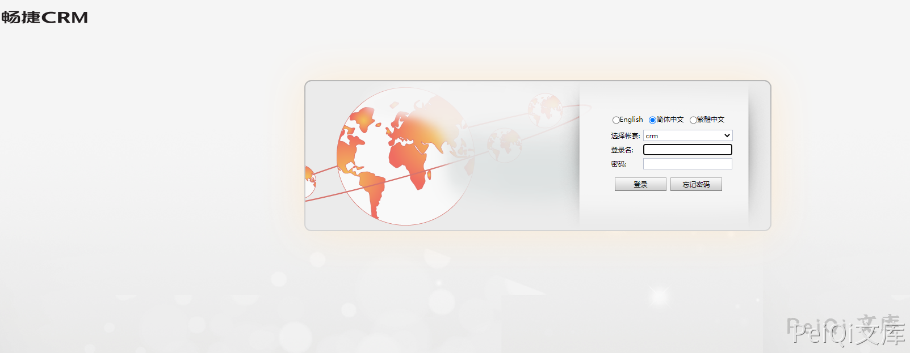
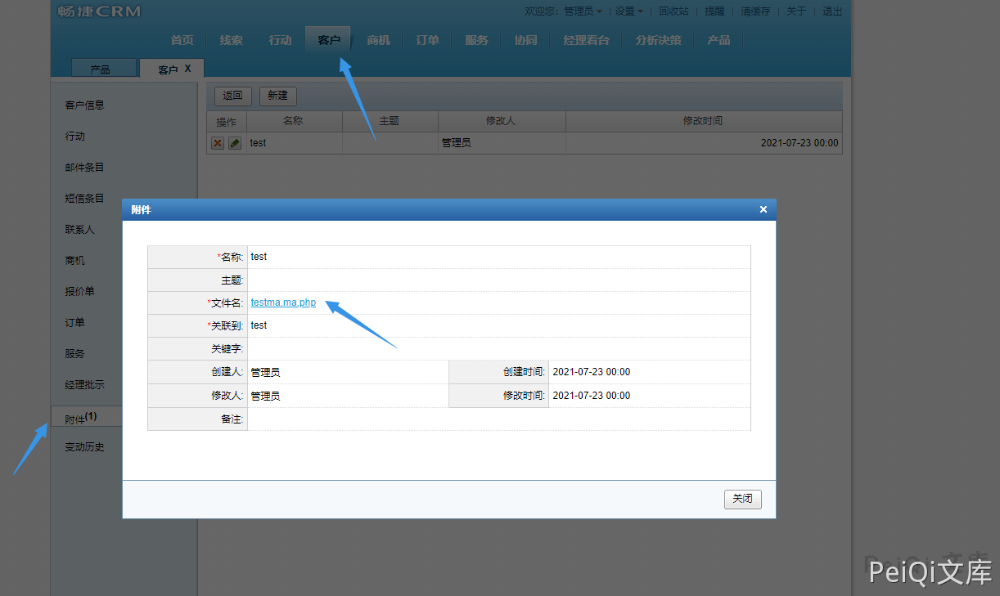
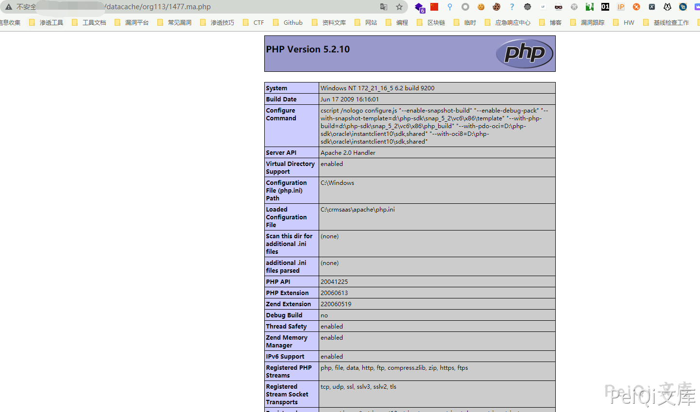

# 畅捷CRM 后台附件任意文件上传漏洞

## 漏洞描述

畅捷CRM 后台附件存在任意文件上传漏洞，通过解析漏洞可跳过后缀更改获取网站权限

## 漏洞影响

```
畅捷CRM
```

## FOFA

```
title="畅捷CRM"
```

## 漏洞复现

登录页面




部分存在空密码 admin/空密码


登录后添加客户，并上传附件为PHP文件，其中文件名为


xxx.xxx.php格式，越过系统中的后缀更改





点击文件名跳转


