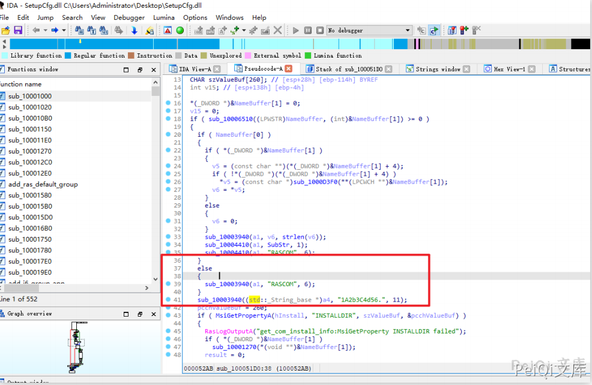
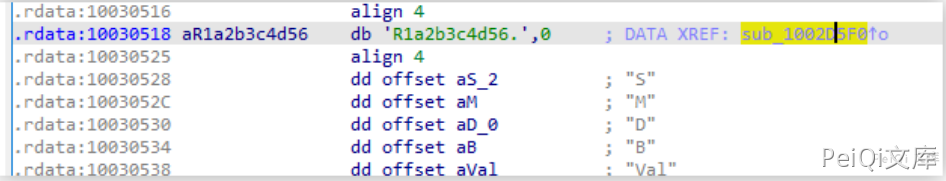

# 科迈 RAS系统 硬编码管理员漏洞

## 漏洞描述

科迈 RAS系统 存在硬编码管理员漏洞，在内部自动创建了两个管理员账户，可被利用于登录

## 漏洞影响

```
科迈 RAS系统
```

## FOFA

```
app="科迈-RAS系统"
```

## 漏洞复现






可得知存在的账号密码为


```plain
user: RASCOM
pass: 1A2b3C4d56.

user: 1A2b3C4d56.
pass: 1A2b3C4d56.
```


当开启RDP即可使用该账号登陆

