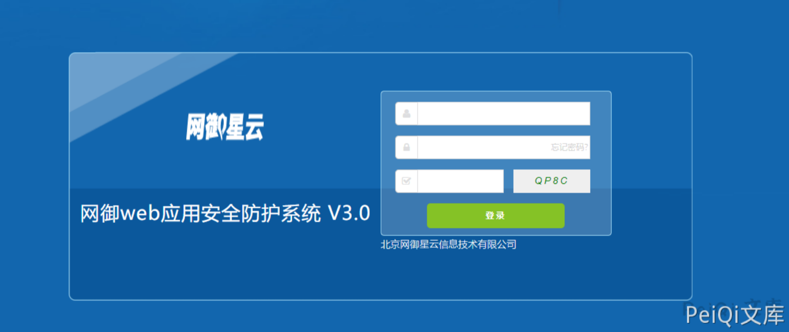
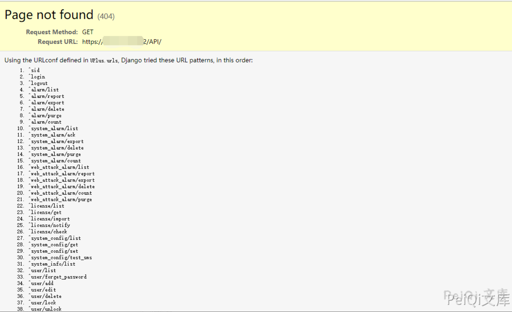
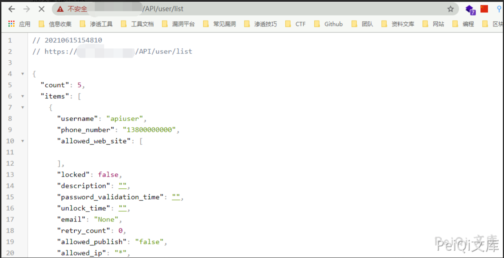

# 网御星云 web防护系统 信息泄露漏洞

## 漏洞描述

网御星云 web防护系统 存在信息泄露漏洞，通过访问特殊的Url获取部分敏感信息

## 漏洞影响

```
网御星云
```

## 网络测绘

```
title="网页防篡改系统"
```

## 漏洞复现

登录页面如下





访问


```plain
http://xxx.xxx.xxx.xxx/API/
```




部分 API请求 不需要登录即可访问获取信息，例如 **/user/list**


