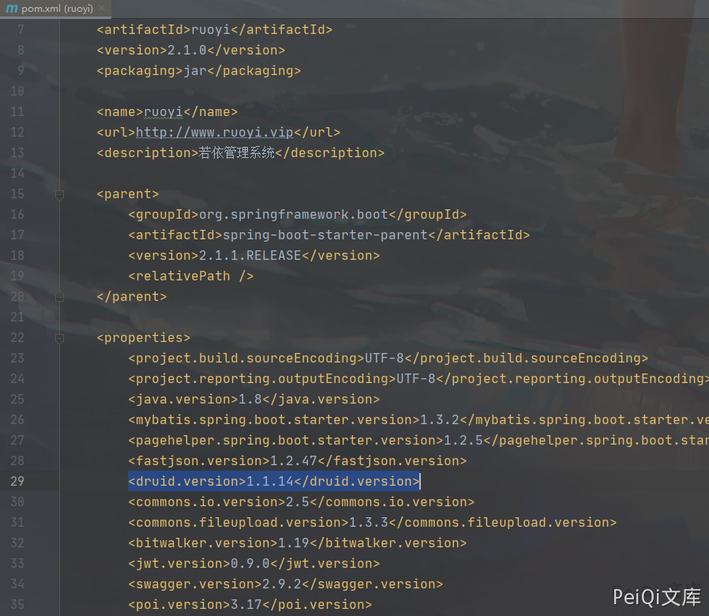
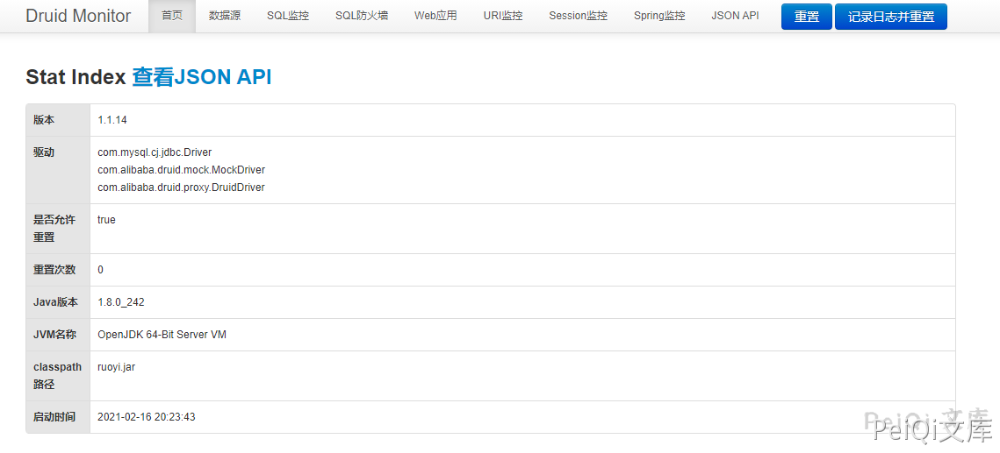

# 若依管理系统 Druid未授权访问

## 漏洞描述

若依管理系统使用了Druid 默认开启了匿名访问，导致未授权获取敏感信息

## 漏洞影响

```
若依管理系统
```

## 网络测绘

```
app="若依-管理系统"
```

## 漏洞复现

源码中看到 pom.xml 文件中查看到引用了 阿里Druid




从 issues 中发现了默认存在的未授权访问


Url为


```plain
http://xxx.xxx.xxx.xxx/prod-api/druid/index.html
```




## 