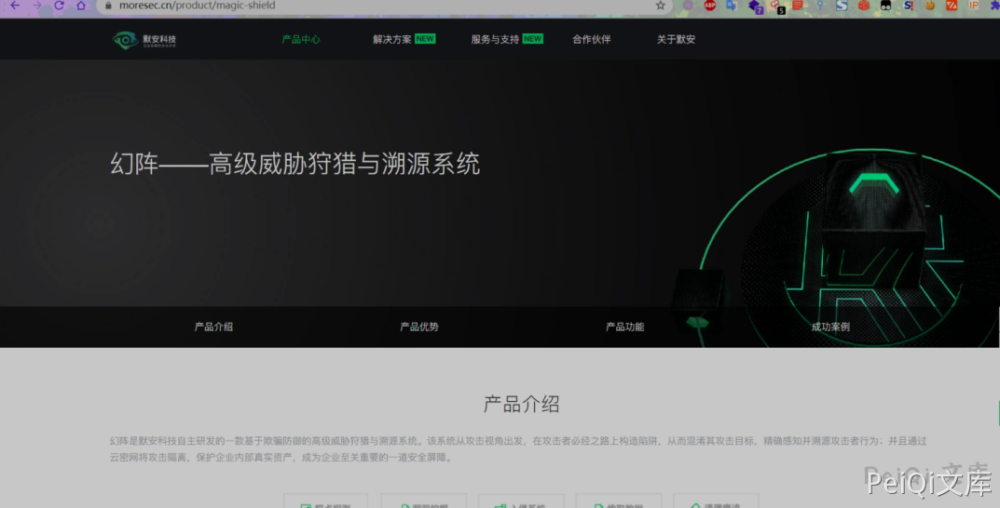
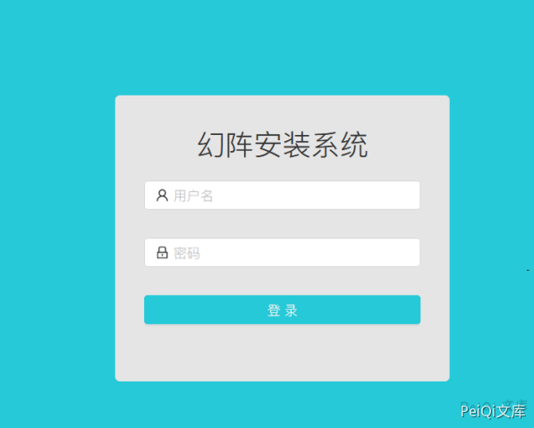
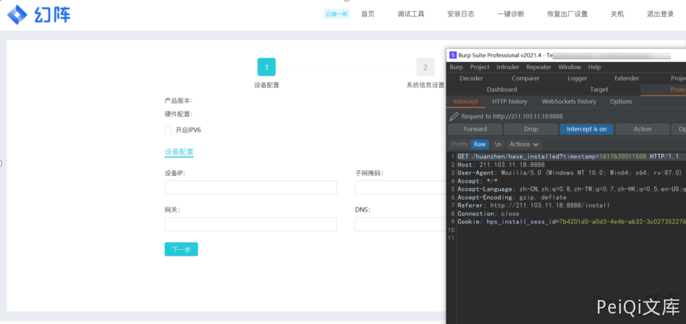
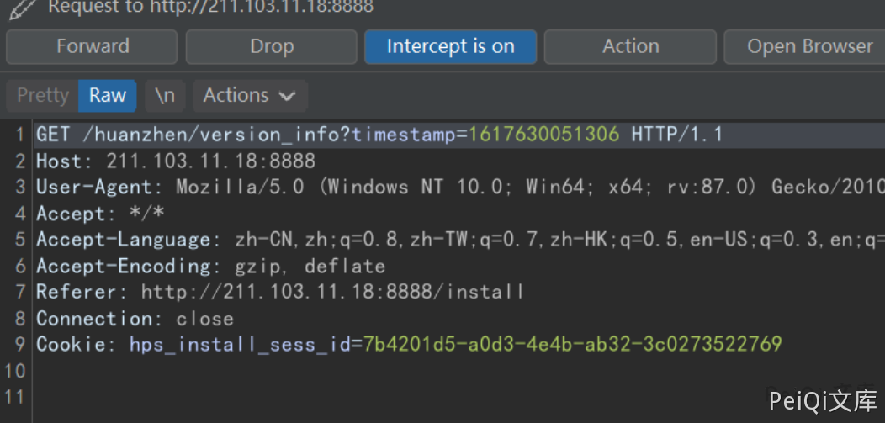
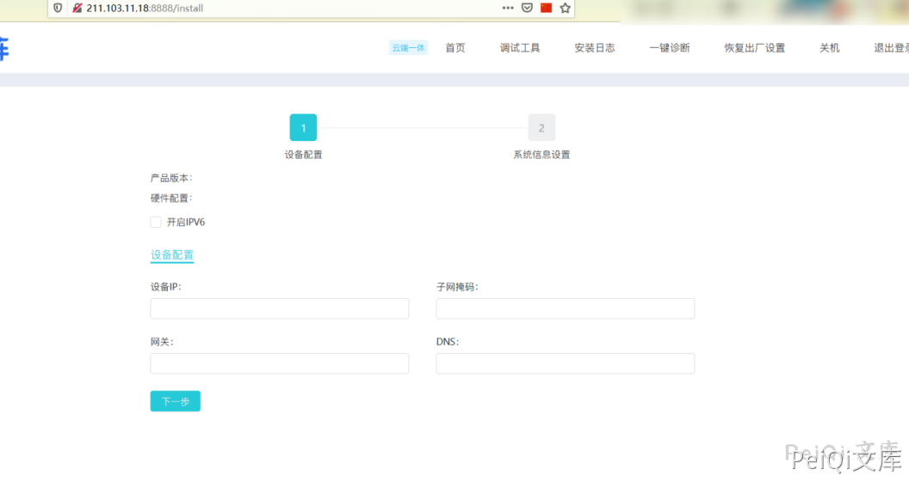
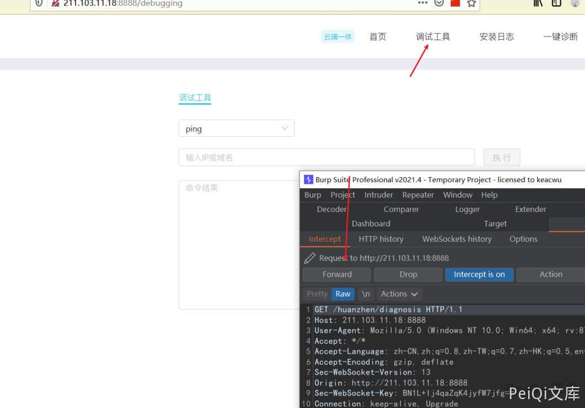
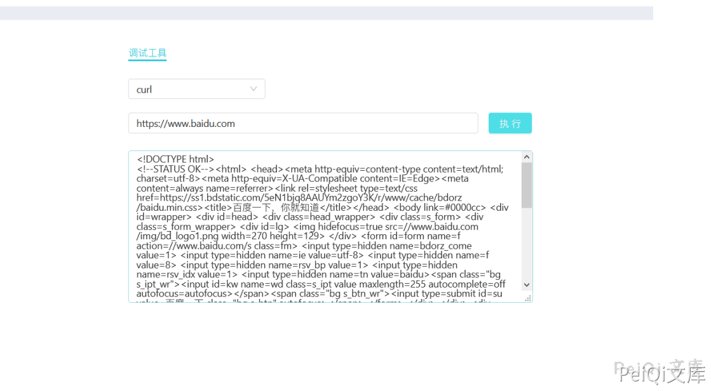
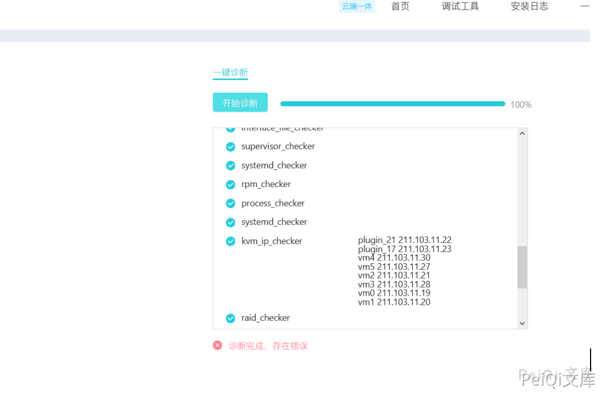

# 默安 幻阵蜜罐未授权访问 RCE

## 漏洞描述

默安 幻阵蜜罐存在部署页面未授权访问 ，可执行任意命令

## 漏洞影响

```
默安 幻阵蜜罐
```

## 漏洞复现

产品页面





安装页面如下




刷新并抓包





Drop掉 **/huanzhen/have_installed?**





进入页面




点击调试抓包




执行其他命令





点击一键诊断泄露 IP数据


