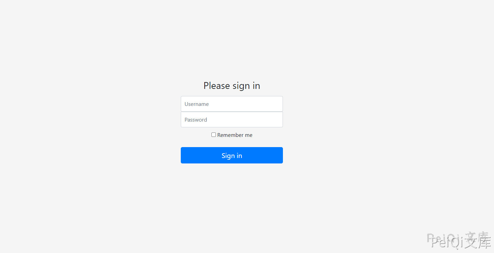
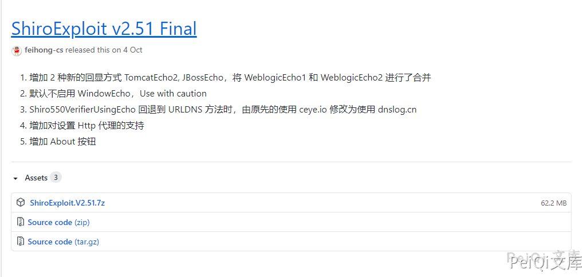
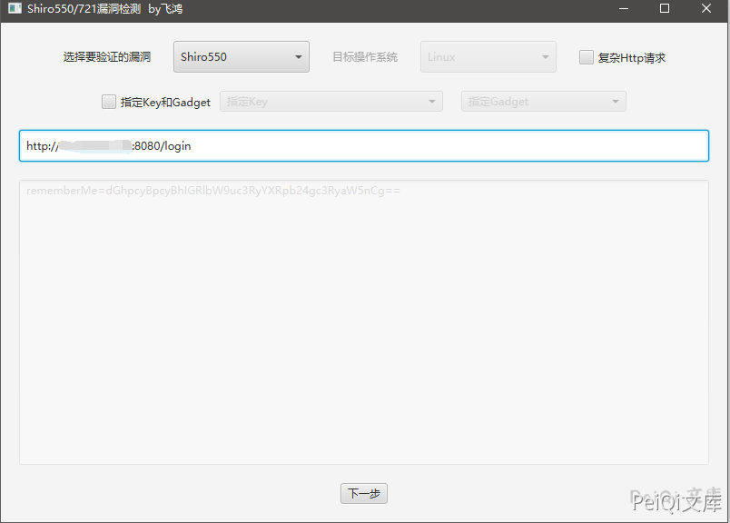
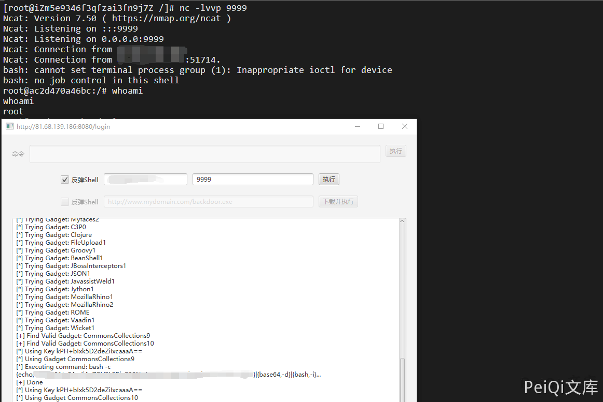

# Apache Shiro 小于1.2.4反序列化漏洞 CVE-2016-4437

## 漏洞描述

Apache Shiro是一款开源安全框架，提供身份验证、授权、密码学和会话管理。Shiro框架直观、易用，同时也能提供健壮的安全性。
Apache Shiro 1.2.4及以前版本中，加密的用户信息序列化后存储在名为remember-me的Cookie中。攻击者可以使用Shiro的默认密钥伪造用户Cookie，触发Java反序列化漏洞，进而在目标机器上执行任意命令。

## 漏洞影响

```
Apache Shiro <= 1.2.4
```

## 漏洞环境

```plain
https://github.com/vulhub/vulhub.git
cd vulhub/shiro/CVE-2016-4437
docker-compose up -d
```

访问[**http://xxx.xxx.xxx.xxx:8080/login**](http://xxx.xxx.xxx.xxx:8080/login)正常即可



## 漏洞复现

Shiro已经有比较完善的工具

```plain
https://github.com/insightglacier/Shiro_exploit
https://github.com/feihong-cs/ShiroExploit/releases/tag/v2.51
```

这里使用的是 [ShiroExploit](https://github.com/feihong-cs/ShiroExploit) 工具进行复现





打开后输入url即可



成功反弹shell



## 参考文章

[Shiro RememberMe 1.2.4远程代码执行漏洞-详细分析](https://xz.aliyun.com/t/6493)