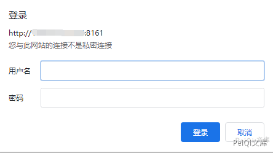
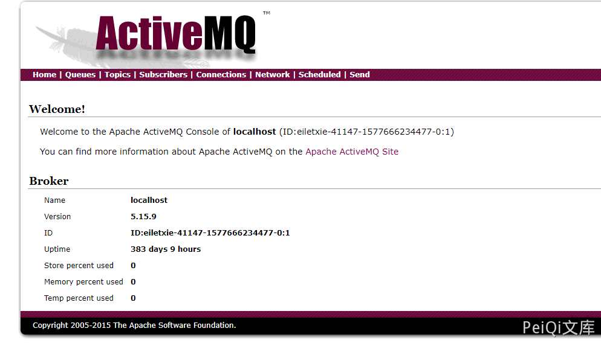

# Apache ActiveMQ Console 控制台默认弱口令

## 漏洞描述

Apache ActiveMQ Console 存在默认弱口令 admin:admin，进入控制台后可被进一步恶意利用

## 漏洞影响

```
Apache ActiveMQ
```

## 漏洞复现

Apache ActiveMQ 默认开启了 8186 控制台

访问目标: http://xxx.xxx.xxx.xxx:8161/admin



使用默认口令 admin:admin


