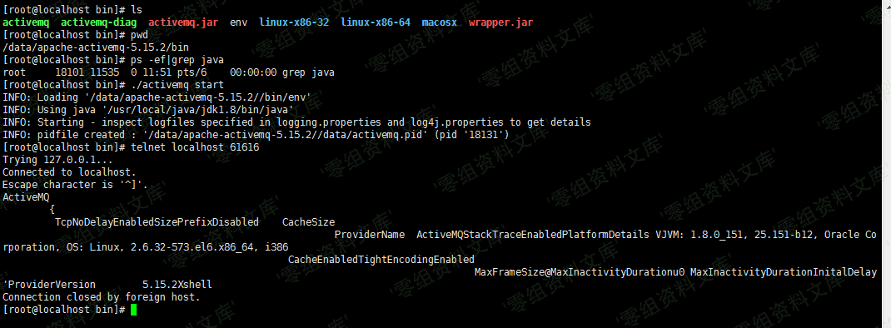

# Apache ActiveMQ 信息泄漏漏洞 CVE-2017-15709

## 漏洞描述

Apache ActiveMQ默认消息队列61616端口对外，61616端口使用了OpenWire协议，这个端口会暴露服务器相关信息，这些相关信息实际上是debug信息。

会返回应用名称，JVM，操作系统以及内核版本等信息。

## 漏洞影响

```
apache-activemq-5.15.0 to apache-activemq-5.15.2
apache-activemq-5.14.0 to apache-activemq-5.14.5
```

## 漏洞复现

