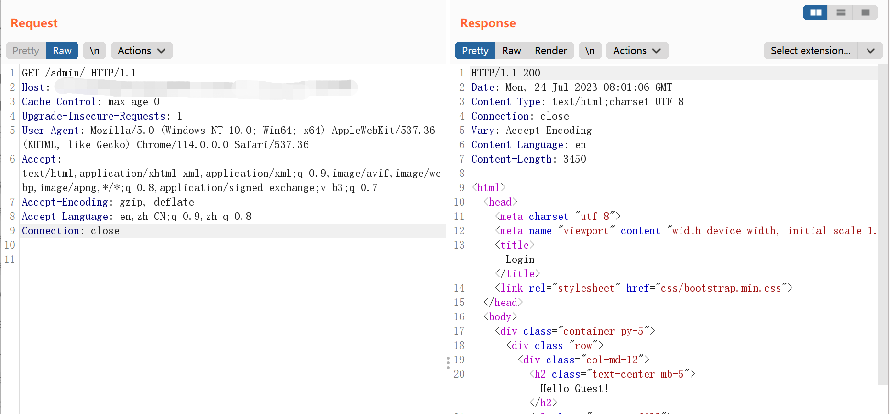
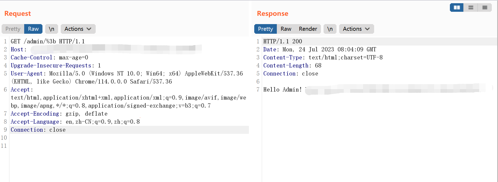

# Apache Shiro 1.6.0 身份认证绕过漏洞 CVE-2020-13933

## 漏洞描述

2020年8月18日，Apache Shiro官方发布安全通告 Apache Shiro身份验证绕过漏洞（CVE-2020-13933），经过分析，攻击者可以通过构造特殊的HTTP请求实现身份验证绕过。

## 漏洞影响

```
Apache Shiro < 1.6.0
```

## 漏洞复现

正常访问 /admin，需要登录：



构造恶意请求绕过：

```
admin/%3b
```

